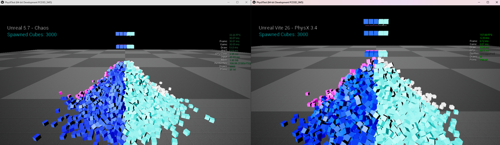

# UE4 与 UE5 的成本分析

性能差距并非源于单一系统。它是由着色器指令数、物理引擎、角色移动、内存、Slate、骨骼网格、tick 开销、渲染线程结构、蓝图原生化功能的缺失以及体积着色器等诸多因素共同造成的——每个因素都独立地影响着性能。

本页面记录了虚幻引擎 4.27 和现代 UE5 之间实际性能差异的来源。之所以要记录，是因为仅仅说“UE5 更慢”是不够的；只有了解是**哪个**子系统出现了退步以及退步的程度，才能决定是否值得维护一个分支版本。相关测量数据已收集在一个[公开的电子表格](https://docs.google.com/spreadsheets/d/1TabQV7UTDLMHI9GVFCbMzXohax2Agm2qzET7tOOXN7w/edit?usp=sharing)中。

## Materials and shaders

从虚幻引擎 5.1 开始，着色器模型 6 (Shader Model 6) 成为首选渲染路径，SM5 和 SM6 路径的着色器指令总数均显著增加。后续版本进一步扩展了指令总数和排列组合数。

虚幻引擎 4.27 生成了更轻量级的着色器，在保证相同视觉效果的前提下，直接提升了整体 GPU 运行速度——而不仅仅是在使用新特性的场景中。

*按引擎版本划分的相同材质工作的着色器指令数。SM5 和 SM6 路径的指令数均随每次发布而增加，而每一条指令都会消耗 GPU 时间，最终图像却不会发生相应的变化。*

## 物理模拟

在许多工作负载下，Chaos 的速度明显慢于 PhysX，这主要是由于其 SIMD（Single Instruction, Multiple Data，单指令多数据流）利用率较低、多线程性能相对较差以及整体工程决策效率较低所致。

内部压力测试表明，在物理密集型场景下，Chaos 的性能比 PhysX 慢 5 倍以上。这种差距不仅限于刚体模拟：它还会影响物理查询、碰撞计算和变换传播，这意味着即使项目很少或根本不显式使用物理模拟，仍然会付出可观的 CPU 成本。

*模拟了 3000 个立方体。Unreal 5.7 搭配 Chaos 渲染器（左图）帧率为 33.26 FPS，帧延迟为 30.07 毫秒；Vite 搭配 PhysX 3.4 渲染器（右图）帧率为 157.88 FPS，帧延迟为 6.33 毫秒——帧率相差 4.7 倍。*

实际效果体现在规模上。相同的 CPU 资源在 PhysX 下可以实现更复杂的布料模拟和破坏效果。参见 [PhysX 概述](../Physics/PhysX.md)。

## 角色移动组件

角色移动组件（Character Movement Component, CMC）的计算成本不断攀升。与虚幻引擎 5.6 相比，4.27 版本在移动和碰撞计算方面速度提升了 2.2 到 2.8 倍，而且这还不包括 PhysX 更快的扫描速度。

这在包含大量玩家或 AI 角色的场景中尤为显著，并直接限制了模拟的可行规模。[400 角色 CMC 基准测试](../ProjectsAndDemos/400-Characters-CMC-Bench.md)场景正是为了精确衡量这一点而存在的。

## 内存

随着引擎的每次迭代，整体内存使用量都在增加。在典型的多人游戏地图场景中，Vite 的总内存使用量比 UE 5.7 少约 1 GB（基于风格化示例的测试结果）。

在内存受限的设备上——例如掌机、Switch 2 和主机——1 GB 的内存占用并非微不足道。它往往决定着纹理池能否正常运行，还是会频繁崩溃。

## Slate 和 UI

从 UE 5.0 开始，Slate 的渲染成本显著增加，同时用于处理 Slate 对象更新、布局计算和变换的系统也变得更加复杂。为了追求更高的 UI 渲染保真度，UI 本身的渲染成本也随之增加。

对于 UI 密集型游戏（考虑到 HUD、物品栏和菜单等元素，大多数游戏都属于此类），这种每帧的持续成本始终存在。

## 骨骼网格

骨骼网格在 5.1 到 5.4 版本左右变得更加复杂。4.27 版本中骨骼网格组件的基础成本要低得多。

这一点至关重要，因为骨骼网格通常是游戏中 CPU 占用率最高的组件。Vite 还提供了一个优化的骨骼网格配置作为默认配置——请参阅[引擎默认更改](../Performance/Engine-Defaults.md)。

## 世界帧和游戏线程

较新的 UE5 版本增加了帧系统的整体开销，使得物理引擎、Niagara 引擎和控制器帧的运行更加耗费资源。这是每帧都会增加的固定开销，与游戏的具体操作无关。

## 渲染线程

随着 Lumen、Nanite、VSM、虚拟纹理、TSR、Substrate、Chaos Cloth 和 Hair 等功能的深度集成，渲染线程变得更大、更分散，PSO（粒子系统优化）也变得更加耗费资源。这会影响渲染器的整体性能，无论在何种情况下，而不仅仅是在启用这些功能时。

## 蓝图原生化功能的缺失

这一点经常被忽视，但它往往是实际项目中影响最大的单一因素。

蓝图虚拟机运行时速度较慢。对于简单的游戏逻辑，它通常比等效的原生 C++ 慢 50 到 80 倍。对于算法工作负载（例如排序、节点操作和寻路），它的速度甚至可能慢 150 到 400 倍。

在虚幻引擎 4 中，蓝图原生化功能通过在打包过程中将蓝图字节码转换为原生 C++ 来缓解这个问题，从而生成比虚拟机执行速度快约 10 倍的代码。UE5 移除了这项功能。

由于大多数虚幻项目都严重依赖蓝图——尤其是通过插件和您无法控制的第三方代码——因此保留原生化功能可以显著提升 UE4 游戏线程在实际项目中的速度，从而降低输入延迟、提高响应速度并支持更高的模拟规模。

## 体积、雾和引擎着色器

处理体积、雾和天空以及许多其他默认引擎着色器的系统和材质的性能大幅下降。着色器复杂性的增加叠加了上述基础材质成本的增加。

*比较不同引擎版本中默认体积、雾和天空材质的着色器成本*

*在同一系统上进行的第二次测量。由于性能下降源于默认引擎着色器本身，因此无论项目是否创建任何自定义体积材质，都会受到影响。*

## 核心类基础成本

除了单个系统之外，核心引擎类的基础成本在游戏逻辑和渲染逻辑中，执行时间和内存占用均有所增加。

*各引擎版本核心引擎类别的基本成本比较*

*按版本划分的核心引擎类基础成本。这是在任何游戏代码运行之前产生的成本，因此即使在未使用任何新功能的项目中也会出现。*

每个类的具体数据在[测量电子表格](https://docs.google.com/spreadsheets/d/1TabQV7UTDLMHI9GVFCbMzXohax2Agm2qzET7tOOXN7w/edit?usp=sharing)中，每个版本的类大小在[类大小报告](https://docs.google.com/spreadsheets/d/1qfS04ke1cVGDGBFVLoAjeqE4IzW5QVJ-JAbvFbUw_SY/edit?usp=sharing)中列出。

## 另请参阅

- [NvRTX 4.27 的优势](Why-NvRTX-427.md)
- [性能目标](Performance-Targets.md)
- [引擎默认设置变更](../Performance/Engine-Defaults.md)
- [性能分析和基准测试](../Performance/Profiling.md)
