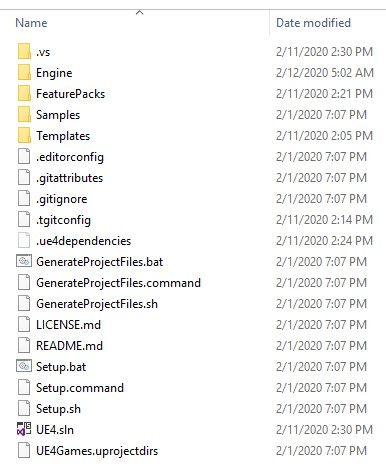
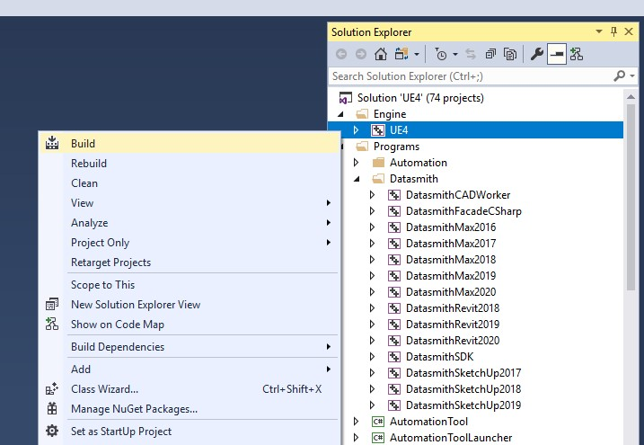

# 从源代码构建

!!! 注意

    `Setup.bat`（询问是否覆盖时选择`N`）→ `GenerateProjectFiles.bat` → 在“Development Editor”中构建 “UE4”

本页介绍了在 Windows 上从源代码构建引擎。首先安装[工具链](Toolchain-Requirements.md)——几乎所有针对Vite报告的构建失败都被证明是工具链问题，而不是代码问题。

如果您以前从未从源代码构建过虚幻引擎，请参阅 Epic 的 [Visual Studio 4.27 设置指南](https://dev.epicgames.com/documentation/en-us/unreal-engine/setting-up-visual-studio-development-environment-for-cplusplus-projects-in-unreal-engine?application_version=4.27)
仍然是最好的背景读物。

## Guided build with ViteSetup

The repository root ships `ViteSetup.bat`, an assistant that runs the whole flow in order: environment
check, toolchain enforcement, dependency setup with platform selection, project file generation, source or
binary build, engine registration, desktop shortcut, and optional debloat.

```batch
ViteSetup.bat
```

For the advanced menu, which lets you run any single step on its own:

```batch
ViteSetup.bat menu
```

The assistant is the recommended path for a first build because it catches missing prerequisites before you
spend twenty minutes compiling. See [ViteSetup Assistant](ViteSetup.md) for a full walkthrough of
its screens and options.

> The assistant enforces its toolchain requirements with no bypass. If it refuses to continue, it will
> print exactly which component is missing.
>
{style="note"}

## Manual build

If you would rather drive the steps yourself, this is what the assistant is doing.

### 1. Download dependencies

```batch
Setup.bat
```

GitDeps is already patched in this fork, so no manual edits are needed. When the script asks whether to
overwrite local changes, answer `N`.

`Setup.bat` accepts `-exclude=` arguments to skip platforms and content you do not need, which
substantially reduces download size and disk usage. A Win64-only setup looks roughly like this:

```batch
Setup.bat -exclude=Android -exclude=IOS -exclude=TVOS -exclude=Mac -exclude=MacOSX ^
          -exclude=Linux -exclude=Linux64 -exclude=HTML5 -exclude=WinRT ^
          -exclude=PS4 -exclude=XboxOne -exclude=Switch -exclude=Dingo ^
          -exclude=Samples -exclude=Templates -exclude=FeaturePacks -exclude=Engine/Documentation
```

> Do not exclude the Win32 folders. Win64 installed builds depend on third-party tools that live under
> Win32, including `ARM\Win32\astcenc.exe`.
>
{style="warning"}

`ViteSetup.bat` exposes these as named presets &mdash; **Recommended Win64**, **Win64 ultra compact**,
**Win64 + templates / feature packs**, **Win64 + Android**, **Win64 + Linux** and **Full setup** &mdash; and
will print the exact `Setup.bat` command line for each one from its **Show setup profiles** menu entry.

### 2. Generate project files

```batch
GenerateProjectFiles.bat
```

This produces `UE4.sln` in the repository root.



*项目文件生成后，资源管理器中的仓库根目录显示为 UE4.sln*

*`UE4.sln` 文件会在生成成功后出现在安装脚本旁边。如果该文件缺失，则表示生成失败——请阅读其输出，而不是打开 Visual Studio。*

### 3. Build

Open `UE4.sln` and set **UE4** as the startup project if it is not already. Build the
**Development Editor** configuration for **Win64**.



*在 Visual Studio 解决方案资源管理器中，选中 UE4 项目并打开“生成”命令。*

*请在**Engine**下构建 **UE4**，而不是在解决方案下构建。构建整个解决方案会编译编辑器构建不需要的程序目标。*


From the command line, the equivalent is:

```batch
Engine\Build\BatchFiles\Build.bat UE4Editor Win64 Development -WaitMutex
Engine\Build\BatchFiles\Build.bat ShaderCompileWorker Win64 Development -WaitMutex
Engine\Build\BatchFiles\Build.bat UnrealLightmass Win64 Development -WaitMutex
```

All three targets are needed for a working editor. `ViteSetup.bat` builds them in this order.

### 4. Register the engine

So that `.uproject` files can find this build, register it under the current user's Unreal Engine build key:

```batch
reg add "HKCU\Software\Epic Games\Unreal Engine\Builds" /v UE_ViteFork /t REG_SZ /d "<engine root>" /f
```

Then set `"EngineAssociation": "UE_ViteFork"` in your project's `.uproject` file. The assistant does this
step for you and also cleans up stale GUID-keyed entries that point at the same folder.

## Build times

Compile time is dominated by core count. As a reference point, a full build of the repository on a
Ryzen 9 9950X3D takes about 15 minutes; removing the bundled Vite plugins brings that down to about
12 minutes, with the Houdini plugin accounting for most of the difference. See
[Debloat Guide](Debloat-Guide.md) if iteration speed matters more to you than plugin coverage.

## Producing an installed build

Once a source build works, you can turn it into a redistributable installed build for the rest of the
team. `RunUAT.bat` in the repository root runs the BuildGraph `Make Installed Build Win64` target and
writes the result to `LocalBuilds\Engine\Windows\`:

```batch
RunUAT.bat
```

See [Installed Builds](Installed-Builds.md) for the full set of options and
[Packaging and Distribution](Installed-Builds.md) for the compression scripts.

## See also

- [Toolchain Requirements](Toolchain-Requirements.md)
- [Build Troubleshooting](Build-Troubleshooting.md)
- [ViteSetup Assistant](ViteSetup.md)
- [Installed Builds](Installed-Builds.md)
- [Cache Management](Cache-Management.md)
