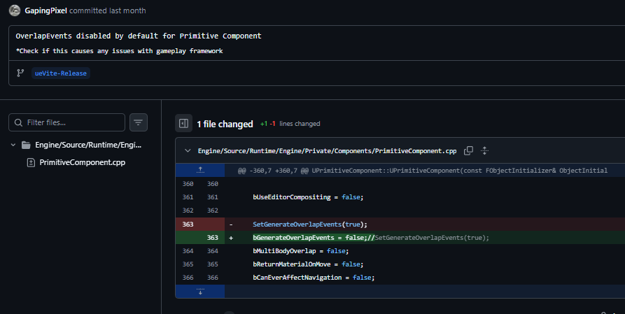
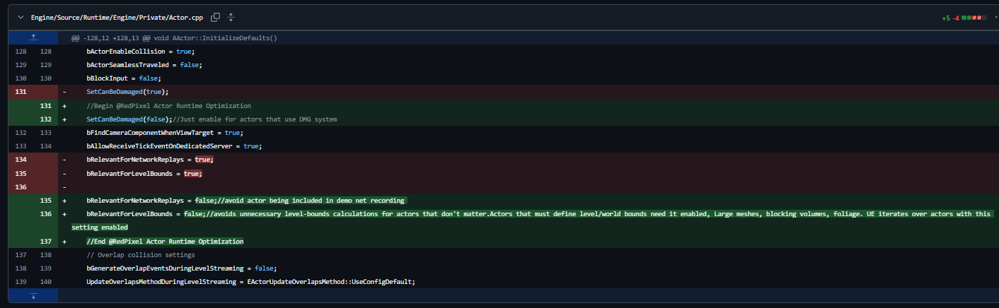
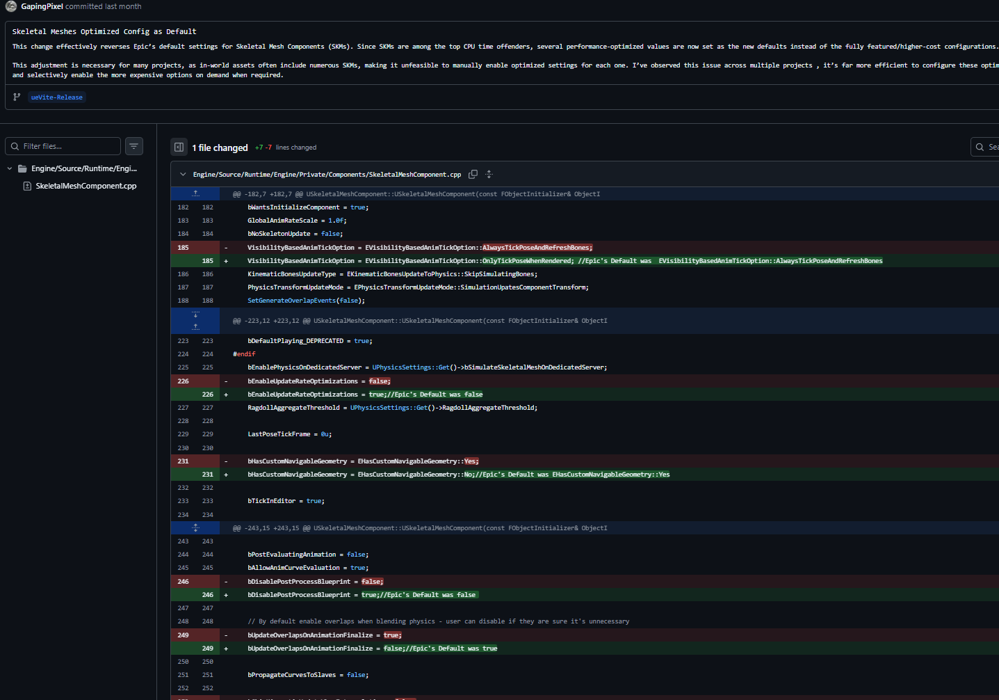
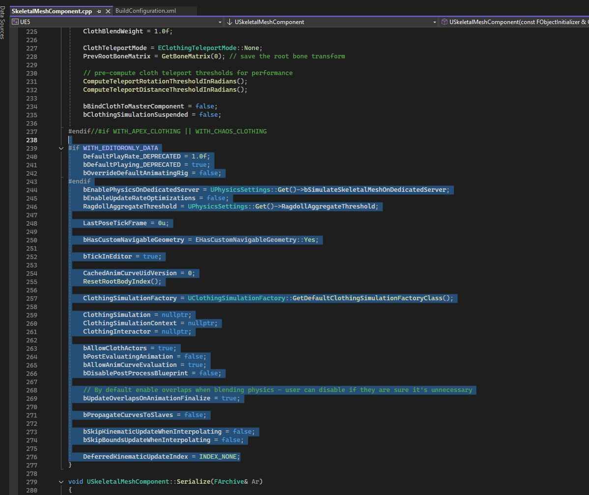
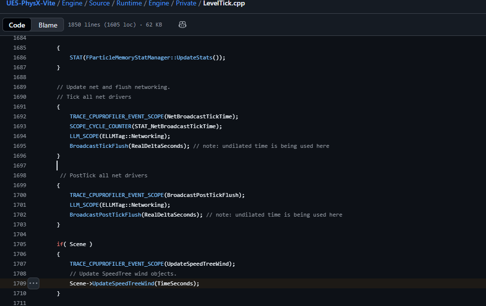

# 引擎默认更改

为了提升性能，Vite 修改了虚幻引擎 4.27 的一些默认设置。这些修改会直接影响您的项目——其中一些会改变运行时行为，而不仅仅是成本。在断定项目出现问题之前，请先阅读此页面。

虚幻引擎的默认设置旨在确保所有功能开箱即用，这意味着它们启用了大多数项目永远不会用到的功能。Vite 修改了其中一些设置以提升性能，其原则是：您需要的功能应该是您主动开启的，而不是您忘记关闭的。

但代价是，从虚幻引擎 4.27 迁移到 Vite 的项目可能会出现不同的行为。此页面列出了所有变更。

## 运行时行为变更

**警告：** 这些更改不仅会改变性能，还会改变行为。如果游戏逻辑依赖于默认设置，则需要进行调整。

### 默认情况下禁用重叠事件 <span id='disabled_overlap'></span>

除非显式启用，否则基本组件不再生成重叠事件。

生成重叠事件会消耗所有组件的资源，无论是否有任何组件绑定到该事件。在默认项目中，大多数基本组件生成的重叠事件都没有被任何组件监听。

**这意味着**：需要重叠事件的组件必须显式设置**生成重叠事件**。触发器体积、拾取检测以及任何由 `OnComponentBeginOverlap` 驱动的组件都需要设置此标志。这很可能是项目迁移后“我的触发器停止工作”问题的原因。



*[提交差异](https://github.com/GapingPixel/UE5-PhysX-Vite/commit/02d7c0ad0a7542b382a70dc3e37877d6ec052d76)：将 PrimitiveComponent.cpp 中的 SetGenerateOverlapEvents(true) 替换为 bGenerateOverlapEvents = false，应用于每个项目中的每个基本组件。*


### 优化 Actor 运行时

Actor 运行时默认值已更改，以减少 `AActor::InitializeDefaults` 中每个 Actor 的开销：

| 默认 | 库存的 4.27 | Vite | 原因 |
|---|---|---|---|
| `SetCanBeDamaged` | `true` | `false` | 仅使用伤害系统的参与者需要此设置 |
| `bRelevantForNetworkReplays` | `true` | `false` | 除非需要，否则将参与者排除在演示网络录制之外 |
| `bRelevantForLevelBounds` | `true` | `false` | 避免对未定义边界的参与者进行边界迭代 |



*[提交 Actor.cpp 中的差异](https://github.com/GapingPixel/UE5-PhysX-Vite/commit/970cbb989c3712f13be1fa370b778e769e5d864c)：更改 SetCanBeDamaged、bRelevantForNetworkReplays 和 bRelevantForLevelBounds 的默认值。大型网格、阻挡体积和必须定义世界边界的植被需要将 `bRelevantForLevelBounds` 设置为 `true`。*

### 骨骼网格体优化配置

骨骼网格体是大多数项目中 CPU 占用率最高的组件之一，因此 `USkeletalMeshComponent` 默认提供的是性能优化配置，而非 Epic 提供的完整功能配置。游戏内资源通常包含大量骨骼网格体，因此为每个组件启用优化设置并不实际；可行的做法是将性能较低的配置设为默认，并在需要时启用性能较高的配置。

| 默认 | 库存的 4.27 | Vite |
|---|---|---|
| `VisibilityBasedAnimTickOption` | `AlwaysTickPoseAndRefreshBones` | `OnlyTickPoseWhenRendered` |
| `bEnableUpdateRateOptimizations` | `false` | `true` |
| `bHasCustomNavigableGeometry` | `Yes` | `No` |
| `bDisablePostProcessBlueprint` | `false` | `true` |
| `bUpdateOverlapsOnAnimationFinalize` | `true` | `false` |



*SkeletalMeshComponent.cpp 中的[提交差异](https://github.com/GapingPixel/UE5-PhysX-Vite/commit/33fe7c638829b8120e8a02ecc639acda761df835)显示了与 Epic 原版相比的五个已更改的默认值。每行更改的内容都会在末尾的注释中保留 Epic 的原始值，因此无需咨询上游即可恢复库存行为。*

`VisibilityBasedAnimTickOption` 是需要关注的选项。`OnlyTickPoseWhenRendered` 表示屏幕外的参与者将完全停止评估其姿势；读取未渲染参与者骨骼变换或插槽的游戏玩法（例如武器枪口位置、IK 目标、远处参与者上的连接点）必须将组件设置回 `AlwaysTickPose` 或 `AlwaysTickPoseAndRefreshBones`。

`bDisablePostProcessBlueprint = true` 是第二个选项：后处理动画蓝图（通常用于 IK 和骨骼校正）将不再运行，除非为每个组件重新启用。



*SkeletalMeshComponent.cpp 构造函数显示了周围的默认块。有关这些默认值设置位置的上下文，请参阅 `SkeletalMeshComponent.cpp` 中的构造函数块。*


### 已禁用生成光照贴图 UV

默认情况下，静态网格体导入不再生成光照贴图 UV（[提交差异](https://github.com/GapingPixel/UE5-PhysX-Vite/commit/acce6fbe432fe9fe5a2536f0979befd5dcd741d1)）。

大多数 Vite 项目使用 [DDGI](../Rendering/DDGI-Dynamic.md) 而非烘焙光照，因此为每个导入的网格体生成光照贴图 UV 会浪费导入时间和 UV 通道。如果您的项目使用烘焙光照，请在静态网格体导入选项中启用此设置。


## 可扩展性

阴影质量 4（Shadow Quality 4）用于中等阴影设置，在可扩展性范围的中间位置提高阴影质量（[提交差异](https://github.com/GapingPixel/UE5-PhysX-Vite/commit/1718cd66e08a2b47222f895162e3be2b2c98ee6a)）。


## 已禁用的插件

4.27 版本默认启用的一些插件已被禁用（[提交差异 1](https://github.com/GapingPixel/UnrealEngineVite-PhysX/commit/e9aebc2ef9f8acb7326a7e989f288ef68969342f) &middot;
[提交差异 2](https://github.com/GapingPixel/UE5-PhysX-Vite/commit/6c5948bf12ea61f82784193ccaa5d43c4f574ae9)）。这可以减少编辑器启动时间、模块加载数量和打包后的构建文件大小。

**如果您需要使用 VR 插件，则必须重新启用它们。**


## 节拍优化

### SpeedTree 节拍

[LevelTick.cpp](https://github.com/OpenHUTB/engine/tree/hutb/Engine/Source/Runtime/Engine/Private/LevelTick.cpp) 中的 [SpeedTree 节拍已优化](https://github.com/GapingPixel/UE5-PhysX-Vite/blob/3e4a16aa89de4f4c37da300c945d6a14dc62edd7/Engine/Source/Runtime/Engine/Private/LevelTick.cpp#L1709)。无论项目是否使用 SpeedTree 资源，SpeedTree 节拍都会运行，因此每个项目都能从中节省资源。

*LevelTick.cpp 显示了世界节拍中的 UpdateSpeedTreeWind 调用。`Scene->UpdateSpeedTreeWind` 在世界节拍中 — 无条件地在 stock 4.27 中。*

### Niagara 节拍

Niagara 插件启用时会发出节拍信号。如果您不使用 Niagara 插件，请在项目关卡中禁用它；Cascade 在 4.27 版本中仍然可用。

## 光线追踪剔除

光线追踪剔除会考虑每个图元的最小绘制距离（[提交差异](https://github.com/GapingPixel/UE5-PhysX-Vite/commit/595f376f6de0912606b05768739aa3d24ac4f61a)）：

```c++
GEngine->Exec(nullptr, TEXT("r.RayTracing.Culling.UseMinDrawDistance 1"));
```

对于有很多小细节网格的场景来说，这是一种廉价且通常安全的解决方案，因为几何体太小以至于无法绘制，在加速结构中也太小以至于无关紧要。


## 编辑器体验优化

这些优化不会影响运行时性能，但会改变编辑器的行为：

- 动画资源始终在新标签页中打开
  ([提交差异](https://github.com/GapingPixel/UE5-PhysX-Vite/commit/8bdae919e6eae61a27ef8d09d38027592a473d8c))
- 用于禁用新插件弹出窗口的配置变量
  ([提交差异](https://github.com/GapingPixel/UE5-PhysX-Vite/commit/9af0349c1832b7094ceae7f47ba8ca5d261e0e69))
- `bDisableAllTutorialAlerts=True`
  ([提交差异](https://github.com/GapingPixel/UE5-PhysX-Vite/commit/d9fd593e11581fd93d0ff60b2933794f150b4780))
- 从更高版本的引擎中安全移植的各种功能
  ([提交差异](https://github.com/GapingPixel/UE5-PhysX-Vite/commit/fe7a6f4d7c54d8725d6308820d5b4fd546b9ff49))

## 您可以自行进行一些可选的精简操作

出于兼容性考虑，这些操作无法在分支发布版本中禁用，但可以针对单个项目进行设置。

**移除 Vite 插件。** 移除已添加的 Vite 插件可以缩短编译时间。在 Ryzen 9 9950X3D 上测试：完整代码库编译耗时 15 分钟，移除 Vite 插件后仅需 12 分钟。Houdini 是最大的单一贡献者。

有关工具，请参阅[精简指南](Debloat-Guide.md)。

## 迁移现有项目

### 将迁移后的项目与 Vite 默认设置进行比较

1. 测试每个触发体积和重叠驱动的交互。重叠事件是最常见的故障点。

2. 检查使用引导/跟随骨骼网格设置的角色是否存在曲线传播缺失的情况。

3. 如果项目烘焙了光照，请重新启用光照贴图 UV 生成，并确认现有网格仍然具有有效的光照贴图 UV。

4. 重新启用项目所需的所有插件，特别是 VR 插件。

5. 检查缩放设置，因为中等阴影现在与默认设置有所不同。


## 另请参阅

- [从 UE5 迁移](../GettingStarted/Migrating-From-UE5.md)
- [精简指南](Debloat-Guide.md)
- [性能分析](Profiling.md)
- [编译时切换](Compile-Time-Switches.md)
