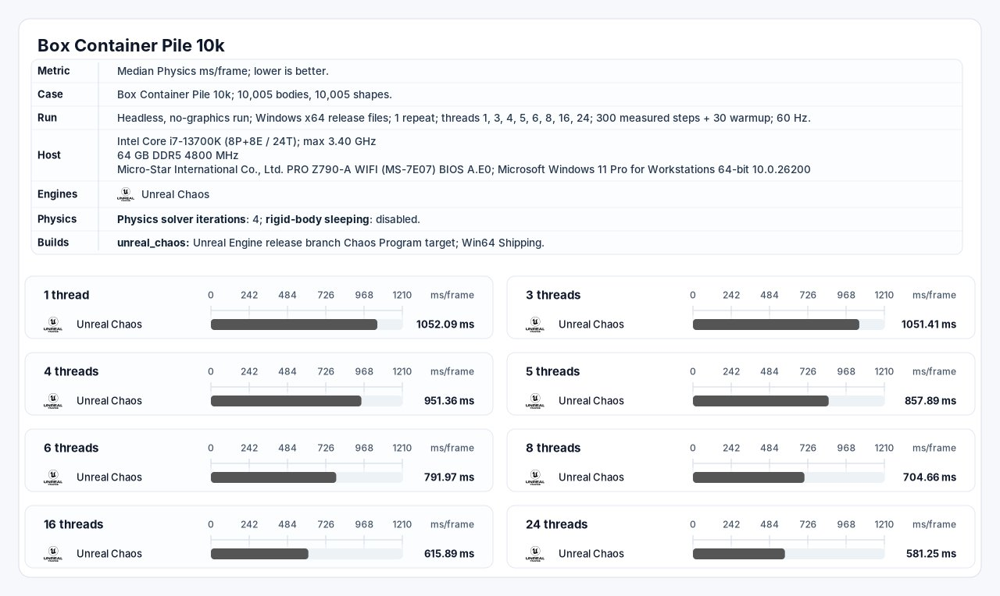
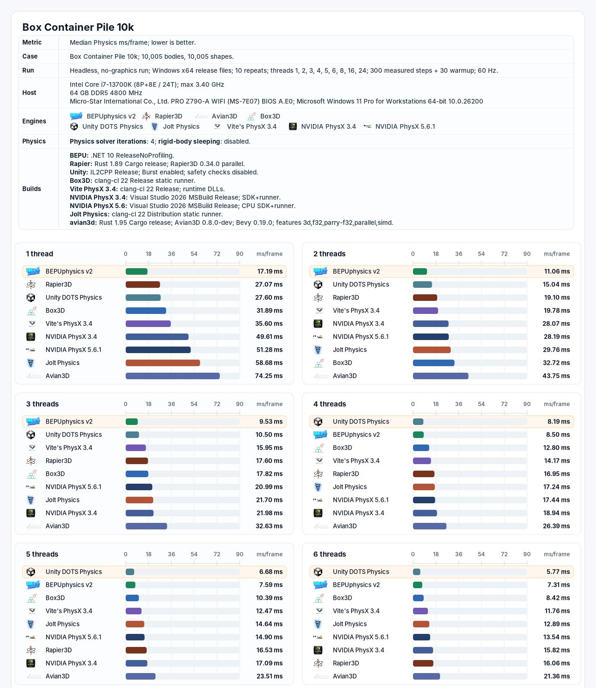
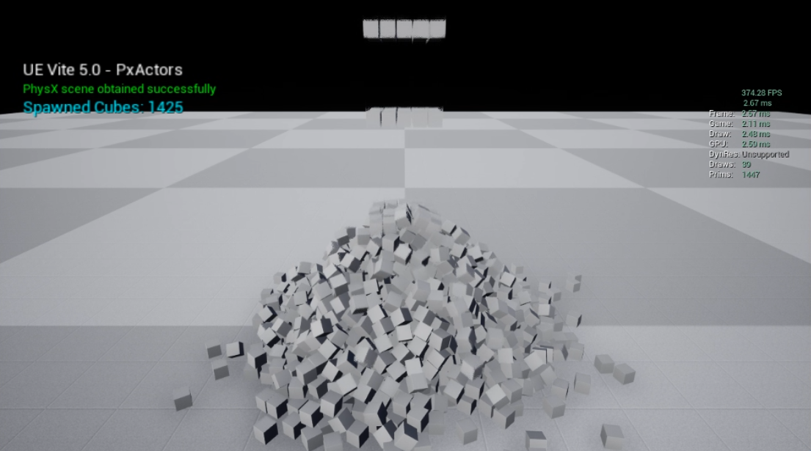

# 物理

物理引擎的物理堆栈使用 <b>PhysX 3.4</b>（可升级到 [PhysX 4.1](https://github.com/dyanikoglu/UnrealEngine/commits/4.25-PhysX4%2BBlast/) 和NVIDIA Omniverse 的物理引擎 [PhysX 5.1](https://github.com/NVIDIA-Omniverse/PhysX)），以及用于固定时间步长模拟、现代工具链、NVIDIA Blast 和高计数实例刚体的 Vite 扩展。本文描述了物理架构及其测量的 CPU 行为；<a href="PhysX.md">PhysX </a>记录了后端功能。

Vite 将物理视为帧时间关键的引擎系统。仿真成本不仅仅包括求解器：粗略检测阶段（broad phase）、接触生成、碰撞岛构建、约束准备、迭代求解、集成、回调以及与引擎状态的同步都对最终物理时间有贡献。

## 本文内容

| 主题 | 涵盖内容 |
|---|---|
| [PhysX](PhysX.md) | PhysX 3.4 特性、Vite 扩展、配置和性能分析 |
| [固定时间步长](Fixed-Timestep.md) | 使用渲染插值的固定步长模拟 |
| [破坏与布料](Destruction-And-Cloth.md) | APEX 破坏、APEX 布料和 NVIDIA Blast |
| [实例化物理子系统](Instanced-Physics.md) | 通过实例化网格模拟大型刚体集合 |

## 物理 CPU 架构

### 线程和关键路径

PhysX 和 Chaos 都支持多线程模拟。Chaos 可以通过任务图执行，使用专用的物理线程，而且并行处理选定的粒子、碰撞和碰撞岛任务。专用线程可以将任务从游戏线程中分离出来，但它本身并不能减少模拟步骤开始和结束之间的时间。

**笔记：** 碰撞岛（Island）将物理世界中相互独立、没有接触的物体分组，形成一个个互不影响的“岛屿”，从而让引擎能并行处理，并为不动的碰撞岛节省算力。

物理包含有序的阶段和数据依赖关系。连接碰撞岛内的约束无法全部独立求解，后续阶段必须等待先前阶段生成的状态。因此，扩展性取决于独立碰撞岛的数量和大小、任务粒度、同步频率以及游戏和物理表示之间传输的状态量。

PhysX 3.4 公开了一个依赖链接的 TaskManager 和 CpuDispatcher。模拟阶段会创建 LightCpuTask 作业，并在其先决条件完成后将其提交到引擎工作线程池。Vite 的 Unreal 集成可以批量处理调度器提交，以在调度开销和可用并行性之间进行权衡，详情参考 NVIDIA [PhysX 3.4 线程文档](https://docs.nvidia.com/gameworks/content/gameworkslibrary/physx/guide/Manual/Threading.html?highlight=cpudispatcher)。

### SIMD 覆盖率

Chaos 包含可选的 Intel ISPC 内核。ISPC 是一种 SIMD 技术：它为目标 CPU 的向量单元编译 SPMD 程序。相关的约束是覆盖率和利用率，而不是“ISPC 与 SIMD 之争”。只有 ISPC 内核实现的运算才能使用该向量路径。发散连接、间接内存访问、聚集和分散操作、异构约束类型以及指针密集型数据都会降低有效通道占用率。Intel 的 [ISPC 文档](https://ispc.github.io/index.html)描述了编译器及其 SIMD 执行模型。

PhysX 的窄相位和求解器是围绕批处理浮点数据和平台 SIMD 内核开发的。有用的衡量指标是整个仿真步骤中的有效向量占用率，包括保持标量状态或因数据移动而耗时的操作。

### 数值精度

UE5 大型世界坐标 (Large World Coordinates, LWC) 将核心世界空间类型更改为双精度。Epic 的 [LWC 文档](https://dev.epicgames.com/documentation/unreal-engine/large-world-coordinates-in-unreal-engine-5)明确记录了 Chaos destruction 中的双精度。但这并不意味着每个 Chaos 子系统中的每个字段都是 FP64。现代 Chaos 在特定路径中使用混合精度，而 UE4.27 基础版中的实验性 Chaos 实现将其主要 `FReal` 别名化为 `float`。

双精度仍然支持 SIMD。然而，固定宽度寄存器存储的双精度值数量是单精度值的一半：一个 256 位寄存器可以存储四个 64 位值或八个 32 位值。基于双精度的字段也需要两倍于等效单精度字段的存储空间和内存带宽。在受影响的内核中，这可能会降低理论元素吞吐量，增加缓存压力，并在单精度/双精度边界处增加转换工作。Epic 的 [LWC 转换指南](https://dev.epicgames.com/documentation/unreal-engine/large-world-coordinates-project-conversion-guidelines-in-unreal-engine-5)记录了 `VectorRegister4f` 和 `VectorRegister4d`；限制因素是通道宽度和数据成本，而不是缺少向量指令。

FP64 开销没有一个准确的通用百分比。在某些 CPU 上，标量 FP32 和 FP64 指令的延迟可能相近，而受限于向量吞吐量或带宽的内核则可能存在更大的延迟差异。任何百分比都必须与特定的工作负载、平台和构建版本相关联。

## 箱式容器堆 10K 基准测试

提供的报告测量了一个特意设计为物理约束的堆，其中包含 10,005 个活动刚体和 10,005 个形状。渲染功能已移除（Chaos 除外），睡眠功能已禁用，两次运行均使用四次求解器迭代、60 Hz 的模拟步长、30 个预热步长和 300 个测量步长。指标为每帧物理运算时间的中位数（毫秒）；数值越低越好。

**注意：** 这纯粹是一项性能测试；模拟精度和 SDK 功能应单独评估。

| 测试属性 | 报告的配置 |
|---|---|
| 主机 | Intel Core i7-13700K（8 核 + 8 核 / 24 线程），最高 3.40 GHz |
| 内存 | 64 GB DDR5-4800 |
| 平台 | Windows 11 专业工作站版 x64，版本 10.0.26200 |
| 工作负载 | 无头模式；10,005 个实体；10,005 个形状；刚体休眠已禁用 |
| 求解器 | 四次迭代；60 Hz |
| 采样 | 30 个预热步后，测量 300 个步 |
| Chaos 版本 | Unreal 发布分支 Chaos Program 目标；Win64 版本；已报告一次重复测试 |
| NVIDIA PhysX 版本 | NVIDIA PhysX 3.4；Visual Studio 2026 MSBuild 发布版；SDK 和运行器；报告了十个重复问题 |
| Vite PhysX 版本 | Vite PhysX 3.4；clang-cl 22 版本；运行时 DLL；报告了十个重复问题 |

### 匹配线程数结果

| 已报告线程 | Unreal Chaos | NVIDIA PhysX 3.4 | Vite PhysX 3.4 | Chaos / Vite | NVIDIA / Vite |
|---:|---:|---:|---:|---:|---:|
| 1 | 1,052.09 毫秒 | 49.61 毫秒 | 35.60 毫秒 | **29.55倍** | **1.39倍** |
| 3 | 1,051.41 毫秒 | 21.98 毫秒 | 15.95 毫秒 | **65.92倍** | **1.38倍** |
| 4 | 951.36 毫秒 | 18.94 毫秒 | 14.17 毫秒 | **67.14倍** | **1.34倍** |
| 5 | 857.89 毫秒 | 17.09 毫秒 | 12.47 毫秒 | **68.80倍** | **1.37倍** |
| 6 | 791.97 毫秒 | 15.82 毫秒 | 11.76 毫秒 | **67.34倍** | **1.35倍** |

**注意：** Chaos 必须在 Win64 环境下进行基准测试，而不能像其他 SDK 那样在无头模式下进行测试。

Vite PhysX 的单线程性能从 35.60 毫秒提升至 6 线程时的 11.76 毫秒，吞吐量**提升了 3.03 倍**。NVIDIA PhysX 3.4 的性能从 49.61 毫秒提升至 15.82 毫秒，提升了 3.14 倍，而 Chaos 在相同线程数下的性能从 1052.09 毫秒提升至 791.97 毫秒，**提升了 1.33 倍**。Chaos 的测试结果显示，在 24 线程的情况下，其性能达到 581.25 毫秒，**是单线程性能的 1.81 倍**。

在线程数相同的情况下，Chaos 的**单线程性能是 NVIDIA PhysX 的 21.21 倍**，**六线程性能则是 NVIDIA PhysX 的 50.06 倍**。在共享线程数的情况下，NVIDIA PhysX 的运行时间是 Vite PhysX 的 1.34 到 1.39 倍；相应地，Vite 相对于 NVIDIA PhysX 3.4 基准版本，将报告的物理计算中值时间缩短了 **25.2% 到 28.2%**。Vite PhysX 在三个线程下即可达到 60Hz 刷新率下 16.67 毫秒的运行时间预算，而 NVIDIA PhysX 在六个线程下才能达到。Chaos 的运行结果在 24 个线程下仍然超出该预算。

单线程结果表明，任务规模的扩大并不能完全解释这种差距：在进一步扩大工作线程数之前，Chaos 的物理计算时间已经是 Vite PhysX 的 29.55 倍，是 NVIDIA PhysX 的 21.21 倍。多线程结果表明，规模的扩大会进一步拉大这种差距，因为这种差距还包括求解器工作、数据访问、碰撞和约束处理、构建配置以及引擎集成等因素。 NVIDIA 的标准结果还可以将基础 PhysX 架构与 Vite 的 PhysX 版本中的额外改进区分开来。

*Unreal Chaos Box Container Pile 跨 1 到 24 个线程的 10K 基准测试报告。每帧平均物理毫秒数；越低越好。*

*Vite PhysX 与对比引擎 Box Container Pile 10K 基准测试报告。上表仅使用所提供报告中 Chaos、NVIDIA PhysX 3.4 和 Vite PhysX 3.4 的线程数。*

**注意：** 这些报告使用了相同的主机和高级工作负载设置，但可执行文件并不完全相同：Chaos 是 Win64 版本的 Chaos 程序目标，NVIDIA PhysX 是 Visual Studio 2026 MSBuild Release SDK 运行器，而 Vite PhysX 是 clang-cl 22 Release 运行时版本（由于 Chaos 无法独立于 UE5 编译，因此必须以 Win64 版本进行测试）。请将这些值作为 **Box Container Pile 10K 测试结果**引用，而不是作为 PhysX 与 Chaos 的通用倍数。

## 重现比较

为了控制引擎选择：

1. 锁定引擎和基准测试项目的提交。

2. 使用等效的编译器优化、检查、日志记录和插桩。

3. 匹配碰撞形状、材质设置、求解器迭代次数、睡眠时间、时间步长和事件生成。

4. 记录混合 CPU 上的线程亲和性和 P 核/E 核的放置情况。

5. 发布原始帧样本、中位数、百分位数和方差。

6. 使用合适的 CPU 分析器捕获求解器关键路径和工作线程利用率。

7. 使用具有代表性的生产场景重复上述步骤；一个完全唤醒的 10,005 个物体堆叠模型是一个压力负载。

## 引擎内立方体工作负载

[Vite PhysX 立方体测](https://github.com/ViteStudio-Tech/Vite-PhysX-Cube-Test)试补充了无头求解器报告，增加了在虚幻引擎内部运行的工作负载。公有的[立方体生成器实现](https://github.com/ViteStudio-Tech/Vite-PhysX-Cube-Test/blob/5ae89c3b7b9d6993fdc535a54769e39ca7a116b4/Source/PhysXTest/CubeSpawner.cpp)会为每个立方体创建一个 `UStaticMeshComponent`，将其注册到引擎，并通过 `SetSimulatePhysics(true)` 启用模拟。生成器本身是一个单独的 `AActor`，因此它测量的是引擎管理的组件路径，而不是 3,000 个单独生成的虚幻 Actor。

### 引擎管理的立方体数量为 3,000 个

匹配捕获报告显示，在两种引擎版本中均生成了 3,000 个立方体和 3,016 个渲染图元。与 Box Container Pile 10K 运行器不同，这些数值包含了虚幻引擎运行时的计算量，并非单纯的物理求解器毫秒级耗时。

| 报告指标 | Unreal 5.7 — Chaos | Unreal Vite 26 — PhysX 3.4 | Vite 相对结果 |
|---|---:|---:|---:|
| 生成的立方体 | 3,000 | 3,000 | 匹配 |
| 渲染的图元 | 3,016 | 3,016 | 匹配 |
| 帧率 (FPS) | 33.26 | 157.88 | **提升 4.75 倍** |
| 帧时间 | 30.07 毫秒 | 6.33 毫秒 | **降低 78.9%** |
| 游戏时间 | 30.01 毫秒 | 6.11 毫秒 | **降低 79.6%** |

Chaos 游戏时间是 Vite PhysX 游戏时间的 **4.91 倍**，帧时间是 Vite PhysX 帧时间的 **4.75 倍**。由于游戏时间在两种录制方式中几乎都占据了完整的一帧，因此该结果是 CPU 性能的比较，而非 GPU 性能的比较。

*在虚幻引擎 5.7 Chaos 和虚幻引擎 Vite 26 PhysX 3.4 中对 3000 个模拟立方体进行引擎内对比。双方均报告渲染了3016个图元。*

### 1425 个原生 PhysX Actor

原生路径捕获直接将模拟立方体表示为 PhysX Actor，而不是为每个物体分配一个单独的 Unreal `Actor`。这样，在场景继续在 Unreal Engine 中运行和渲染的同时，模拟表示中就不再需要每个物体的 Unreal Actor 生命周期。任何剩余的渲染表示和变换桥接开销都取决于原生集成。

| 报告指标 | 原生 PhysX Actor 路径 |
|---|------------------------:|
| 引擎标签 |     UE Vite  — PxActors |
| 生成的立方体 |                   1,425 |
| 渲染的图元 |                   1,447 |
| 帧率 (FPS) |                  374.28 |
| 帧时间 |                 2.67 毫秒 |
| 游戏时间 |                 2.11 毫秒 |

*使用 1425 个模拟立方体对引擎内的 Vite 原生 PhysX Actor 进行测试，无需为每个模拟立方体单独创建一个 UE Actor 表示。*

**警告：** 不要直接计算原生路径捕获结果与 3000 个立方体比较结果之间的乘数。原生结果使用 1425 个立方体、不同的引擎标签和不同的对象表示。它记录了开销更低的原生集成路径；它并非 Chaos 与 PhysX 的匹配结果。

## 实用入门指南

### 为新项目设置物理引擎

1. 请查阅 [PhysX 功能和配置参考](PhysX.md)。

2. 当快速移动或受严格约束的物体需要更小的模拟步长时，请在 **项目设置（Project Settings）>引擎（Engine）>物理（Physics）** 下配置子步长。

3. 对于固定的模拟节奏，在围绕可变帧增量创建系统之前，请阅读[固定时间步长](Fixed-Timestep.md)部分。

4. 对于大量碎片、壳体或其他重复物体，请评估[实例化物理子系统](Instanced-Physics.md)。

5. PhysX 在稳定的帧速率下表现最佳。在帧速率过高或不稳定时，可能会出现卡顿，因此请限制帧速率 (FPS) 以获得更稳定的帧节奏。将“最大穿透速度”设置为 100 左右也有助于减少由帧节奏不稳定引起的卡顿。

## 参考工作负载

- [物理立方体基准测试](../ProjectsAndDemos/Physics-Cube-Bench.md) — 引擎内刚体吞吐量
- [PhysX 实例化子系统演示](../ProjectsAndDemos/PhysX-Instanced-Subsystem.md) — 大规模实例化仿真
- [400 角色 CMC 基准测试](../ProjectsAndDemos/400-Characters-CMC-Bench.md) — 角色移动和物理查询成本

## 另请参阅

- [PhysX](./PhysX.md)
- [UE4 与 UE5 成本分析](../EngineOverview/UE4-Versus-UE5-Cost-Analysis.md)
- [性能目标](../EngineOverview/Performance-Targets.md)
- [性能分析](../Performance/Profiling.md)
