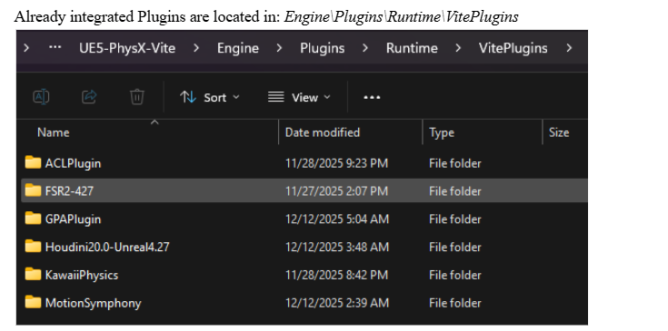

# 已捆绑的插件

Vite 在 UE 4.27 原版基础上添加的所有内容，包括版本和默认启用状态。原版 4.27 插件未列出，仅列出 Vite 添加的内容和厂商集成。

版本信息截至 7 月份的主要版本更新。请查看 `.uplugin` 文件以获取您插件树中的权威版本。

*Vite 自身添加的插件位于 `Engine\Plugins\Runtime\VitePlugins` 目录下。NVIDIA 提供的厂商集成插件则位于 `Engine\Plugins\Runtime\Nvidia` 目录下。*

## 超分辨率和帧生成

| 插件 | 版本 | 默认值 | 路径 |
|---|---|---|---|
| NVIDIA DLSS 超分辨率/光线重建/DLAA / DLAA | 8.7.0 (NGX 310.7.0) | 关闭 | `Runtime\Nvidia\DLSS` |
| NVIDIA DLSS 帧生成 (Streamline) | 1.3.0-SL2.4.0 | 关闭 | `Runtime\Nvidia\Streamline` |
| NVIDIA NIS | 1.2.1 | 关闭 | `Runtime\Nvidia\NIS` |
| NVIDIA RTX 动态色彩 (DeepDVC) | 1.3.0-SL2.4.0 | 关闭 | `Runtime\Nvidia\StreamlineDeepDVC` |
| AMD FSR 4 | 4.1.1 | &mdash; | `Runtime\VitePlugins\FSR4-427` |
| AMD AntiLag 2 | 2.0.4 | &mdash; | `Runtime\VitePlugins\AntiLag2.0.4` |
| Intel XeSS | 3.0.5 | &mdash; | `Runtime\VitePlugins\XeSS_UE4.27_Plugin_v3.0.5` |
| 影片渲染队列 DLSS/DLAA 支持 | 2.3.3 | &mdash; | `Runtime\Nvidia\DLSSMoviePipelineSupport` |

FSR 4 使用原生 ffx-api，仅支持 DX12。它已针对 Vite 特别移植到 4.27 版本。详情请参阅[超分辨率](../Rendering/Upscalers.md)部分。

## 光线追踪和渲染

| 插件 | 版本 | 默认 | 路径 |
|---|---|---|---|
| NVIDIA RTX 全局光照 (RTXGI) | 1.1.50 | **开启** | `Runtime\Nvidia\RTXGI` |
| NVIDIA 实时降噪器 (NRD/ReLAX) | 2.10.00-relax | **开启** | `Runtime\Nvidia\NRD` |
| NVIDIA Reflex | &mdash; | &mdash; | `Runtime\Nvidia\Reflex` |
| NVIDIA Ansel | &mdash; | &mdash; | `Runtime\Nvidia\Ansel` |
| 显卡信息工具 | 1.0 | 关闭 | `Runtime\Nvidia\GraphicsCardInfoUtils` |

RTXGI 提供 DDGI 实现，这是 Vite 推荐的动态全局光照解决方案。NRD/ReLAX 用于对光线追踪输出进行降噪。两者默认开启是有意为之：它们是 Vite 推荐光照设置的基础。请参阅[全局光照](../Rendering/Global-Illumination.md)和[动态 DDGI](../Rendering/DDGI-Dynamic.md)。

## 头发

| 插件 | 版本 | 默认 | 路径 |
|---|---|---|---|
| TressFX 5.0 | 5.0 | &mdash; | `Runtime\TressFX` |
| Groom (HairStrands) | 1.0 | 关闭 | `Runtime\HairStrands` |

两个独立的毛发系统，采用不同的制作流程。参见[毛发渲染](../Rendering/Hair-Rendering.md)部分。

## 物理和破坏

| 插件 | 版本 | 默认值 | 路径 |
|---|---|---|---|
| Blast（运行时） | 1.0 | 关闭 | `GameWorks\Blast` |
| Blast 插件（创作） | 0.1 | 关闭 | `Experimental\BlastPlugin` |
| PhysX 实例子系统 | 1.11 | &mdash; | `Runtime\VitePlugins\PhysXInstancedSubsystem` |
| Kawaii Physics | 1.18.0 | &mdash; | `Runtime\VitePlugins\KawaiiPhysics` |

Apex Destruction、Apex Cloth 和 PhysX Vehicles 是 Vite 保留的 4.27 版本自带插件——它们在 UE5 中被移除，因为 Chaos 取代了 PhysX。参见[破坏与布料](../Physics/Destruction-And-Cloth.md)。

Kawaii Physics 是一个从 UE5 移植到 Vite 的辅助运动骨骼解算器。它能够通过单个动画节点为头发、布料和配饰提供物理跟随效果，比完整的布料模拟成本低得多。

PhysX Instanced Subsystem 通过世界子系统管理大量基于 PhysX 的实例化物体，并将姿态写入 ISM/HISM 实例变换，而不是生成单个 Actor。参见[实例化物理子系统](../Physics/Instanced-Physics.md)。

## 动画

| 插件 | 版本 | 路径 |
|---|---|---|
| 动画压缩库 (Animation Compression Library, ACL) | 2.1.0 | `Runtime\VitePlugins\ACLPlugin` |
| Motion Symphony | 1.09 | `Runtime\VitePlugins\MotionSymphony` |

ACL 以更优的尺寸/质量曲线取代了虚幻引擎内置的动画压缩。对于拥有大量动画的项目，内存节省非常显著，而且它是性价比最高的优化方案之一——详见[性能目标](../EngineOverview/Performance-Targets.md)。

Motion Symphony 提供动作匹配和姿势匹配功能，这是育碧式（Ubisoft, Ubiquity Software, 无处不在）的动画合成方法。它是 4.27 版本中最接近 UE5 动作匹配功能的组件。[文档](https://www.wikiful.com/@AnimationUprising/motion-symphony/motion-matching)· [示例项目](https://github.com/Animation-Uprising/MotionSymphony_ExampleProject/tree/main)

## 游戏玩法（Gameplay）

| 插件 | 版本 | 路径 |
|---|---|---|
| Abilities (SplashAbilities) | 1.1 | `Runtime\VitePlugins\SplashAbilities` |
| Flecs ECS | 1.0 (Flecs 3.2.12) | `Runtime\FlecsECS` |

Abilities 是 `GameplayAbilities` 的一个轻量级替代方案，适用于那些希望拥有技能系统但又不想面对 GAS 的复杂性和复制模型的项目。

Flecs ECS 是 Fl​​ecs 实体组件系统的引擎级集成，提供世界子系统、蓝图实体句柄、基于 ISM 的渲染演示以及可选的 Flecs Explorer 支持。默认情况下，它处于关闭状态。当每个实体对应一个 Actor 的开销成为瓶颈时，它非常有用——请参阅 [UE4 与 UE5](../EngineOverview/UE4-Versus-UE5-Cost-Analysis.md) 核心类基成本的对比分析。

## 调试和性能分析

| 插件 | 版本 | 路径 |
|---|---|---|
| Dear ImGui | 0.1.0 | `Runtime\VitePlugins\UnrealImGui` |
| ImGui Tools | 1.0 | `Runtime\VitePlugins\ImGuiTools` |
| Intel GPA | 1.0 | `Runtime\VitePlugins\GPAPlugin` |
| Automatron | 1.1a | `Runtime\VitePlugins\Automatron` |

ImGui 提供即时模式调试 UI，可在视口和独立构建中使用，而 Slate 调试组件在这些情况下则显得笨拙。ImGui Tools 基于 ImGui 构建了功能开发工具。

GPA 插件将 Intel 图形性能分析器集成到编辑器中。Automatron 改进了 C++ 和蓝图的自动化测试。请参阅[性能分析](../Performance/Profiling.md)部分。

## 内容和实用工具

| 插件 | 版本 | 默认 | 路径 |
|---|---|---|---|
| 自定义启动画面预加载画面 | 1.0 | **开启** | `Runtime\PostSplashScreen` |
| Impostor Baker | 1.0 | &mdash; | `Experimental\ImpostorBaker` |
| Shallow Water | 1.0 | 关闭 | `Experimental\ShallowWater` |

启动画面插件会在引擎预初始化期间，在系统启动画面之后显示一个自定义屏幕，填补第一帧之前的空白。

Impostor Baker 会生成用于远景网格 LOD 的虚拟模型——这是渲染大量远景树木或道具的常用低成本技术，值得优先考虑，避免承担无法承受的绘制调用成本。

## 默认启用概要

默认情况下仅启用三个捆绑插件：

| 插件 | 用途 |
|---|---|
| RTXGI | 提供 DDGI，Vite 推荐的动态全局光照 |
| NRD | 对光线追踪输出进行降噪，光线追踪套件需要此功能 |
| 自定义启动画面 | 外观装饰，成本极低 |

其他所有功能均为可选。如果某个功能似乎无法正常工作，请先检查其插件是否已启用，然后再进行进一步调试——对于光线追踪功能，还需查看[编译时开关可用性表](../Rendering/Ray-Tracing.md)。

## 另请参阅

- [插件](./Plugins.md)
- [推荐的插件](./Proposed-Plugins.md)
- [超分辨率](../Rendering/Upscalers.md)
- [毛发渲染](../Rendering/Hair-Rendering.md)
- [实例化物理](../Physics/Instanced-Physics.md)
- [精简指南](../Performance/Debloat-Guide.md)
