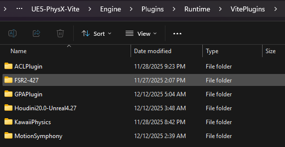
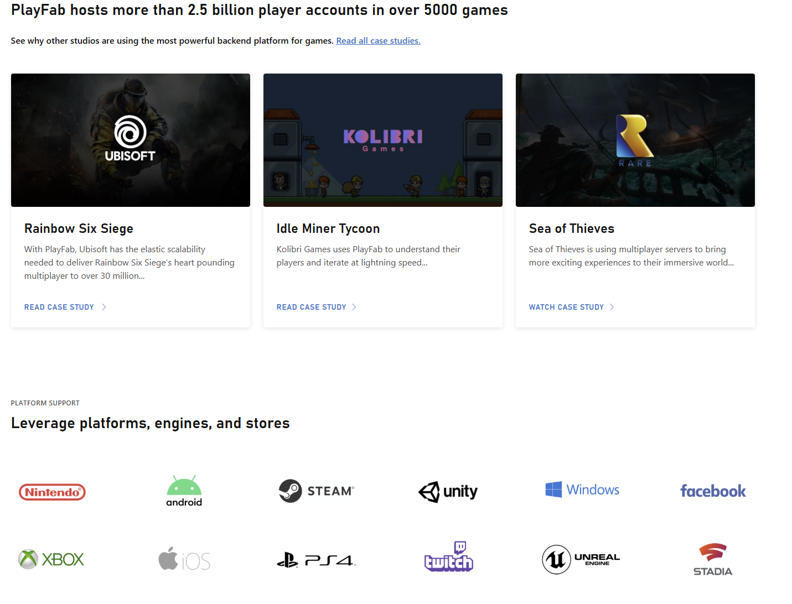
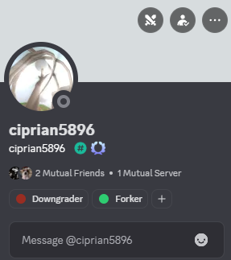
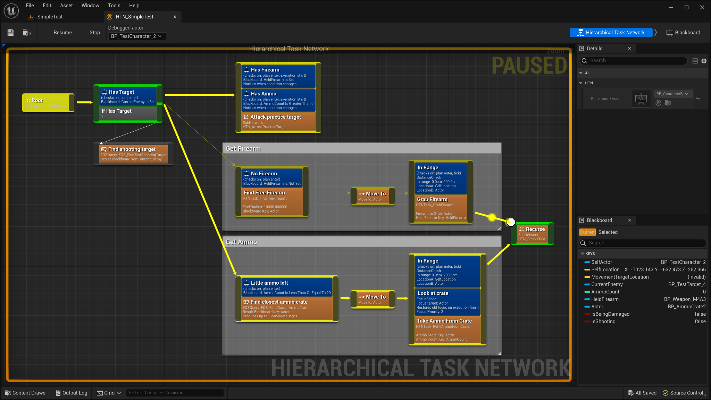
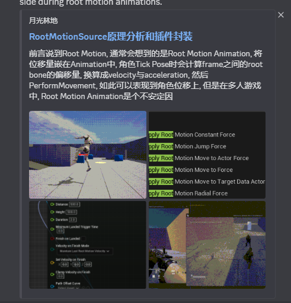

# 提议的插件

此处列出了可打包到引擎中的插件候选列表，以及推荐项目自行添加的插件。所有插件必须兼容 UE 4.21 至 4.27 版本——仅适用于 UE5 的插件不在讨论范围内。

并非所有有用的插件都应该放在引擎仓库中。与 Vite 打包的插件会增加每个克隆项目的大小、每次构建所需的时间以及每次集成所需的工作量。此页面用于跟踪已提交的插件及其所属层级。

*资源管理器视图显示`Engine\Plugins\Runtime\VitePlugins` 目录下的集成插件文件夹*

## 层级

* 引擎仓库

    核心功能和原生运行时。体积小、编译速度快，几乎适用于所有人。这些功能会被打包——参见[已捆绑的插件](Bundled-Plugins.md)。

* 基础功能

    与通用游戏制作相关，常用于 AAA 级游戏，代表主要功能。如果许可和大小允许，则值得打包；否则，应提供文档以便团队自行添加。

* 常用功能

    非必要或高级工具，通常是蓝图扩展。项目自行添加这些功能。

## 常用插件

### PhysX 实例化子系统 — 集成，免费

一个世界子系统，外加实例化 Actor 工作流程，用于管理大量基于 PhysX 的实例化刚体。无需生成数千个独立的 `AActor`/`UPrimitiveComponent` 对象，只需保留一个或几个实例化网格 Actor 用于渲染，子系统即可创建和更新每个实例的 PhysX 刚体，并将其姿态写回 ISM/HISM 实例变换。

已在 1.11 版本集成。参见[实例​​化物理](Instanced-Physics.md)。

[仓库](https://github.com/Dragomirson/PhysXInstancedSubsystem) ·
[演示项目](https://drive.google.com/file/d/1NulunBP2Qre5vLyYnkiqywovsycNuWdQ/view)

### Houdini 引擎 — 集成，可商用/免费使用

通过 Houdini 数字资产实现程序化工作流程。艺术家在编辑器中交互式地调整资产参数，并使用虚幻引擎资产作为输入；Houdini 的程序化引擎会处理资产，结果无需烘焙即可显示在编辑器中。

[HoudiniEngineForUnreal，Houdini 20.0 / Unreal 4.27 分支](https://github.com/sideeffects/HoudiniEngineForUnreal/tree/Houdini20.0-Unreal4.27)

### Motion Symphony — 集成

育碧（Ubisoft）风格的动作匹配和姿势匹配。已包含在 1.09 版本中；请参阅[已捆绑的插件](Bundled-Plugins.md)。

### PopcornFX — 商用/免费使用

专有粒子系统，已应用于包括暴雪游戏和赛车游戏在内的多款 AAA 级游戏中。2.18.6 版本是最新完全兼容 4.27 版本的版本。GPU 性能优于 Niagara。

[仓库](https://github.com/PopcornFX/UnrealEnginePopcornFXPlugin) ·
[v2.18.6 下载](https://github.com/PopcornFX/UnrealEnginePopcornFXPlugin/archive/refs/tags/v2.18.6.zip)

bunnyofficial 提供的补丁版本修复了一个编译错误：[补丁版本](https://drive.google.com/file/d/1hckpY_1zSLsW6mBqBlDeEgPVSijg9Z_y/view?usp=drive_link)。

### Azure PlayFab — 商用/免费使用

用于实时游戏的后端平台：玩家身份验证、数据存储、匹配、多人网络、分析和 LiveOps（例如活动和 A/B 测试），基于 Azure 基础架构。

*Azure PlayFab 后端服务概述*

[PlayFab Unreal Marketplace 插件](https://github.com/PlayFab/UnrealMarketplacePlugin)

### Wwise — 商用/免费使用

游戏音频中间件的事实标准，数百款游戏已采用 Wwise。

[Wwise 与 Unreal 集成](https://www.audiokinetic.com/en/public-library/2025.1.3_9039/?source=UE4&id=index.html)

### 资产降级器（Asset Downgrader） — 付费

将资源降级到 5.6.1、5.5.4、5.4.4、5.3.2、5.2.1、5.1.1、5.0.3、4.27 和 4.26 版本。它首先将资源升级到源版本 (5.6)，然后对 `.uasset` 文件应用补丁，使其与目标版本兼容，但会移除较新的数据——例如，降级到 4.27 版本时会移除 Nanite 数据。

**警告**： 旧版本中不存在的功能无法移植：例如，蒙版材质上的 Nanite、新的材质节点和新的 Niagara 模块。降级器仅迁移数据，不迁移功能。

*Asset Downgrader 插件界面显示目标版本选择，降级工具支持的目标版本从 5.6.1 降级到 4.26。*

这是在 Vite 中使用 UE5 商城内容的实用方法。请参阅[从 UE5 迁移](Migrating-From-UE5.md)。作者 Ciprian Stanciu 活跃于 Vite Discord 社区，并为多个 Vite 项目提供过直接帮助。

*Vite Discord 上的 Asset Downgrader 作者*

### HTN Planner — FAB / 付费

适用于 Unreal 的分层任务网络 AI 框架。目标驱动型策略，将“做什么”与“怎么做”分离。1.18.3 版本最近已向后移植到 4.27 版本。

*Unreal 编辑器中的 HTN （hierarchical task network ）Planner 任务网络。层级式任务网络将目标与实现目标的方法分离，这使得计划能够在不同智能体之间进行组合。*

[适用于虚幻引擎的 HTN 插件](https://maksmaisak.github.io/htn/front.html)

## 常用插件

这些插件推荐使用，但未包含在项目中。请根据项目需要单独添加。

### FFMPEG 媒体播放器

支持比原生媒体框架更多的视频格式和 Alpha 通道视频。

[bakjos/FFMPEGMedia](https://github.com/bakjos/FFMPEGMedia)

### UI 导航

基于蓝图的 UI 导航，支持游戏手柄和键盘菜单浏览。

[goncasmage1/UINavigation, 4.27 分支](https://github.com/goncasmage1/UINavigation/tree/4.27_3.0)

### 多人游戏移动 (SMN2)

蓝图多人游戏移动。官方支持到 4.26 版本，但也能在 4.27 版本上编译运行，并且可以进一步扩展。上游已弃用。

[Reddy-dev/SMN2](https://github.com/Reddy-dev/SMN2)

### Root Motion Source（根运动源）

在 4.26 和 4.27 版本上功能齐全，相当于 UE5 的运动扭曲功能。在原生 UE4 中，根运动源只能通过 GAS 正确连接；此插件覆盖了这一限制，并将完整的根运动源功能直接暴露在蓝图中。

在网络延迟较高的环境下进行的现场测试表明，遵循正常的 CMC 逻辑可以在根运动动画期间获得清晰的结果，不会出现抖动或服务器端校正。

*根运动源（Root Motion Source）蓝图节点*

[VJien/RootMotionSource](https://github.com/VJien/RootMotionSource) ·
[write-up](https://supervj.top/2022/03/24/RootMotionSource/?highlight=root+motion+source)

## 提交一个插件提议

提交提案前，请检查：

| 标准 | 要求 |
|---|---|
| 引擎版本 | 兼容 4.21–4.27 版本。仅限 UE5 版本不在考虑范围内。 |
| 许可 | 可再分发，或明确说明用户需自行获取。 |
| 大小 | 捆绑插件会被所有人克隆。大型二进制依赖项需要说明理由。 |
| 编译成本 | 增加每次引擎构建的成本。请参阅[着色器编译和 PSO](Shader-Compilation-And-PSO.md)。 |
| 重复 | 是否与已捆绑或默认功能重复？ |

然后说明你认为它应该属于哪个层级，并解释原因。

## 另请参阅

- [已捆绑的插件](Bundled-Plugins.md)
- [插件](Plugins.md)
- [从 UE5 迁移](Migrating-From-UE5.md)
- [贡献](Contributing.md)

