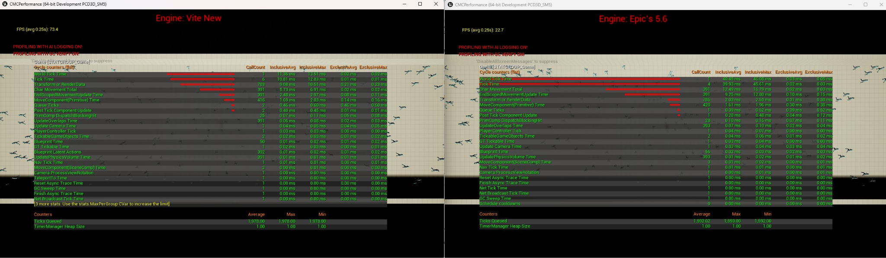

# 400 角色 CMC 基准测试

400 个角色同时移动，由角色移动组件 (Character Movement Component, CMC) 驱动。此测试旨在衡量在人群密集场景中主导游戏线程开销的指标。

*同一硬件上运行相同的 400 角色场景。Vite（左）帧率为 73.4 FPS，虚幻引擎 5.6（右）帧率为 22.7 FPS。世界帧延迟分别为 11.56 毫秒和 40.45 毫秒；角色移动总延迟分别为 5.73 毫秒和 12.49 毫秒。*

## 下载

[400 角色 CMC 基准测试](https://drive.google.com/file/d/1RrOXCeJEhO4H2x1QK9FlBv0GDD8qSsN7/view)

## 测试内容

角色移动组件是虚幻引擎中每个实例消耗资源最多的组件之一。每个移动的角色都会在游戏线程上每帧运行碰撞检测、地面检测、根运动评估和网络预测记账。

单个角色时，这些开销几乎可以忽略不计。但当角色数量达到 400 时，它往往会占用整个帧的资源，这也是为什么很多项目在 GPU 达到饱和之前，就已经遇到了游戏线程瓶颈。

这个基准测试旨在将这种开销量化，使其不再局限于理论层面。

## 运行方法

启用统计单位（`stat unit`），并观察 **游戏（Game）** 而非 **帧（Frame）** 的值。如果“游戏”的值最大，则说明游戏线程的 CPU 瓶颈已经出现，任何渲染优化都无济于事。

然后缩小范围：

| 命令 | 显示 |
|---|---|
| `stat game` | 按类别划分的游戏线程细分 |
| `stat character` | 角色移动细节 |
| `stat anim` | 动画评估成本，通常是第二贡献者 |
| `stat physics` | 移动扫描碰撞查询成本 |

参见[性能分析](../Performance/Profiling.md)。

## 这对 Vite 为什么重要

UE 4.27 在游戏线程成本方面比 UE5 更具结构性优势，这也是 [Vite 设计理念的核心](../EngineOverview/Why-NvRTX-427.md)。4.27 中核心类、帧管线和移动组件的基础成本都更低，而 Vite 则进一步降低了这些成本——具体更改请参见[引擎默认设置](../Performance/Engine-Defaults.md)。

相关的对比数据请参见 [UE4 与 UE5 成本分析](../EngineOverview/UE4-Versus-UE5-Cost-Analysis.md)。

## 如何在您的项目中降低 CMC 成本？

如果此基准测试的曲线与您的瓶颈相符：

- **更少的节拍。** 远处或屏幕外的角色不需要全速率移动。显著性管理器和帧间隔均适用。
- **简化碰撞。** 移动扫描的成本与碰撞的复杂度成正比。
- **降低动画预算。** 动画预算分配器（Animation Budget Allocator）插件是 4.27 的默认插件，专门用于此目的。
- **考虑不使用 CMC.** 对于不需要网络预测的群体，更简单的自定义移动路径可以避免大部分成本。
- **考虑使用 ECS.** 对于实体数量非常庞大的情况，捆绑的 [Flecs ECS](../Plugins/Bundled-Plugins.md) 集成可以完全避免每个实体单独增加 Actor 的开销。 

## 另请参阅

- [性能目标](../EngineOverview/Performance-Targets.md)
- [性能分析](../Performance/Profiling.md)
- [UE4 和 UE5 的消耗对比分析](../EngineOverview/UE4-Versus-UE5-Cost-Analysis.md)
- [引擎默认](../Performance/Engine-Defaults.md)
