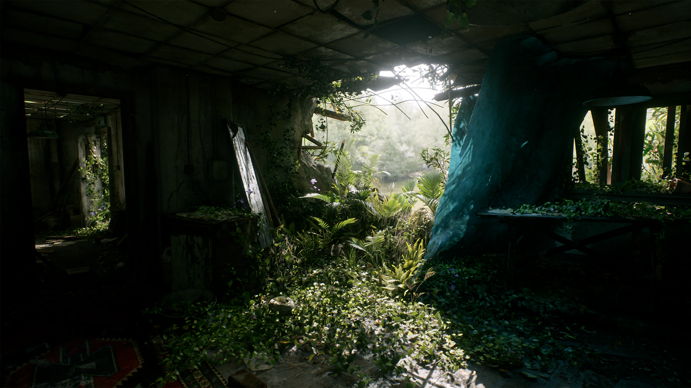

# 废弃的公寓场景

Interior lighting scene. Interiors are the hardest case for global illumination, which makes them the most useful place to evaluate it.

*废弃公寓内部几乎所有可见的表面都是通过反射光而非阳光直射照明的。正因如此，室内环境才是检验整体照明解决方案是否真正有效的试金石。*

## 下载

[废弃的公寓场景](https://drive.google.com/file/d/1OCb9sW9xH3FsFUza0ZG1tKWOPMMus5XA/view?usp=sharing)

## 为什么选用室内场景

An interior is almost entirely indirect light. Sun enters through a small number of openings and everything else the eye sees is bounce. Get the GI wrong and the scene reads as flat or as leaking; there is no direct lighting to hide behind.

That makes scenes like this the right place to evaluate the practical differences between Vite's GI
options:

| 方法 | 在室内的行为 |
|---|---|
| [静态 DDGI](../Rendering/DDGI-Static.md) | Baked probe data. Cheapest, and correct if nothing moves. |
| [动态 DDGI](../Rendering/DDGI-Dynamic.md) | Probes update at runtime. Handles time of day and moving occluders. |
| [SSGI](../Rendering/SSGI.md) | Adds contact-scale detail the probe grid cannot resolve |
| Per-pixel ray-traced GI | Reference quality, unaffordable at frame rate, and compiled out by default |

The realistic answer for most interiors is DDGI plus SSGI. DDGI supplies the low-frequency bounce and SSGI
fills in the detail near contacts and in corners. See
[Global Illumination](../Rendering/Global-Illumination.md).

## What to look at

- **Light leaking.** Probe-based GI leaks through thin geometry when probe spacing is too coarse relative
  to wall thickness. Interiors are full of thin walls, so this is where to tune probe density.
- **Corner darkening.** Compare DDGI alone against DDGI with SSGI enabled. The difference concentrates in
  corners and at contacts.
- **Ambient occlusion choice.** [HBAO+ versus the optimised SSAO path](../Rendering/Ambient-Occlusion.md) is most
  visible in cluttered interiors.
- **Ray-traced reflections.** Interior surfaces reflect a great deal of off-screen geometry, which is
  exactly the case screen-space reflections cannot handle.

## 另请参阅

- [全局照明](../Rendering/Global-Illumination.md)
- [动态 DDGI](../Rendering/DDGI-Dynamic.md)
- [SSGI](../Rendering/SSGI.md)
- [环境遮蔽](../Rendering/Ambient-Occlusion.md)
- [阁楼场景](./Attic-Scene.md)
