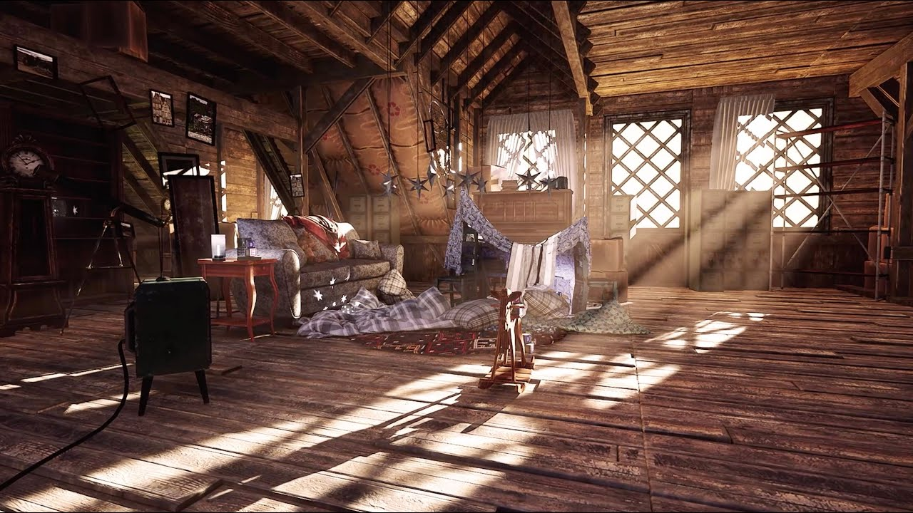
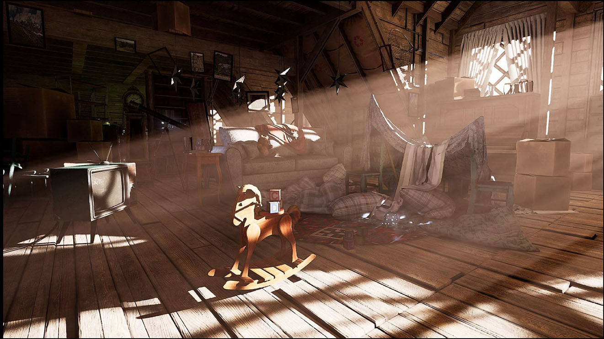

# 阁楼场景

室内照明场景，强光通过有限的开口照射进来。这是一个很好的案例，可以用来观察全局光照如何处理高对比度的室内场景。

*阁楼内部，强烈的阳光透过一扇小窗户照射进来。同一画面中既有直射的阳光，也有深深的阴影，两者之间还有大量的昏暗散射光。*

## 下载

[阁楼场景](https://drive.google.com/file/d/12CEdigm95nuu7GhRd_KjYIGeCi9_QvVT/view?usp=sharing)

*阁楼场景采用增强型光线追踪全局光照路径渲染，通过窗户形成体积光通道。在 NVIDIA 的增强型 RTGI 路径下，同样的场景也会出现，NvRTX Caustics 分支为 Vite 贡献了这一功能。*

## 它能锻炼什么？

阁楼的照明环境特殊且要求很高：一束强烈的定向光源透过狭小的开口照射进来，大量昏暗的间接光，以及许多杂乱的几何物体投射到空间中。

与普通场景相比，阁楼的照明对以下三点要求更高：

1. **动态范围。** 同一画面中同时出现直射阳光和深阴影，对[色调映射器和曝光设置](../Rendering/Color-Management.md)提出了更高的要求。如果处理不当，场景要么在窗户处过曝，要么其他部分全部变成黑色。

2. **间接反射衰减。** 光线从开口处反射后衰减的程度决定了空间的深度感。探针密度和全局光照方法的选择在此至关重要。

3. **接触细节。** 地板和墙壁上的杂物需要[环境光遮蔽](../Rendering/Ambient-Occlusion.md)，理想情况下还需要使用[SSGI](../Rendering/SSGI.md)（静态全局光照），才能呈现出与地面接触的效果。

## 观察要点

比较[静态和动态 DDGI](../Rendering/DDGI-Static.md)。对于场景中没有任何物体移动的情况，静态烘焙完全足够，而且成本更低；动态 DDGI 的价值只有在太阳角度或遮挡物发生变化时才会显现出来。移动平行光会使两者的区别变得显而易见。

接下来观察[抗锯齿](../Rendering/Anti-Aliasing.md)处理。在明亮的窗户背景下呈现精细的杂物几何体是一个棘手的问题，SMAA 的表现与 TAA 最为明显的区别就在这里。

## 另请参阅

- [全局光照](../Rendering/Global-Illumination.md)
- [静态 DDGI](../Rendering/DDGI-Static.md)
- [色彩管理](../Rendering/Color-Management.md)
- [抗锯齿](../Rendering/Anti-Aliasing.md)
- [废弃的公寓场景](./Abandone-Apartment.md)
