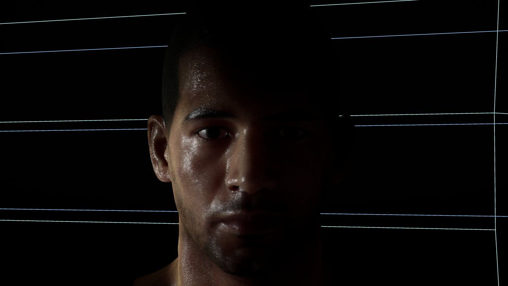
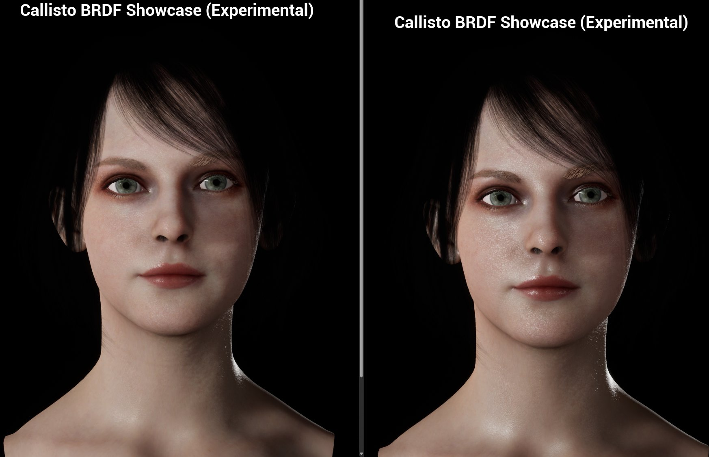

# Callisto BRDF 演示

两个角色场景演示了 Vite 的自定义 Callisto BRDF （双向反射分布函数）着色模型，该模型重新利用标准材质引脚来实现[逆反射](https://baike.baidu.com/item/%E9%80%86%E5%8F%8D%E5%B0%84/7584246)（retroreflection）、漫反射菲涅尔和终止线控制。

## Downloads

| Demo | Link |
|---|---|
| Male character | [Download](https://drive.google.com/file/d/133RwxvHT9jELgXWn338hieiAJUUeIoVq/view?usp=sharing) |
| Female character | [Download](https://mega.nz/file/5I1STApA#zmKqFu_8X1bYZPakb2VvAbCF-GPQhmR98Iot3QVJtRM) |

*使用 Callisto BRDF 着色模型渲染的男性角色。掠射角下，逆反射和漫反射菲涅尔效应共同作用。*

*使用 Callisto BRDF 着色模型渲染的女性角色。“平滑终止线”技术柔化了面部和手臂曲面上的阴影线条。*

!!! 笔记
    **终止线**是指物体表面从“被照亮”区域过渡到“阴影”区域的那条分界线。在现实世界中，这条线往往是柔和、平滑的（因为光线有衍射和散射）。但在实时渲染的3D游戏中，由于计算精度的限制，这条线可能会变得非常生硬、锯齿状，甚至在模型表面断裂。

## What Callisto BRDF does

Unreal's default lit model is a good general-purpose BRDF and a mediocre skin and character model. Callisto
BRDF is a Vite addition that gives you direct control over the terms that matter for character rendering,
by repurposing existing material pins rather than adding new ones:

| Standard pin | Becomes |
|---|---|
| Opacity | Retroreflection |
| Anisotropy | Diffuse Fresnel |
| Custom Data 0 | Smooth Terminator |
| Custom Data 1 | Diffuse Fresnel Falloff |
| Ambient Occlusion | Retroreflection Falloff |

Smooth Terminator is the one to look at first. The hard shadow terminator on curved surfaces is one of the
most obvious tells of a real-time character, and controlling it directly is cheaper and more predictable
than working around it with normal map or lighting tricks.

Full pin reference and authoring notes in [Shading Models](Shading-Models.md).

## Using the demos

Open the character material and change one pin at a time. The remapped pins interact, and the effect of
each is much clearer in isolation than in the shipped combination.

Pay attention to how the model responds to grazing light. Retroreflection and diffuse Fresnel both act
strongest there, and that is where the difference from the default lit model is most visible.

## Porting the setup

The material graph is the useful part of these demos. Callisto BRDF is a shading model selection, so
adopting it is a matter of switching the model and rewiring the affected pins &mdash; there is no plugin to
enable and no compile-time switch involved.

<note>
Each additional shading model in use adds shader permutations. If you only need Callisto on characters,
use it only on characters. See
<a href="Shader-Compilation-And-PSO.md">Shader Compilation and PSO</a>.
</note>

## See also

- [Shading Models](Shading-Models.md)
- [Color Management](Color-Management.md)
- [Hair Rendering](Hair-Rendering.md)
