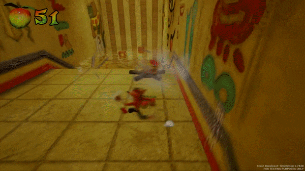

# 古惑狼：时空扭曲

这是基于虚幻引擎 4.26 制作的《古惑狼3：时空穿梭》中“古墓探险者”关卡的社区重制版。这是一个完整的游戏关卡，而不是一个灯光场景。

*古墓丽影关卡重制版正在引擎中运行。这是一个完整的可玩关卡，而不是一个光照场景，这使得它的帧成本曲线更接近于一个真实的项目。*

## Source

[dyanikoglu/CrashBandicoot-Timetwister](https://github.com/dyanikoglu/CrashBandicoot-Timetwister)

## Why it is here

Most of the projects in this section are technology demonstrations: a scene that exists to show one
rendering feature. This one is a playable level with movement, collision, hazards, collectibles and a
camera system, which makes it a different kind of reference.

It is useful for two things:

- **Gameplay-shaped profiling.** A real level has a frame cost profile that a lighting scene does not:
  actor ticks, animation, collision queries and gameplay logic competing with rendering. That is the shape
  most projects actually have. See [Profiling](Profiling.md).
- **Demonstrating 4.x sufficiency.** Stylized platformers are precisely the genre where UE5's headline
  features add cost without adding much, and where 4.27's lower base cost is the better trade. See
  [Why NvRTX 4.27](Why-NvRTX-427.md).

## Version note

<note>
The project targets Unreal Engine 4.26, not 4.27. Opening it in Vite will prompt an engine version
conversion. Expect to resolve some asset and API differences; the 4.26 to 4.27 gap is small but not zero.
</note>

This is a much easier conversion than coming from UE5, which requires the Asset Downgrader &mdash; see
[Migrating from UE5](Migrating-From-UE5.md).

## Licensing

This is a third-party community project, not a Vite deliverable. It is a fan remake of copyrighted
material; treat it as a reference to study rather than a source of assets to reuse. See the repository for
its own terms.

## See also

- [Profiling](Profiling.md)
- [Why NvRTX 4.27](Why-NvRTX-427.md)
- [First Project](First-Project.md)
