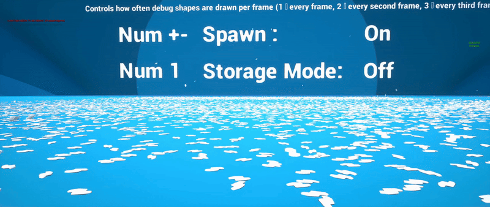

# PhysX 实例化子系统演示

通过使用由世界子系统管理的 PhysX 刚体来支持实例化的网格变换，实现了传统逐个物体模拟无法达到的刚体数量。

## 下载

[演示项目](https://drive.google.com/file/d/1NulunBP2Qre5vLyYnkiqywovsycNuWdQ/view) ·
[插件库](https://github.com/Dragomirson/PhysXInstancedSubsystem)

*PhysX实例化子系统模拟了大量实例化的刚体。采用实例化渲染，每个实例都使用真实的 PhysX 物理体。在相同预算下，这里的物理体数量远远超过每个角色一个物理体的模拟方式。*

## 它展示了什么

传统的虚幻物理引擎会为每个物体生成一个带有 `UPrimitiveComponent` 的 `AActor`。这种方法可以处理几千个物体，但之后，限制因素就变成了 Actor 和组件的开销，而不是求解器本身——正如[物理立方体基准测试](./Physics-Cube-Bench.md)所显示的那样。

该子系统保留一个或几个用于渲染的实例化网格 Actor，为每个实例创建 PhysX 刚体，并将它们的姿态写回 ISM/HISM 实例变换。渲染是实例化的，模拟是真实的，并且消除了 Actor 的开销。

运行此子系统并同时运行物理立方体基准测试，即可直观地比较两者的区别。

## 需要关注的内容

| 特性 | 显示位置 |
|---|---|
| 逐帧预算 | 生成和模拟工作量按帧限制，而非峰值波动 |
| 自动停止条件 | 已完成的实例停止模拟并转换为存储 |
| 动态实例与存储实例 | 仅模拟需要模拟的内容 |
| 生命周期管理 | 实例过期时不会留下任何 Actor |
| CCD 模式 | 快速移动的物体不会出现隧道效应 |

预算和自动停止机制是值得理解的部分。大量物体之所以能够承受，是因为大多数物体大部分时间都处于休眠状态；子系统实现了这一点，无需人工管理。

完整的 API 和配置详情请参见[实例化物理](../Physics/Instanced-Physics.md)。

## 何时使用？

碎片、瓦砾、弹壳、脱落的树叶、爆炸产生的尘埃——任何需要大量物理模拟物体，但每个物体无需拥有独立的参与者标识、游戏逻辑或复制机制的场景。

它不能替代基于参与者的物理，后者需要每个物体拥有独立的游戏行为。它适用于物体本身是场景，并且恰好会移动的情况。

## 状态

版本 1.11 已捆绑在 `Engine\Plugins\Runtime\VitePlugins\PhysXInstancedSubsystem`。请参阅[已捆绑的插件](../Plugins/Bundled-Plugins.md)。

## 另请参阅

- [实例化物理](../Physics/Instanced-Physics.md)
- [物理立方体测试台](./Physics-Cube-Bench.md)
- [PhysX](../Plugins/PhysX.md)
- [已捆绑的插件](../Plugins/Bundled-Plugins.md)
