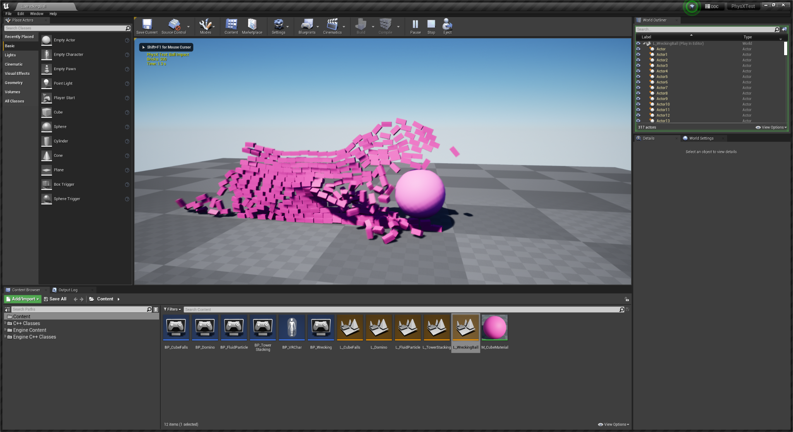
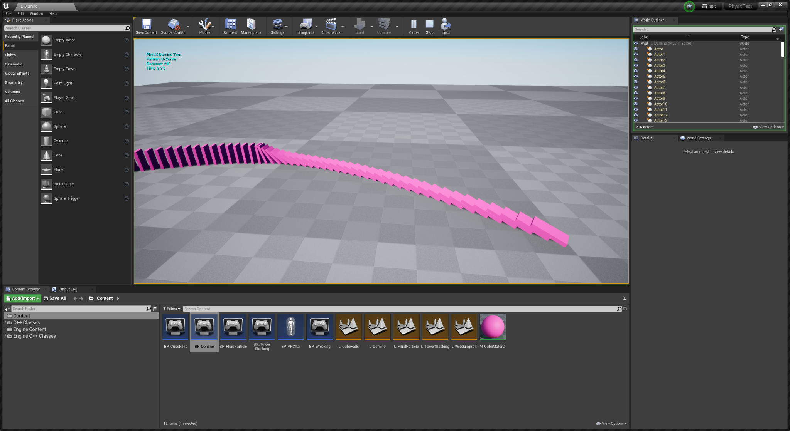
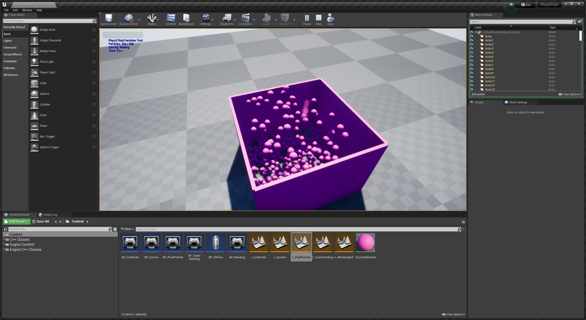

# PhysX 测试

通用 PhysX 行为和稳定性测试项目。对于验证引擎更改后构建的物理层是否完好无损非常有用。

## 下载

[PhysicsTest 存储库](https://github.com/tanger1n/PhysicsTest)

## 它涵盖什么

PhysX 行为的广泛练习，而不是吞吐量基准：碰撞响应、约束、堆叠稳定性、睡眠和唤醒，以及求解器是否按其应有的方式运行的一般问题。

*PhysX 测试项目、碰撞和约束场景*

*PhysX 测试项目，堆叠稳定性场景*

*PhysX 测试项目，睡眠和唤醒场景*

*测试项目的场景。每个都隔离了一种行为，因此回归显示为可见的差异，而不是移动的数字。*

当您更改了与物理相关的内容并想知道您是否破坏了它，而不是它的速度有多快时，可以运行这个项目。

## 与 Vite 的相关性

Vite 保留 PhysX 而不是迁移到 Chaos，只有当 PhysX 层通过引擎更改保持正确时，这种选择才合理。任何触及以下几点的事：

- 物理场景或子步进，特别是在启用 [`VITE_PHYSX_FIXED_TIMESTEP`](../Physics/Fixed-Timestep.md) 的情况下
- 刚体实例变换或插值
- 碰撞查询路径，大量使用角色移动组件（Character Movement Component）
- Apex 或布料整合

在认为完成之前应在此处进行验证。验证要求另请参阅[编码指南](../Contributing/Coding-Guidelines.md)。

## 固定时间步测试

如果您正在评估[固定时间步物理](../Physics/Fixed-Timestep.md)，那么该项目是观察差异的合理场所。以解锁的帧速率运行它，然后将`t.MaxFPS`设置为各种值：使用默认变量时间步长，模拟结果会随帧速率变化，而使用固定时间步长则不会。

请记住，固定时间步是编译时功能。如果构建中没有`VITE_PHYSX_FIXED_TIMESTEP=1`，则`p.VitePhysXFixedTimestep.Enabled`不会执行任何操作。

## 另请参阅

- [PhysX](../Physics/PhysX.md)
- [固定时间步长](../Physics/Fixed-Timestep.md)
- [物理立方台](Physics-Cube-Bench.md)
- [编译时开关](../Performance/Compile-Time-Switches.md)
