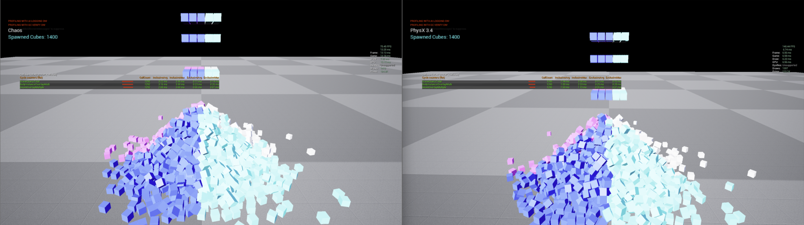

# Physics Cube Bench

<tldr>

Rigid body throughput test using conventional PhysX actors. The baseline that the
<a href="../Physics/Instanced-Physics.md">instanced subsystem</a> is measured against.

</tldr>

*并排捕捉 1400 个模拟立方体，Chaos 的帧率为 75.45 FPS，而 PhysX 3.4 的帧率为 148.44 FPS。*

*1400 个模拟立方体，相同场景。Chaos（左）帧率为 75.45 FPS，帧率为 13.25 毫秒；PhysX 3.4（右）帧率为 148.44 FPS，帧率为 6.74 毫秒。*

## Download

[Physics Cube Bench](https://drive.google.com/file/d/1WVsC8cp2fx8eiM56Ueek-mJbO_EdPKOR/view?usp=sharing)

## What it measures

Simple rigid bodies simulated conventionally: one actor per body, each with its own component, transform
and tick. It establishes how many PhysX bodies you can simulate before the frame budget runs out using the
standard workflow.

The interesting part is not the number, it is where it stops scaling and why. Two costs grow with body
count and they grow differently:

| Cost | Grows with |
|---|---|
| PhysX solver | Bodies actually in contact and awake |
| Actor and component overhead | Total body count, whether or not anything is moving |

The second one is what the [PhysX Instanced Subsystem](../Physics/Instanced-Physics.md) eliminates. Comparing this
benchmark against the [instanced subsystem demo](PhysX-Instanced-Subsystem.md) shows the difference
directly.

## Running it

`stat unit` first, then:

| Command | Shows |
|---|---|
| `stat physics` | Solver time |
| `stat game` | Actor tick and component overhead |
| `p.showConstraints 1` | Constraint visualisation |

If **Game** exceeds **Physics** by a wide margin, actor overhead rather than the solver is your limit,
and the instanced path is the answer.

## PhysX versus Chaos

Vite retains PhysX rather than migrating to Chaos. On this class of workload PhysX is the faster and more
predictable solver, which is part of why. See [PhysX](../Physics/PhysX.md).

If you need frame-rate-independent determinism from this kind of simulation, Vite's optional
[fixed timestep](../Physics/Fixed-Timestep.md) applies &mdash; it requires rebuilding with
`VITE_PHYSX_FIXED_TIMESTEP=1`.

## See also

- [PhysX](../Physics/PhysX.md)
- [Instanced Physics](../Physics/Instanced-Physics.md)
- [Fixed Timestep](../Physics/Fixed-Timestep.md)
- [Profiling](../Performance/Profiling.md)
