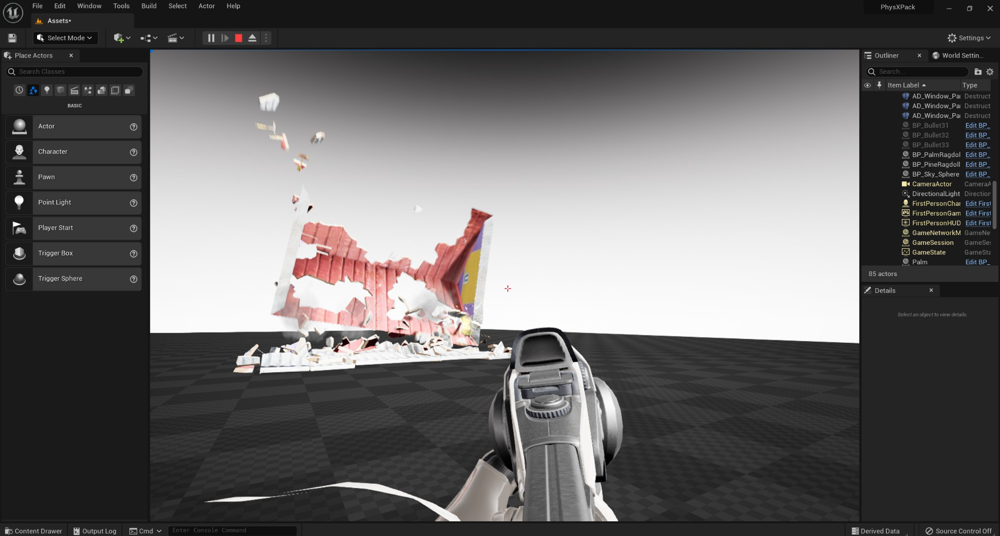

# 技术演示项目

Vite 的主要演示项目。包含四个场景，涵盖了动态全局光照、Apex 破坏（Apex Destruction）和 Apex 布料（Apex Cloth）技术。这是用于验证构建版本是否正常运行的参考项目。

*技术演示项目场景在虚幻引擎 Vite 中渲染，用于验证新构建版本是否能够正确渲染和模拟的参考项目。*

## 内容

| 场景 | 演示 |
|---|---|
| NVIDIA DDGI Cornell Box 办公室样本 | 受控参考环境下的[动态 DDGI](../Rendering/DDGI-Dynamic.md)  |
| PhysX Apex Destruction 测试平台 | [Apex Destruction](../Physics/Destruction-And-Cloth.md) |
| PhysX Apex Cloth 示例 | [Apex Cloth](../Physics/Destruction-And-Cloth.md) |
| “高端” DDGI + SSGI Deep Elder Caves | 生产级场景中 [DDGI](../Rendering/DDGI-Dynamic.md) 与 [SSGI](../Rendering/SSGI.md) 的结合应用 |

“康奈尔盒”（Cornell Box）是理解 DDGI 的有力工具。它之所以成为标准的全局光照参考场景，正是因为其正确结果已知；这使得人们能够对照“基准真值”（ground truth），直观地评估探针布局、漏光现象以及响应时间等表现。

“Deep Elder Caves”场景则代表了另一种情况：这是一个具有生产级规模的几何场景，采用了 DDGI 与 SSGI 叠加使用的方案。其中，DDGI 负责提供低频的间接光反射（bounce），而 SSGI 则补充了 DDGI 探针网格无法解析的接触级细节。关于为何将两者结合使用，请参阅[全局光照](../Rendering/Global-Illumination.md)相关内容。

## 下载

[技术演示项目](https://drive.google.com/file/d/1SuHlT4KC3nTQrB2rwVcwBpNgWa_r6yKh/view)

## 用作验证项目

Vite 的[贡献指南](../Contributing/Coding-Guidelines.md)明确提及了该项目：对引擎的修改不得导致启动、关闭或运行“技术展示”项目时发生崩溃。如果您正在修改引擎，请在提交 Pull Request 之前先运行此项目。

它涵盖了具有代表性的关键功能：动态全局光照（GI）、光线追踪、PhysX 破坏效果以及布料模拟。任何导致上述功能失效的改动，通常都会在此项目中引发问题。

## 要求

动态 DDGI 需要支持 DXR 的 GPU 以及 DirectX 12 环境。Apex Destruction 和 Apex Cloth 需要相应的插件，这些是 4.27 版本内置并由 Vite 保留的插件。请参阅[平台](../Platforms/Platforms.md)与[系统要求](../GettingStarted/System-Requirements.md)。

## 另请参阅

- [动态 DDGI](../Rendering/DDGI-Dynamic.md)
- [全局光照](../Rendering/Global-Illumination.md)
- [破坏与布料](../Physics/Destruction-And-Cloth.md)
- [项目与演示](../ProjectsAndDemos.md)
