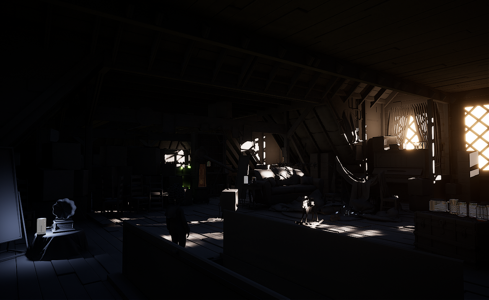
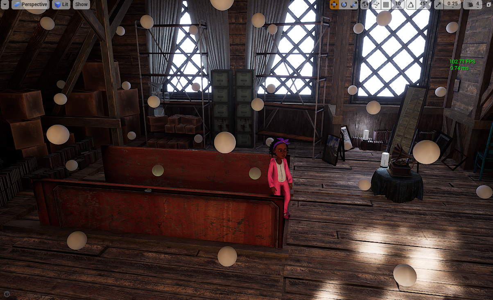
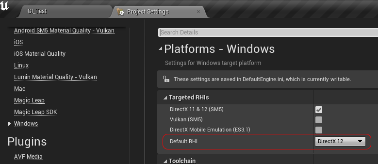
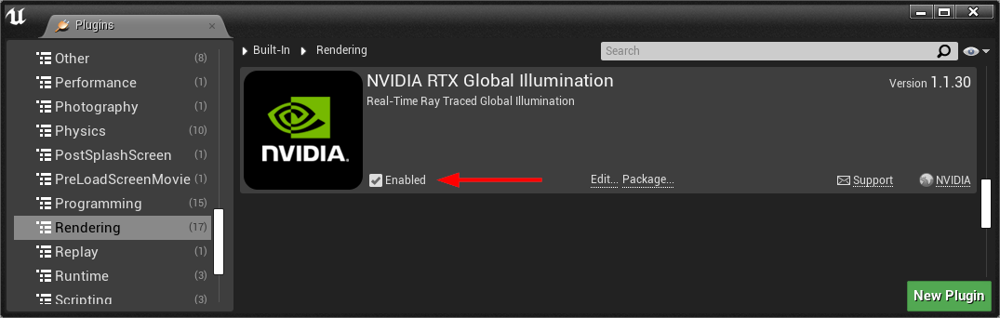
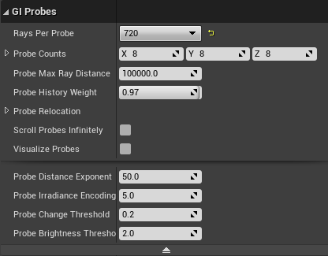
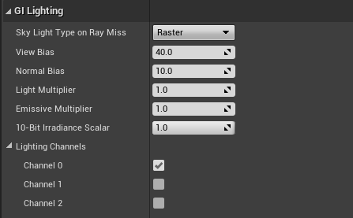
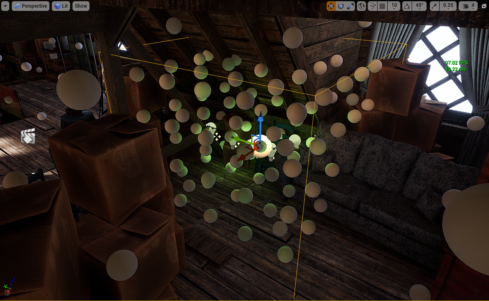

# 动态 DDGI

实时光线追踪辐照度探测体积设置方法：
```json
r.GlobalIllumination.ExperimentalPlugin 1
```
然后将 DDGI 体积放置在关卡中。它本身无噪声，完全动态，并且在类似场景中帧速率约为硬件 Lumen 的两倍。

动态漫反射全局光照 (Dynamic Diffuse Global Illumination, DDGI) 是 Vite 的主要全局光照解决方案，也是该分支最知名的功能。本页面将介绍其工作原理、设置方法和调整方法。



*阁楼内部只有直射光，阳光照射不到的地方都是黑色的，因为没有任何东西能将光线传递到房间的各个角落。*


*同样是阁楼内部，启用动态 DDGI 后，间接反射光充满整个房间。天花板、左侧的箱子以及屋檐下的空间完全由反射光照明——由于探头辐照度本身就是平滑的，因此无需进行降噪处理。*


## 工作原理

DDGI 在场景中放置一个三维探针网格。每一帧都会从每个探针追踪一定数量的光线进入场景；最终的辐射度会被累积到每个探针的辐照度和深度纹理中，并使用球谐函数进行存储。

这种表示方法具有两个特性，几乎可以解释 DDGI 的所有行为：

**它无噪声。** 由于辐照度是在多帧内累积并滤波成一个平滑的基，而不是逐像素逐帧采样，因此输出没有随机噪声，无需降噪。这就是为什么 DDGI 不会出现与降噪光线追踪全局光照相关的沸腾、重影和时间不稳定性。

**它较为粗糙。** 空间分辨率受限于探针间距。这种表示方法无法呈现比探针网格更精细的光照细节。因此，建议将其与 [SSGI](./SSGI.md) 结合使用。

每个探针的深度信息可以防止光线穿过薄壁结构泄漏——探针知道每个方向上最近表面的距离，并能排除那些必须穿过墙壁才能到达的光线。这就是为什么 DDGI 的泄漏量比软件 Lumen 少的原因。



*编辑器视口中，DDGI 探测球体在整个内部空间中可视化显示。每个球体代表一个探针，显示其存储的辐照度，这使得探针间距和任何错位的探针都能立即显示出来。*


## Vite 的集成

Vite 的 DDGI 并非 4.27 版本自带的启动器插件。它继承了 NvRTX 的引擎端集成，直接深入光线追踪管线，而非仅仅作为辅助插件。实际区别如下：

- **基于探针的光线追踪反射。** 反射光线可以采样探针辐照度进行二次反射，而不是返回黑色或回退到立方体贴图。这显著提升了光线追踪反射的质量，也是该分支版本中最大的视觉优势之一。参见[光线追踪反射](./RT-Reflections.md)。
- 持续优化 DDGI 更新路径，并在每个版本中持续更新。
- 与其余光线追踪特效套件协同工作，因此 DDGI、RTXDI 和光线追踪反射可以同时激活。


**注意：** 请勿将 4.27 版本的启动器 DDGI 插件安装到 Vite 项目中。引擎本身已包含 DDGI，两者会冲突。独立的 [DDGI 1.1.5 插件](https://github.com/GapingPixel/UE4-RTXGI-1.1.5-Latest-Official)仅适用于在 Vite 项目旁边使用标准启动器 4.27 安装的团队成员。

## 设置

**在关卡中设置动态 DDGI**

1. 确认项目已启用光线追踪。DDGI 需要 DXR 支持。

2. 使用 `r.GlobalIllumination.ExperimentalPlugin 1` 启用插件路径，可以通过控制台、代码或 `DefaultEngine.ini` 文件进行设置。

3. 放置一个 DDGI 体积 Actor，使其包围您想要照亮的可玩空间。体积覆盖的是体积，而不是表面——考虑的是玩家和动态物体可以移动的位置，而不是墙壁的位置。

4. 设置每个轴的探针数量。先从粗略设置开始，仅在能够看到差异时才增加；探针数量会影响内存和每帧光线的成本。

5. 使用 `r.SSGI.Enable 1` 启用 [SSGI](./SSGI.md)，以恢复探针网格无法表示的接触细节。

6. 在动态画面中进行验证，而不是在静态帧中。DDGI 的优势是暂时的——屏幕截图无法显示其与降噪技术相比的稳定性差异。



*第一步，也是很多人会忽略的一步。“项目设置 → 平台 → Windows → 目标 RHI”必须设置为 DirectX 12，并勾选了 DirectX 11 和 12 SM5；4.27 版本中的光线追踪仅支持 DX12。*




*在内置渲染下启用 NVIDIA RTX 全局光照插件的插件对话框。全局光照插件路径位于**内置”→“渲染**下。Vite 引擎自带此插件，因此这是引擎内置插件，而不是启动器 4.27 插件——请勿将其与后者同时安装。*


*在编辑器视口的关卡中放置一个 DDGI 体积 Actor。体积覆盖空间，而非表面——根据摄像机和动态物体实际可以到达的位置来调整体积大小。*


### 体积（Volume）设置


*DDGI 体积设置面板*




*DDGI 探头设置面板显示每轴计数和探头间距控制*




*DDGI 体积 Actor 的体积、探针和照明光照设置。每个轴的探针数量是影响内存占用和每帧光线消耗的关键参数。*


## 微调

以下设置最为重要，大致按影响程度排序：

**探针密度。** 这是成本和质量控制的主要因素。更密集的网格可以解析更小的光照特征，但同时也会相应地增加光线追踪和内存消耗。室内空间（包含许多小房间）比开阔的室外空间需要更多的探针。



*探针密度对比图显示了照明细节如何随探针间距变化。在任何质量设置下，图像中都不存在比探针间距更精细的细节——这就是 [SSGI](./SSGI.md) 的作用所在。*


**体积放置和数量。** 多个紧密贴合的体积通常优于一个松散的大型体积。低密度的体积如果覆盖整个关卡，会将探针浪费在实体几何体上，而忽略了真正重要的空间。

**每个探针的射线数。** 在收敛速度和每帧成本之间进行权衡。射线数越少，收敛速度越慢，这在光照快速变化时会表现为延迟——例如，门打开后映入明亮的室外。

**滞后/更新速率。** 探针接收新信息的速度。更快的响应速度可以减少延迟，但会增加时间变化。

**法线和视图偏差。** 用于平衡光线泄漏和接触阴影变暗的标准控制项。如果看到光线透过薄墙渗出，请增加偏差；如果接触区域看起来分离，请减少偏差。

## 参考资料

NVIDIA 的原始文档和演讲仍然是深入理解该技术的最佳参考资料。

- [RTXGI 插件自述文件](https://github.com/GapingPixel/UE5-PhysX-Vite/tree/ue5Vite-release/Engine/Plugins/Runtime/Nvidia/RTXGI)
- [动态漫反射全局光照，GDC 演讲](https://developer.download.nvidia.com/video/gputechconf/gtc/2019/presentation/s9900-irradiance-fields-rtx-diffuse-global-illumination-for-local-and-cloud-graphics.pdf)

光线追踪辐照度场：

[](https://www.youtube.com/watch?v=KufJBCTdn_o)

示例场景设置，以及与 SSGI 的结合使用：

[](https://www.youtube.com/watch?v=ZefvmV1pdP8&t=1210s)

插件设置详解：

[](https://www.youtube.com/watch?v=U57_a3lGKOo)

完整官方播放列表：

[](https://www.youtube.com/playlist?list=PL4FII4B-zM0f5h75klcOfiO1v_atlp8Ky)


团队还维护着一份内部 [DDGI 参考文档](https://docs.google.com/document/d/1kdZGRV6bRNjNvec1OzzEJd64NtLBDZ8hzQvFVzB2GfI/edit?tab=t.0)。

## 示例场景

- [技术演示项目](../ProjectsAndDemos/Tech-Demo-Project.md) — 包括 NVIDIA 官方的 DDGI Cornell Box 示例以及一个高端 DDGI + SSGI 洞穴场景。
- [风格化光线追踪演示](../ProjectsAndDemos/Stylized-Raytracing-Demo.md) — 4K120 风格化目标。
- [废弃公寓](../ProjectsAndDemos/Abandone-Apartment.md)和[阁楼场景](../ProjectsAndDemos/Attic-Scene.md) — NVIDIA 的 RTGI 展示场景。

## 另请参阅

- [全局光照](./Global-Illumination.md)
- [静态 DDGI](./DDGI-Static.md)
- [SSGI](./SSGI.md)
- [光线追踪反射](./RT-Reflections.md)
- [性能目标](../EngineOverview/Performance-Targets.md)
