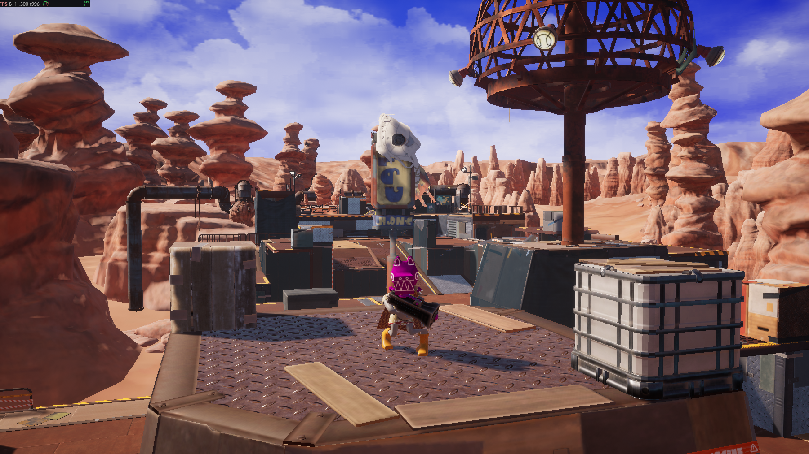
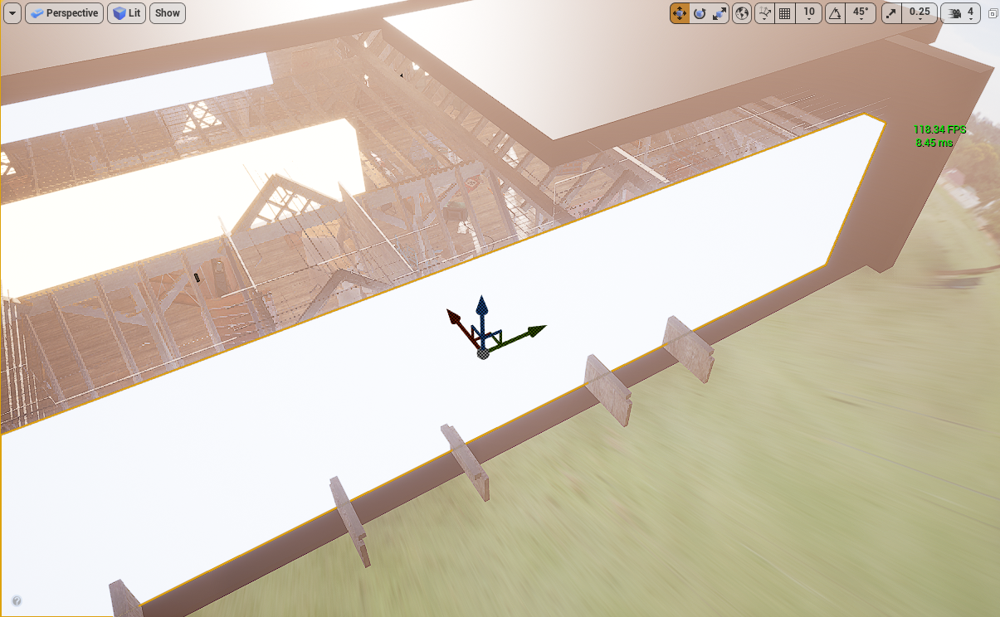

# 全局照明

Vite推荐的GI设置是动态**动态漫反射全局光照**（Dynamic Diffuse Global Illumination, DDGI）加**屏幕空间全局光照**（Screen Space Global Illumination, SSGI）。DDGI 可以无噪声地解析世界尺度的反射；SSGI 可以填充探针体积过于粗糙而无法捕捉的高频接触细节。
使用 <code>r.GlobalIllumination.ExperimentalPlugin 1</code> 和 <code>r.SSGI.Enable 1</code> 启用。


全局照明是 Vite 作为独立分支存在的最大原因。本页解释了这些选项以及如何在它们之间进行选择；各个技术都有自己的页面。

## 选项

| 解决方案                          | 成本                 | 需要 DXR | 动态照明 | 最适合                                                          |
|-----------------------------------|----------------------|---|---|-------------------------------------------------------------------|
| [动态 DDGI](DDGI-Dynamic.md)   | 低                  | 是 | 完全动态 | 几乎所有的东西                                                 |
| [静态 DDGI](DDGI-Static.md)     | 运行时接近于零 | No | 烘焙 | 低端和无 DXR 硬件                                       |
| [SSGI](SSGI.md)                   | 低                  | 否 | 完全动态 | 高频细节，与 DDGI 一起运行                 |
| [Per-pixel RT GI](Ray-Tracing.md) | 高                 | 是 | 完全动态 | GPU 比 PS5 快得多，参考                     |
| 路径追踪                      | 极端主义者                | 是 | 完全动态 | RTX 5080 及以上，Ground Truth 参考                        |
| 烘焙光照贴图                   | 运行时为零      | 否 | 仅静态 | 全静态场景，始终使用 CPU LightMass 以获得最高质量 |


!!! 注意
    Vite 包括多个辅助间接反弹解决方案，例如距离场反弹和 IBL 捕获（Vite 特定添加）。除了非常具体的目标平台或专门的设置之外，很少考虑上面列出的解决方案。


## 为什么选择 DDGI 而不是 Lumen

动态漫反射全局照明将辐照度存储在探头网格中，并使用球谐函数对其进行过滤。由于表示在结构上是平滑的，因此结果是无噪声的，无需降噪器 -这是其相对于 Lumen 的大部分优势的根本原因。

与软件流明相比，DDGI 提供更高质量的反射和更少的漏光。与硬件流明相比，它的反弹质量相当，但通常运行速度大约是前者的两倍（最终场景 FPS 不仅仅是孤立的 GI 成本）。在 RTX 4080 Super 上以 1440p 原生播放的一个代表性测试场景中，DDGI 测得的帧率为 811 FPS，而 Lumen 5.7 的帧率为 324 FPS。在 AMD 硬件上，该技术表现良好：同类型的测试场景在 RX 6600 上以 245 FPS、1080p 本机运行。


DDGI 也不是实验性技术。已在《地铁：离去》、《守望先锋 2》、《总决赛》、《控制》、《巫师 3》、《战锤 40,000：暗潮》、《DOOM：黑暗时代》、《夺宝奇兵》、《007 曙光》、《羊蹄之魂》和《星球大战亡命之徒》（包括 Switch 2 版本）中发布。包括 Anvil 和 Snowdrop 在内的 AAA 引擎使用 DDGI 探针作为其光线追踪 GI 管道的一部分。该技术旨在跨广泛的硬件范围进行扩展，从用于静态模式的 Xbox One S GPU 和用于动态 RT 模式的 GTX 1060 级 GPU 开始。



*动态 DDGI 灯光营造出风格化的场景，帧计数器显示 811 FPS。*


*811 FPS，RTX 4080 Super，1440p原生分辨率，动态DDGI。同一场景在Lumen 5.7模式下测得324 FPS。*



*室内照明由发光表面提供，有助于DDGI（直接、分散、增强）。*

*自发光材质直接影响 DDGI，因此无需放置光源即可通过自发光几何体照亮场景。*

## 为什么将 DDGI 与 SSGI 配对

探测体积具有空间分辨率。小于探头间距的细节（椅子腿与地板接触处的变暗​​、狭窄间隙内的弹跳、桌子下的接触阴影）未显示，因为那里没有探头来表示它。


屏幕空间 GI 以像素分辨率运行并准确捕获该分辨率。这两种技术在相反的方向上都有缺点：SSGI 没有关于屏幕外或被遮挡的任何信息，而 DDGI 具有粗分辨率下的完整世界知识。运行两者可为您提供来自 DDGI 的世界范围反弹​​和来自 SSGI 的高频联系详细信息。这是 NVIDIA 在 Unreal Engine DDGI 演示中官方推荐的设置。 Vite 的 SSGI 从一开始就配置为与 DDGI 一起工作。

这在 UE5 中是不可能的。当 SSGI 合并到 Lumen 中时，其质量和性能均有所下降，并且无法再与单独的 GI 解决方案一起启用。在 Vite 中，它是 UE4 时代的实现，并且组成干净。

## 启用推荐设置

```c++
IConsoleManager::Get().FindConsoleVariable(TEXT("r.GlobalIllumination.ExperimentalPlugin"))->Set(1);
IConsoleManager::Get().FindConsoleVariable(TEXT("r.SSGI.Enable"))->Set(1);
```

或者在配置中，这对于交付项目来说是更可取的，因为它参与了可扩展性：

```ini
; Config/DefaultEngine.ini
[/Script/Engine.RendererSettings]
r.GlobalIllumination.ExperimentalPlugin=1
r.SSGI.Enable=1
```

然后，您需要将 DDGI 体积放置在关卡中。请参阅 [动态 DDGI](DDGI-Dynamic.md) 了解体积设置、探针密度和重要的设置。

## 根据硬件配置选择合适的全局光照 (GI) 配置

### 选择 GI 配置

1. 如果您的最低配置支持 DXR，请使用动态 DDGI + SSGI。这是默认推荐配置，适用于 GTX 1060 6GB 及以上显卡。

2. 如果您的最低配置完全不支持 DXR，请使用[静态 DDGI](../Rendering/DDGI-Static.md)。它几乎可以瞬间完成烘焙，比传统的烘焙光照提供更好的反射保真度，并且由于探测体积覆盖的是空间而非表面，因此能更好地处理移动物体。

3. 如果您需要同时支持这两种模式，请将静态 DDGI 作为可扩展性的备选方案。两种模式共享体积和创作过程，因此这是一种可扩展性设置，而不是对关卡进行第二次光照渲染。

4. 只有在生成参考图像或预可视化时才使用逐像素光线追踪全局光照。它比 DDGI 的开销大得多，而且其优势无法弥补帧时间预算的限制。它还是从默认构建中编译出来的，需要使用 VITE_RT_PSO_DEBLOAT=0 重新构建——请参阅[编译时开关](../Performance/Compile-Time-Switches.md)。


## 参见

- [动态 DDGI](DDGI-Dynamic.md)
- [静态 DDGI](DDGI-Static.md)
- [SSGI](SSGI.md)
- [光线追踪](Ray-Tracing.md)
- [性能目标](Performance-Targets.md)
