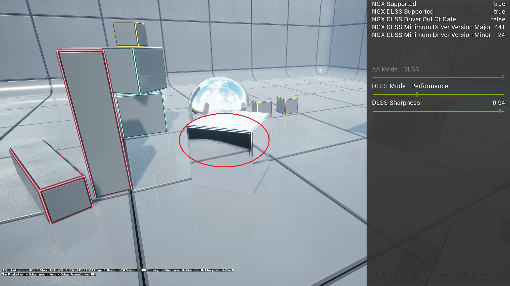

# 光线追踪反射

启用 `r.RayTracing.Reflections 1` 后，Vite 的反射效果经过深度优化，可在 PS5 级硬件上以原生 4K 分辨率 60 帧运行。启用 [DDGI](./DDGI-Dynamic.md) 后，反射光线会采样探测器辐照度进行二次反射，从而显著提升图像质量。

光线追踪反射将屏幕空间反射替换为追踪实际场景的光线，解决了屏幕空间反射的两个根本性缺陷：屏幕外几何体的反射以及背对摄像机的表面反射。

*反射表面显示屏幕空间反射丢失，即反射几何体离开画面的位置。图中圈出的故障模式是：反射在反射几何体离开屏幕处终止，因为屏幕空间反射已经没有可供采样的内容了。*

## 性能

这是 Vite 投入最多优化精力的领域之一，因为反射通常是继逐像素全局光照之后第二大最耗费资源的光线追踪效果。

正如虚幻竞技场 Vite 演示所展示的那样，Vite 的反射效果能够在 PS5 级别的 GPU 上以 4K 原生 60 帧运行，该演示结合了动态全局光照和曲面细分技术。这种配置在[性能目标](../EngineOverview/Performance-Targets.md)中属于“性能，高端”类别。

Vite 仍在继续优化光线追踪反射的性能，目标是达到与 PS5 版《鬼泣 5 特别版》中 [RE Engine](https://baike.baidu.com/item/RE%E5%BC%95%E6%93%8E/56040558) 的实现效果相当的性能水平。

## DDGI 光照反射

这是渲染器中最重要的交互，也是 Vite 之所以基于 NvRTX 分支而非标准的 4.27 版本构建的具体原因之一。

反射光线照射到一个表面上。该表面需要着色，这就需要知道照射到其上的间接光。如果光线追踪管线无法获取全局光照表示，则只能选择仅返回直接光照（阴影区域的反射会变成黑色），或者回退到立方体贴图（反射看起来不自然且静态）。

启用 DDGI 后，反射光线采样会探测照射点处的辐照度。反射表面的光照与场景其他部分保持一致，反射中的阴影区域保留了反射光，整个图像变得协调一致。

这是通过引擎端的集成实现的，而不是通过单独的开关：同时运行 DDGI 和 RT 反射即可。

## 调整

以下控制项对成本的影响大致如下：

**分辨率。** 反射可以以较低的分辨率进行追踪，然后再放大。这通常是节省成本最有效的方法，而且在粗糙表面上，质量损失并不大。

**最大粗糙度。** 粗糙度高于此阈值的表面会回退到成本更低的技术。降低此阈值非常有效，因为粗糙的反射恰恰是那些成本高昂但精度更高的结果最不明显的场景。

**最大反射次数。** 额外的反射会消耗大量成本，而且在特意使用正对镜面的场景之外，几乎不可见。

**光线距离。** 限制反射光线的传播距离可以降低大型开放场景的成本。

**降噪器设置。** 与 DDGI 不同，反射会使用降噪器。如果您在运动过程中看到反射出现沸腾或重影，则需要检查此设置。

## Vite 运行的是哪种反射算法？

Vite 继承了 4.27 和 NvRTX 的两种光线追踪反射实现：较旧的 `FRayTracingReflectionsRGS` 路径，支持混合反射和反射半透明效果；以及较新的排序延迟路径。

在默认构建中，`VITE_RT_PSO_DEBLOAT` 会强制使用**排序延迟**路径，并编译掉较旧的路径。排序延迟路径速度更快，Vite 的[性能目标](../EngineOverview/Performance-Targets.md)也以此为基准进行衡量。

需要注意的后果：

- `r.RayTracing.Reflections.ExperimentalDeferred` 无效——延迟路径会被无条件使用。
- 混合反射和下方的反射半透明效果控制选项不可用。
- 光线追踪反射捕获和反射探针（`r.RayTracing.Reflections.RayTraceEnvironmentCaptures`）会被编译掉。
- 单层水体光线追踪反射（`r.Water.SingleLayer.RTR`）已被编译移除。

请参阅[编译时开关](../Performance/Compile-Time-Switches.md)以恢复完整集合。

## 反射半透明效果

**注意：** 需要 `VITE_RT_PSO_DEBLOAT=0`。这些控件是未延迟反射着色器的排列维度，默认情况下该着色器会被编译掉。

默认情况下，虚幻引擎 4 在渲染光线追踪反射时，仅混合反射半透明网格的自发光颜色，这会导致玻璃和类似表面在反射中看起来不自然。Vite 继承了 NvRTX 选项，可以在反射中渲染完全光线追踪的半透明对象：

| 控制台变量 | 用途 |
|---|---|
| `r.RayTracing.Reflections.ReflectedTranslucencyMode` | 0 仅自发光，1 着色，2 着色和折射，3 着色、折射和吸收。默认值为 0。 |
| `r.RayTracing.Reflections.ReflectedTranslucencyMaxBounces` | 反射中光线追踪半透明效果的最大反弹次数。默认值为 8。 |
| `r.RayTracing.Reflections.ReflectedTranslucencyTransmissionThreshold` | 当累积透射率低于此值时，停止半透明效果的叠加。默认值为 0.1。 |

模式 3 效果最佳，但成本最高。在反射中可见大量玻璃的场景中，差异显著；在玻璃较少的场景中，则将其设置为 0。

## 何时使用 SSR？

对于 4K120 风格化目标以及任何最低规格不包含 DXR 的项目，屏幕空间反射 (Screen-space reflections, SSR) 仍然是最佳选择。SSR 的成本要低得多，而且在没有大面积平面反射面的场景中，其缺陷通常难以察觉。

光线追踪 (RT) 反射成本较高的场景包括：潮湿的街道、抛光的地板、水面、玻璃建筑和车辆油漆——任何大面积光滑表面反射摄像机无法看到的物体的地方。

## 另请参阅

- [光线追踪](./Ray-Tracing.md)
- [动态 DDGI](./DDGI-Dynamic.md)
- [RT 半透明和焦散](./RT-Translucency-And-Caustics.md)
- [编译时开关](../Performance/Compile-Time-Switches.md)
- [性能目标](../EngineOverview/Performance-Targets.md)
