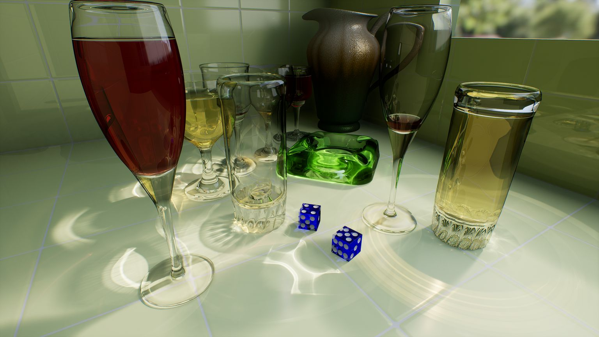
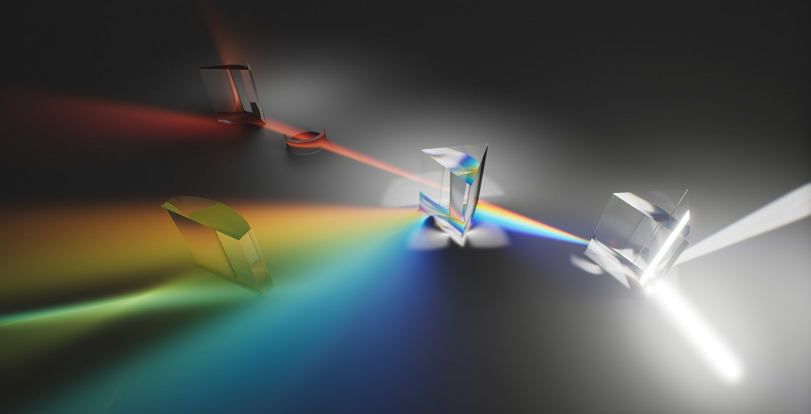
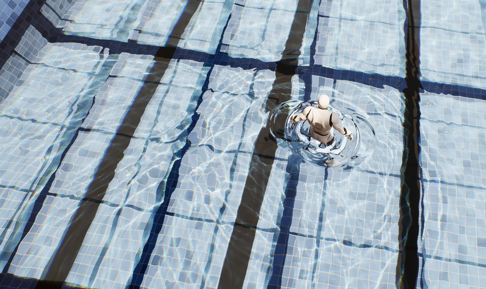
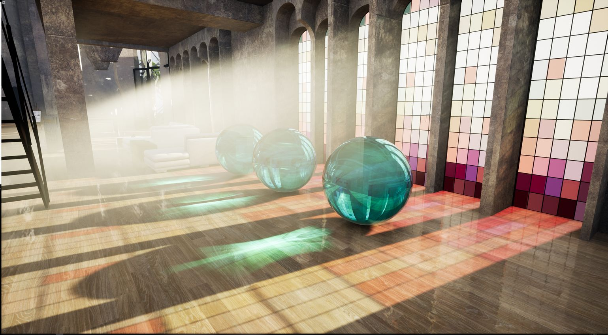

# 光线追踪半透明和焦散

混合半透明允许光栅化半透明和光线追踪半透明共存。推荐的高质量设置是 `r.RayTracing.Translucency 3` 加上吸收。网格焦散和水焦散是独立的系统，分别通过 `r.RayTracing.MeshCaustics.Enable` 和 `r.RayTracing.WaterCaustics.Type` 启用。

这些特性源自 NVIDIA 的 NvRTX 4.27 焦散分支，Vite 正是基于此分支。它们是渲染器中参数最多的部分，因此本页以参考文档的形式呈现，而非叙述。


**警告：** 本页所有内容均在默认版本中编译完成。当 `VITE_RT_PSO_DEBLOAT` 设置为 1（默认值）时，光线追踪半透明、网格焦散和水焦散的着色器变体将被移除。它们的控制台变量将成功设置，但不会渲染任何内容。要使用这些特效，请使用 `VITE_RT_PSO_DEBLOAT=0` 重新编译。请参阅[编译时开关](../Performance/Compile-Time-Switches.md)。


这些是光线追踪套件中最耗费资源的特效，在 4K 分辨率下，它们都无法满足 Vite 的[性能目标](../EngineOverview/Performance-Targets.md)。此处记录这些特效是因为 NvRTX 系列提供了这些特效，并且某些项目会在过场动画、宣传素材或特定场景中使用它们。

**注意：** 所有从 NvRTX Caustics 分支继承的 RTX 特性代码和美术资源均受 [GameWorks 许可协议](https://developer.nvidia.com/gameworks-source-sdk-eula)保​​护。


## 半透明模式

UE4 默认的光线追踪半透明效果会强制**所有**半透明效果都通过光线追踪管线实现，这会导致不支持的图元类型（例如级联粒子）消失，并且产生的折射行为与为光栅化而制作的内容交互起来不直观。混合半透明可以解决这个问题。

| `r.RayTracing.Translucency` | 模式 |
|---|---|
| `0` | UE4 原生光线追踪半透明关闭 |
| `1` | UE4 原生光线追踪半透明开启 |
| `2` | 混合半透明 1 — 仅光线追踪半透明反射 |
| `3` | 混合半透明 2 — 光线追踪半透明反射和折射 |

混合模式需要在项目设置中勾选**混合半透明**复选框，因为它们会改变基础半透明着色器。相应的着色器支持开关是 `r.RayTracing.HybridTranslucencySupport`。


### 模式 2 — 仅反射


将多层半透明效果追踪到屏幕外表面，然后将其合成为普通光栅半透明效果的一部分。与完全光线追踪的半透明效果相比，它会损失与顺序无关的透明度和折射效果，但在提供光线追踪反射和着色的同时，这些方面并不逊色于光栅模式。


| 控制台变量 | 用途 |
|---|---|
| `r.RayTracing.Translucency.HybridLayers` | 追踪多少个重叠的光线追踪半透明层 |
| `r.RayTracing.Translucency.HybridDepthThreshold` | 几何体被视为不同半透明层的世界空间分离阈值。阈值过小，混合半透明效果将不会显示，或者会出现 Z 冲突伪影；阈值过大，堆叠的层会错误地合并。 |
| `r.RayTracing.Translucency.HalfRes` | 0 全透明，1 垂直半透明（交错），2 半棋盘格（四点），3 半棋盘格（垂直两点） |

### 模式 3 — 反射和折射

混合了光栅化和**完全**光线追踪的半透明效果，包括反射、折射和 OIT 支持。级联粒子可以与光线追踪半透明效果共存，而不会损失其优势。此模式下，与顺序无关的透明度是自动的。

这是半透明网格的推荐模式，建议与吸收效果结合使用。

推荐设置以获得最佳视觉效果：

```
r.RayTracing.Translucency.Refraction 1
r.RayTracing.Translucency.HybridLayers 5
r.RayTracing.Translucency.MaxRefractionRays 5
```

在 4.27 版本中，当在模式 3 下启用 RT 折射时，每个材质的折射率 (IOR) 将绑定到基于 PBR 的折射率输入；材质的“折射模式”输入必须设置为“折射率（Index Of Refraction）”。


模式 3 还允许您为每个网格选择半透明静态网格是否参与光线追踪。不参与光线追踪的网格将通过光栅化渲染，这允许您在同一场景中混合使用光线追踪和光栅化的半透明效果，并通过减少光线追踪管线的工作负载来提高性能。

模式 3 的补充说明：

- `r.RayTracing.Translucency.HybridDepthThreshold` 不适用。在确定图层顺序时，请使用 `r.RayTracing.Translucency.PrimaryRayBias` 来调整深度。
- 当 Cascade 和 Niagara 发射器生成的不透明网格被光线追踪生成的半透明网格完全遮挡时，这些不透明网格可能会消失，因为某些粒子类型无法生成光线追踪硬件所需的 BVH 数据。这是 UE4 的一个已知特性，混合模式 2 不会改变这一点。
- 半分辨率折射可通过 `r.RayTracing.Translucency.HalfRes` 实现：0 为全分辨率折射，1 为加权颜色重建的半棋盘格折射，2 为帧间半棋盘格折射，3 为平均颜色重建的半棋盘格折射。这些重建技术旨在用于 TAA 抗锯齿，在 DLSS 下需要仔细调整，因为 DLSS 会放大像素级重建伪影。 

## 半透明吸收

启用吸收后，由相同材质制成的较厚物体看起来透明度较低，这符合物理规律，并且在玻璃和液体材质的渲染上能显著提升保真度。吸收是针对特定材质的选项，因此启用和禁用吸收的物体会同时渲染。

### 启用半透明吸收

1. 确保已启用光线追踪半透明。

2. 将 `r.RayTracing.Translucency.EnableAbsorption` 设置为 1，或在后处理体积中选中**启用吸收（Enable Absorption）**。

3. 在材质编辑器中，为每个需要使用吸收的材质选中**光线追踪半透明吸收（Ray Traced Translucency Absorption）**。

吞吐量剔除通过丢弃低贡献度的光线路径来降低渲染成本：

| 控制台变量 | 用途 |
|---|---|
| `r.RayTracing.Translucency.MinRefractionThroughput` | 值越高，剔除的折射光线越多。可能会产生瑕疵。 |
| `r.RayTracing.Translucency.MinReflectionThroughput` | 值越高，剔除的反射光线越多。可能会产生瑕疵。 |
| `r.RayTracing.PrimaryRays.AbsorptionForceShadingOnOpaqueObjects` | 设置为 1 可消除 Actor 遮挡背景时透明反射产生的双重着色瑕疵。 |

## 主光线景深

光栅化景深处理半透明效果不佳，尤其是在级联粒子与半透明玻璃相交时。光线追踪可以实现精确的**影视级**景深。

### 启用光线追踪景深

1. 使用电影摄影机并按常规方式应用景深。

2. 收集摄影机视锥体内的所有半透明材质，包括半透明粒子。对于每个根材质，选中**输出半透明深度（Output Translucency Depth）**，并确保**半透明深度不透明度阈值（Translucency Depth Opacity Threshold）**低于材质实例的不透明度参数。

3. 设置 `r.RayTracing.PrimaryRays.IncludeDOF` 为 1。

强烈建议同时启用增强型半透明模式 3、光线追踪半透明反射和折射以及半透明吸收，并配合光线追踪景深使用。DLSS 会自动支持。


## 网格焦散

为半透明和金属物体渲染交互式焦散效果。支持所有四种 UE4 光照类型、多个光源、反射和折射焦散、色散和柔和焦散。

*POV-Ray 眼镜场景，光线追踪折射焦散投射到瓷砖表面上。瓷砖上的每一个明亮图案都是折射焦散线，是描摹出来的，而不是创作出来的。*


*棱镜通过光线追踪**色散**将白光束分解成光谱。需要材质根节点中**光线追踪焦散色散量**大于 0，并且 `r.RayTracing.MeshCaustics.EnableDispersion 1`。*


### 启用网格焦散

1. 启用光线追踪。

2. 在后处理体积的**光线追踪网格焦散（Ray Tracing Mesh Caustics）**下选中**已启用（Enabled ）**，或设置 `r.RayTracing.MeshCaustics.Enable 1`。

3. 在灯光属性中，选中**投射网格焦散（Cast Mesh Caustics）**。

4. 对于金属材质，选中**投射光线追踪反射焦散（Cast Ray Traced Reflection Caustics）**。对于半透明物体，选中
**投射光线追踪反射焦散（Cast Ray Traced Reflection Caustics）**以启用反射焦散，选中**投射光线追踪折射焦散（Cast Ray Traced Refraction Caustics）**以启用折射焦散。


### 功能设置

当控制台变量设置为 `-1` 时，后处理体积控制其实际值。

| 控制台变量 | 用途 |
|---|---|
| `r.RayTracing.MeshCaustics.EnableTranslucentReflection` | 为透明物体启用反射焦散 |
| `r.RayTracing.MeshCaustics.TranslucentReflectionMode` | 0 仅折射，1 折射加反射（第一次反弹），2 任意反弹次数均反射 |
| `r.RayTracing.MeshCaustics.EnableDispersion` | 启用散射。需要材质根节点中**光线追踪焦散散射量（Ray Traced Caustics Dispersion Amount）**大于 0。 |
| `r.RayTracing.MeshCaustics.DispersionSamples` | 用于散射的颜色样本 |
| `r.RayTracing.MeshCaustics.SoftCausticsSample` | 软焦散的样本数量。需要光照设置中**网格焦散柔和度（Mesh Caustics Softness）**大于 0。 |
| `r.RayTracing.MeshCaustics.EnableAdvancedSoftCaustics` | 更高质量的软焦散算法 |

要显示每个材质实例的色散量，请勾选**光线追踪焦散使用自定义数据 0 作为色散量（Ray Traced Caustics Use CustomData 0 As Dispersion Amount）**，并将一个标量连接到“自定义数据 0”通道，这样就可以在运行时调整该参数。


### 性能调优

性能的关键在于限制光子数量。将视图模式设置为**光线追踪调试→网格焦散调试数据（Ray Tracing Debug &rarr; Mesh Caustics Debug Data）**，然后将**调试光照数据类型（Debug Light Data Type）**设置为**光子数量（Photon Count）**。在典型情况下，大约 10 万个光子即可获得不错的效果。如果光子数量过高，请在后处理体积中增加**自适应光子大小（Adaptive Photon Size）**并降低**自适应方差增益（Adaptive Variance Gain）**，同时提高**最终剔除阈值（Final Cull Threshold）**和**中间剔除阈值（Mid Cull Threshold）**，直到焦散开始消失。


| 控制台变量 | 用途 |
|---|---|
| `r.RayTracing.MeshCaustics.FinalCullColorThreshold` | 剔除低贡献度光线 |
| `r.RayTracing.MeshCaustics.MidCullColorThreshold` | 剔除低贡献度光线 |
| `r.RayTracing.MeshCaustics.BufferScale` | -1 表示后处理体积，0 表示全分辨率，1 表示半分辨率，2 表示四分之一分辨率 |
| `r.RayTracing.MeshCaustics.AdaptivePhotonSize` | 目标屏幕空间光子尺寸。尺寸越小，细节越丰富，但计算成本也越高。 |
| `r.RayTracing.MeshCaustics.AdaptiveVarianceGain` | 更高的值可以抑制闪烁 |
| `r.RayTracing.MeshCaustics.EnableTemporalFilter` | 启用时间滤波以减少闪烁 |
| `r.RayTracing.MeshCaustics.TemporalStrength` | 更高的值可以提高稳定性，但可能会引入延迟或重影 |
| `r.RayTracing.MeshCaustics.MaxTraceDepth` | 限制反弹次数；提高半透明物体的性能 |

## 水体焦散效果

为从池塘到开阔**海域**的各种水域渲染交互式焦散效果。支持所有四种光照类型、多光源、反射和折射焦散、色散、柔和焦散和级联焦散贴图。

*游泳池场景，泳池底部被光线追踪技术营造出水波纹效果，一个角色正在搅动水面。采用单向光源照射。由于焦散效果是逐帧追踪水面网格生成的，因此会随着水面扰动而变化。*


### 启用水体焦散

1. 启用光线追踪。

2. 在后处理体积中选择水体焦散类型，或将 `r.RayTracing.WaterCaustics.Type` 设置为 1 或 2。

3. 在灯光属性中，选中**投射水体焦散（Cast Water Caustics）**。

4. 在水面静态网格 Actor 上，在“光线追踪”选项卡下选中**评估光线追踪水体焦散（Evaluate Ray Tracing Water Caustics）**。水面材质必须使用半透明混合模式。


### 选择算法

**光子差分散射（类型 1）** 灵活，适用于 UE4 支持的所有光照类型。它需要相对高分辨率的焦散贴图才能生成清晰的图案，因此对于海洋和大型湖泊等大面积表面，建议同时启用级联焦散贴图。级联焦散贴图可以保持摄像机附近的焦散清晰，同时降低远处的渲染成本。

**程序化焦散网格（类型 2）** 即使使用相对低分辨率的贴图也能生成非常清晰的焦散。它不需要级联焦散贴图，因此不与级联焦散贴图一起使用。它通常比 PDS 更快，但不支持面光源，并且可能会在焦散接收器的边缘留下瑕疵。

### 设置

| 控制台变量 | 用途 |
|---|---|
| `r.RayTracing.WaterCaustics.MaxReflectionRayDistance` | 设置为 0 可禁用反射焦散 |
| `r.RayTracing.WaterCaustics.MaxRefractionRayDistance` | 设置为 0 可禁用折射焦散 |
| `r.RayTracing.WaterCaustics.MapCascades` | 级联数量，最多 4 级。仅限类型 1。 |
| `r.RayTracing.WaterCaustics.MapSizeX` / `MapSizeY` | 焦散贴图大小，默认值为 2048。对于小型池塘，1024 通常足够，并且可以显著提升性能。 |
| `r.RayTracing.WaterCaustics.NumDenoisePasses` | 默认值为 2。减少到 0 可获得更锐利的效果。 |
| `r.RayTracing.WaterCaustics.UseSceneLightDir` | 设置为 0 可从摄像机上方而非沿光照方向捕获焦散贴图。仅适用于平行光。 |
| `r.RayTracing.WaterCaustics.BufferScale` | 1 表示全分辨率，2 表示半分辨率，4 表示四分之一分辨率 |
| `r.RayTracing.WaterCaustics.PhotonScale` | PDS 中的初始光子大小。默认值为 3。 |
| `r.RayTracing.WaterCaustics.ShowPhoton` | 调试：将光子绘制为点 |
| `r.RayTracing.WaterCaustics.RefractBackFaceCullingThreshold` | 设置为 -0.5 左右可忽略出现裂缝或接缝的表面法线 |
| `r.RayTracing.WaterCaustics.ReflectBackFaceCullingThreshold` | 与上述相同，用于反射焦散。 |

将水体焦散限制在单个动态光源上可以显著提升性能；光源距离剔除和强度衰减功能完全受支持。

焦散焦点取决于网格和法线强度：较大的波浪或较强的法线贴图值会产生更显著的焦散效果。要启用分散效果，请在后期处理体积中增加**分散强度（Dispersion Intensity）**并调整**分散偏移（Dispersion Offset）**。


## 示例内容

NVIDIA 为以下功能提供了项目文件和打包演示：

- [所有项目文件](https://drive.google.com/drive/folders/1MfJ1rLqwx8acdscFfQtaYOR2Cdm1WPz9?usp=sharing)
- [所有打包演示](https://drive.google.com/drive/folders/1yHFOtmZWVDof8GbfZJMeazfb927ahTDn?usp=sharing)


特定场景：用于演示强折射的 POV-Ray 眼镜场景、棱镜分散演示、用于演示水体焦散的游泳池场景，以及混合了粒子、反射、折射、网格焦散和实时全局光照 (RTGI) 的办公室场景。另请参阅本手册中的[废弃公寓](../ProjectsAndDemos/Abandone-Apartment.md)和[阁楼](../ProjectsAndDemos/Attic-Scene.md)场景。

*结合了体积光、半透明球体、光线追踪反射和折射的办公室场景，一次性运用了所有技术：粒子、半透明反射和折射、网格焦散和光线追踪全局光照都在单个帧中实现。*


## 另请参阅

- [光线追踪](./Ray-Tracing.md)
- [光线追踪反射](./RT-Reflections.md)
- [超分辨率和帧生成](./Upscalers.md)
- [控制台变量参考](../Reference/Console-Variables.md)
