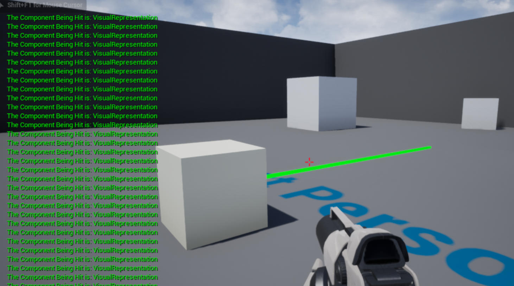

# Actor 线轨迹（line trace）碰撞检测


接上一节教程，创建一个新的 actor，在这个例子中，我们将新建的 Actor 子类称为 `ActorLineTrace` 。

我们不需要在头文件中做任何事情。以防万一，下面是默认创建的头文件。

**ActorLineTrace.h**

```cpp
#pragma once
 
#include "CoreMinimal.h"
#include "GameFramework/Actor.h"
#include "ActorLineTrace.generated.h"
 
UCLASS()
class UNREALCPP_API AActorLineTrace : public AActor
{
	GENERATED_BODY()
	
public:	
	// Sets default values for this actor's properties
	AActorLineTrace();
 
protected:
	// Called when the game starts or when spawned
	virtual void BeginPlay() override;
 
public:	
	// Called every frame
	virtual void Tick(float DeltaTime) override;
};
```

为了帮助我们可视化线轨迹，我们将包含 `DrawDebugHelpers` 头文件。这将允许我们绘制一条高亮的线轨迹。我们还将包含 `ConstructorHelpers.h` ，以立即向 actor 添加一个网格以实现可视化表示。通常首选在编辑器中添加一个网格（没有 `ConstructorHelpers.h` 帮助的情况下），但我们应该继续在 C++ 中尝试新的东西。

```cpp
#include "ActorLineTrace.h"
// add these scripts to use their functions
#include "ConstructorHelpers.h"
#include "DrawDebugHelpers.h"
```

我们通过创建 `UStaticMeshComponent` 的 `DefaultSubobject` 向 actor 添加一个立方体。然后，我们让新的立方体成为 actor 的根组件。我们通过从 `ConstructorHelpers` 调用 `FObjectFinder`，以编程方式向 actor 添加一个网格。在 `FObjectFinder` 中，我们提供了到网格的路径。在此处我们需要检查我们是否成功得到网格。如果我们成功获得了网格，我们就设置 actor 的 `StaticMesh`, `RelativeLocation` 和 `Scale`。

下面是我们放入 actor 的构造函数中的代码。

```cpp
AActorLineTrace::AActorLineTrace()
{
 	// Set this actor to call Tick() every frame.  You can turn this off to improve performance if you don't need it.
	PrimaryActorTick.bCanEverTick = true;
 
	// add cube to root
    UStaticMeshComponent* Cube = CreateDefaultSubobject<UStaticMeshComponent>(TEXT("VisualRepresentation"));
    Cube->SetupAttachment(RootComponent);
 
    static ConstructorHelpers::FObjectFinder<UStaticMesh> CubeAsset(TEXT("/Game/StarterContent/Shapes/Shape_Cube.Shape_Cube"));
 
	if (CubeAsset.Succeeded())
    {
        Cube->SetStaticMesh(CubeAsset.Object);
        Cube->SetRelativeLocation(FVector(0.0f, 0.0f, 0.0f));
        Cube->SetWorldScale3D(FVector(1.f));
	}
	
	// add another component in the editor to the actor to overlap with the line trace to get the event to fire
}
```

接下来，在 actor 的 `Tick` 函数上，我们想要绘制线条轨迹，看看它是否碰到了什么东西。

对于本例，我们将检查同一 actor 内是否有其他对象。让我们先分别创建变量 `HitResult` 和 `StartingPosition`

```cpp
void AActorLineTrace::Tick(float DeltaTime)
{
	Super::Tick(DeltaTime);
 
	FHitResult OutHit;
	FVector Start = GetActorLocation();
}
```

起始位置是矢量，这意味着它有X,Y,Z三个分量。我想要向上移动线轨迹，让其更靠近网格的中心，同时又要让它和网格保持一定距离，这样它才不会与自己碰撞。那么上面的代码修改为

```cpp
void AActorLineTrace::Tick(float DeltaTime)
{
	Super::Tick(DeltaTime);
 
	FHitResult OutHit;
	FVector Start = GetActorLocation();
 
	Start.Z += 50.f;
	Start.X += 200.f;
}
```

在那之后，让我们通过使用 `GetActorForwardVector()` 来获得网格的前向向量，以确保线轨迹是从网格的前面移动出来的。然后我们将创建 `End` 变量来告诉线轨迹到哪里结束。在这个例子中，行跟踪将从 50 个单位以上开始，向前 200 个单位，并从起点 500 个单位结束。

同时，我们还要为线轨迹函数创建碰撞参数变量。


```cpp
void AActorLineTrace::Tick(float DeltaTime)
{
	Super::Tick(DeltaTime);
 
	FHitResult OutHit;
	FVector Start = GetActorLocation();
 
	Start.Z += 50.f;
	Start.X += 200.f;
 
	FVector ForwardVector = GetActorForwardVector();
	FVector End = ((ForwardVector * 500.f) + Start);
	FCollisionQueryParams CollisionParams;
}
```

在开发时，我们希望看到我们的线轨迹。通过上面的变量，我们将使用 `DrawDebugLine` 函数来画一条绿色的线。如果线轨迹接触到我们这个 actor 中的任何组件，将向屏幕打印一条消息。

```cpp
void AActorLineTrace::Tick(float DeltaTime)
{
	Super::Tick(DeltaTime);
 
	FHitResult OutHit;
	FVector Start = GetActorLocation();
 
	Start.Z += 50.f;
	Start.X += 200.f;
 
	FVector ForwardVector = GetActorForwardVector();
	FVector End = ((ForwardVector * 500.f) + Start);
	FCollisionQueryParams CollisionParams;
 
	DrawDebugLine(GetWorld(), Start, End, FColor::Green, false, 1, 0, 5);
 
	if(ActorLineTraceSingle(OutHit, Start, End, ECC_WorldStatic, CollisionParams))
	{
		GEngine->AddOnScreenDebugMessage(-1, 1.f, FColor::Green, FString::Printf(TEXT("The Component Being Hit is: %s"), *OutHit.GetComponent()->GetName()));
	}
}
```

以下是完整的 cpp 代码

```cpp
#include "ActorLineTrace.h"
#include "UObject/ConstructorHelpers.h"
#include "DrawDebugHelpers.h"
 
// Sets default values
AActorLineTrace::AActorLineTrace()
{
 	// Set this actor to call Tick() every frame.  You can turn this off to improve performance if you don't need it.
	PrimaryActorTick.bCanEverTick = true;
 
	// add cube to root
    UStaticMeshComponent* Cube = CreateDefaultSubobject<UStaticMeshComponent>(TEXT("VisualRepresentation"));
    Cube->SetupAttachment(RootComponent);
 
    static ConstructorHelpers::FObjectFinder<UStaticMesh> CubeAsset(TEXT("/Game/StarterContent/Shapes/Shape_Cube.Shape_Cube"));
 
	if (CubeAsset.Succeeded())
    {
        Cube->SetStaticMesh(CubeAsset.Object);
        Cube->SetRelativeLocation(FVector(0.0f, 0.0f, 0.0f)); ///< 根据自己的实际情况调整
        Cube->SetWorldScale3D(FVector(1.f));
	}
	
	// add another component in the editor to the actor to overlap with the line trace to get the event to fire
 
}
 
// Called when the game starts or when spawned
void AActorLineTrace::BeginPlay()
{
	Super::BeginPlay();
	
}
 
// Called every frame
void AActorLineTrace::Tick(float DeltaTime)
{
	Super::Tick(DeltaTime);
 
	FHitResult OutHit;
	FVector Start = GetActorLocation();
 
	Start.Z += 50.f;
	Start.X += 200.f; ///< 根据自己的实际情况调整
 
	FVector ForwardVector = GetActorForwardVector();
	FVector End = ((ForwardVector * 500.f) + Start);
	FCollisionQueryParams CollisionParams;
 
	DrawDebugLine(GetWorld(), Start, End, FColor::Green, false, 1, 0, 5);
 
	if(ActorLineTraceSingle(OutHit, Start, End, ECC_WorldStatic, CollisionParams))
	{
		GEngine->AddOnScreenDebugMessage(-1, 1.f, FColor::Green, FString::Printf(TEXT("The Component Being Hit is: %s"), *OutHit.GetComponent()->GetName()));
	}
 
}
```

实际的运行效果如下




## 参考

* [Actor 线轨迹（line trace）碰撞检测【十七】](https://panda1234lee.blog.csdn.net/article/details/119133207)
* [英文原地址](https://unrealcpp.com/actor-line-trace/)
