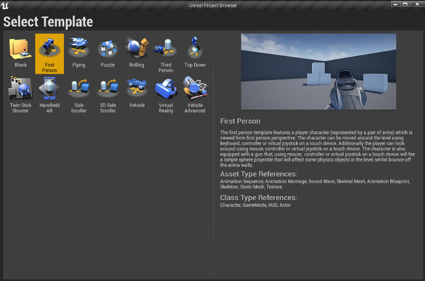
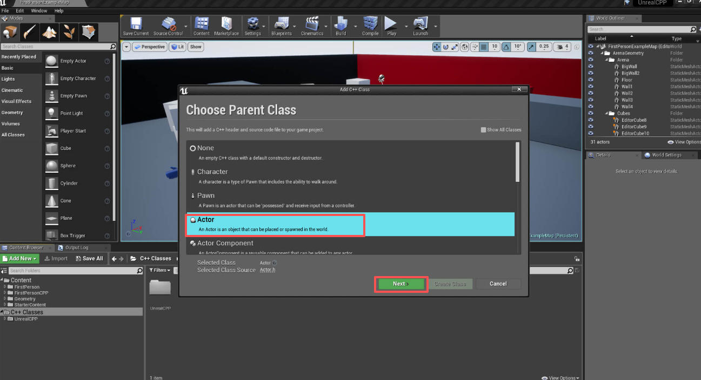
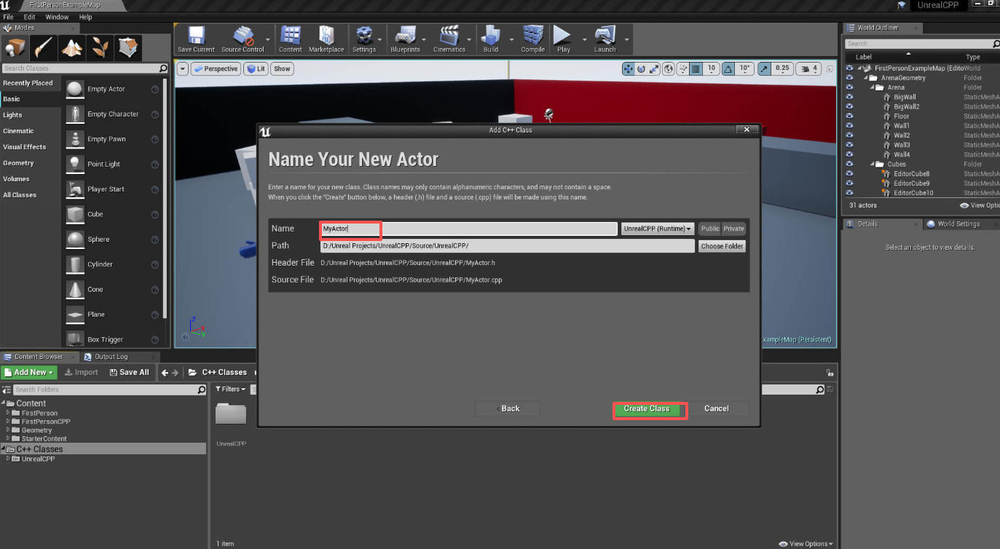

# 1. 添加 Actor 子类

新建项目时使用标准的第一人称 C++ 模板并带上入门内容

要添加一个新的 C++ 类到您的项目，首先右键单击，然后选择 new C++ 类。然后选择您想要继承的父类。在本教程大多数情况，都是从 Actor 类中继承的。接下来，命名并设置类的位置路径。

**创建一个新的 C++ 类**

**选择我们想要继承的父类**

**设置该新建的 Actor 子类的路径和名字**

在本教程中，将新建的 Actor 命名为 MyActor，并将默认路径设置为引擎提供的路径。
