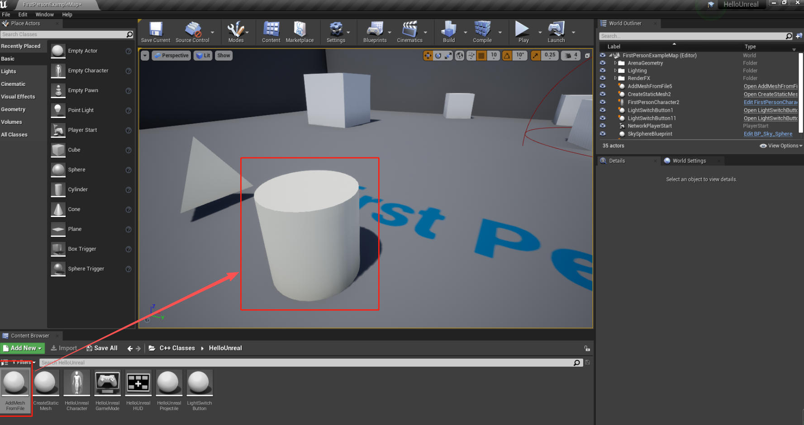

# 3. 添加静态网格文件

接上一节的教程，让我们首先创建一个名为 AddMeshFromFile 的新 Actor 子类。

我们不需要在头文件中做任何事情。下面是创建新类时生成的默认头文件`AddMeshFromFile.h`。

```C++
#pragma once
#include "CoreMinimal.h"
#include "GameFramework/Actor.h"
#include "AddMeshFromFile.generated.h"
UCLASS()
class UNREALCPP_API AAddMeshFromFile : publicAActor
{
	GENERATED_BODY()
public:
	// Sets default values for this actor's properties
	AAddMeshFromFile();
protected:
	// Called when the game starts or when spawned
	virtual void BeginPlay() override;
public:
	// Called every frame
	virtual void Tick(float DeltaTime) override;
};
```

为了以编程方式添加一个特定的网格，我们必须包含头文件 [`ConstructorHelpers.h`](https://github.com/OpenHUTB/engine/blob/hutb/Engine/Source/Runtime/CoreUObject/Public/UObject/ConstructorHelpers.h) 。

代码如下，在 Actor 子类头文件后包含该头文件。

```C++
#include "AddMeshFromFile.h"
// add constructor header
#include "UObject/ConstructorHelpers.h"
```

接下来，在 Actor 子类的构造函数中，我们将设置要添加到 actor 中的网格的默认值。创建一个 `UStaticMeshComponent` 指针，并将其设置为 `RootComponent` 。

```C++
AAddMeshFromFile::AAddMeshFromFile()
{
	// Set this actor to call Tick() every frame. You can turn this off to improve performance if you don't need it.
	PrimaryActorTick.bCanEverTick = true;
	// add Cylinder to root
    UStaticMeshComponent* Cylinder = CreateDefaultSubobject<UStaticMeshComponent>(TEXT("VisualRepresentation"));
    Cylinder->SetupAttachment(RootComponent);
}
```

在初始化设置之后，下一步是添加我想要的网格到我们的角色。我们将使用 `ConstructorHelpers` 中的方法 `FObjectFinder` 来定位我们的网格。在这个例子中，我构造并调用了变量 `CylinderAsset`，并传入了由初学者内容提供的圆柱体形状的路径。我们传入的路径是 `/Game/StarterContent/Shapes/Shape_Cylinder.Shape_Cylinder` 。

```C++
AAddMeshFromFile::AAddMeshFromFile()
{
	// Set this actor to call Tick() every frame. You can turn this off to improve performance if you don't need it.
	PrimaryActorTick.bCanEverTick = true;
	// add Cylinder to root
    UStaticMeshComponent* Cylinder = CreateDefaultSubobject<UStaticMeshComponent>(TEXT("VisualRepresentation"));
    Cylinder->SetupAttachment(RootComponent);
   static ConstructorHelpers::FObjectFinder<UStaticMesh> CylinderAsset(TEXT("/Game/StarterContent/Shapes/Shape_Cylinder.Shape_Cylinder"));
}
```

接下来，让我们做一个错误检查，以确保我们成功地获得网格。
```C++
if (CylinderAsset.Succeeded()) {}
```

如果该检查语句通过的话，让我们接着在圆柱体组件上执行下面三句话

* 设置静态网格：SetStaticMesh
* 设置相对位置：SetRelativeLocation
* 设置缩放：SetWorldScale3D

```C++
if (CylinderAsset.Succeeded())
{
    Cylinder->SetStaticMesh(CylinderAsset.Object);
    Cylinder->SetRelativeLocation(FVector(0.0f, 0.0f, 0.0f));
    Cylinder->SetWorldScale3D(FVector(1.f));
}
```

最后完整的 cpp 为 [AddMeshFromFile.cpp](../../src/tutorial/AddMeshFromFile.cpp)

将新建的 actor 子类拖入场景中，最后的结果如下：




## 参考

* [C++ 中添加静态网格文件【三】](https://blog.csdn.net/panda1234lee/article/details/119094175)