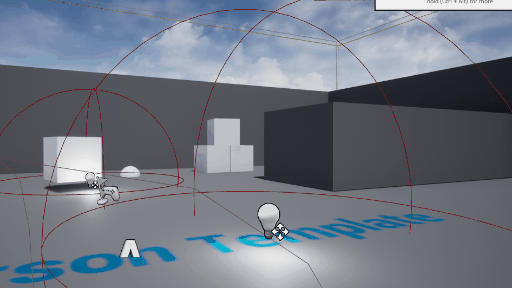

# 给 Actor 添加径向推力


接上一节教程，本教程非常有趣，我们将通过在设定范围内的所有物体上添加径向推力来模拟爆炸。

创建一个名为 `AddRadialForce` 的新角色。我们不需要对头文件做任何操作。下面是由虚幻生成的默认头文件。

**AddRadialForce.h**

```cpp
#pragma once
 
#include "CoreMinimal.h"
#include "GameFramework/Actor.h"
#include "AddRadialForce.generated.h"
 
UCLASS()
class UNREALCPP_API AAddRadialForce : public AActor
{
	GENERATED_BODY()
	
public:	
	// Sets default values for this actor's properties
	AAddRadialForce();
 
protected:
	// Called when the game starts or when spawned
	virtual void BeginPlay() override;
 
public:	
	// Called every frame
	virtual void Tick(float DeltaTime) override;
	
};
```

为了在调试过程中提供帮助，让我们将 `DrawDebugHelpers` 头文件添加到代码中。


```cpp
#include "AddRadialForce.h"
// add debug helpfers
#include "DrawDebugHelpers.h"
```

在这个例子中，我们将在 `BeginPlay()` 函数中执行所有的逻辑。我们想要收集我们范围内的所有命中结果，并从范围的扫描中获得结果。为此，我们将使用 `TArray` 跟踪重叠的 actor。


```cpp
void AAddRadialForce::BeginPlay()
{
	Super::BeginPlay();
 
	// create tarray for hit results
	TArray<FHitResult> OutHits;
 
	// crate tarray for sweep actors
	TArray<AActor*> SweepActors;	
}
```

接下来我们要声明 `TArray` 数组 `OutHits` 。我们希望扫描范围从 actor 的位置开始同时也从该位置结束，并让 `CollisionShape` 是一个 500 单位的球体。您可以使用 `GetActorLocation()` 来获取 actor 的位置，它返回一个向量。我们使用 `FCollisionShape::makephere(500.0f)` 来创建一个CollisionShape。

```cpp
// 当游戏开始或生成时调用
void AAddRadialForce::BeginPlay()
{
	Super::BeginPlay();
 
	// 为撞击结果创建 tarray 数组
	TArray<FHitResult> OutHits;
 
	// 获得 actor 的位置
	FVector MyLocation = GetActorLocation();
	
	// 开始和结束位置。该球体会创建镜像扫描
	FVector Start = MyLocation;
	FVector End = MyLocation;
 
	// 创建碰撞球体
	FCollisionShape MyColSphere = FCollisionShape::MakeSphere(500.0f);	
}
```

为了可视化扫描的球体，我们将绘制一个调试球体。

```cpp
// Called when the game starts or when spawned
void AAddRadialForce::BeginPlay()
{
	Super::BeginPlay();
 
	// create tarray for hit results
	TArray<FHitResult> OutHits;
 
	// get actor locations
	FVector MyLocation = GetActorLocation();
	
	// start and end locations. The sphere will create the radial sweep.
	FVector Start = MyLocation;
	FVector End = MyLocation;
 
	// create a collision sphere
	FCollisionShape MyColSphere = FCollisionShape::MakeSphere(500.0f);
 
	// 绘制碰撞球体
    DrawDebugSphere(GetWorld(), GetActorLocation(), MyColSphere.GetSphereRadius(), 50, FColor::Cyan, true);
}
```

如果 isHit 为真，我们将通过遍历数组 OutHits ，并向每个成功 cast 的 actor 的根组件添加径向推力。

```cpp
if (isHit)
	{
		// loop through TArray
		for (auto& Hit : OutHits)
		{
			UStaticMeshComponent* MeshComp = Cast<UStaticMeshComponent>((Hit.GetActor())->GetRootComponent());
 
			if (MeshComp)
			{
                // alternivly you can use  ERadialImpulseFalloff::RIF_Linear for the impulse to get linearly weaker as it gets further from origin.
				// set the float radius to 500 and the float strength to 2000.
				MeshComp->AddRadialImpulse(GetActorLocation(), 500.f, 2000.f, ERadialImpulseFalloff::RIF_Constant, true);
			}
		}
	}
```

最终完整 cpp 代码如下：

```cpp
#include "AddRadialForce.h"
// add debug helpfers
#include "DrawDebugHelpers.h"
 
// Sets default values
AAddRadialForce::AAddRadialForce()
{
 	// Set this actor to call Tick() every frame.  You can turn this off to improve performance if you don't need it.
	PrimaryActorTick.bCanEverTick = true;
 
}
 
// Called when the game starts or when spawned
void AAddRadialForce::BeginPlay()
{
	Super::BeginPlay();
 
	// create tarray for hit results
	TArray<FHitResult> OutHits;
 
	// get actor locations
	FVector MyLocation = GetActorLocation();
	
	// start and end locations. The sphere will create the radial sweep.
	FVector Start = MyLocation;
	FVector End = MyLocation;
 
	// create a collision sphere
	FCollisionShape MyColSphere = FCollisionShape::MakeSphere(500.0f);
 
	// draw collision sphere
	DrawDebugSphere(GetWorld(), GetActorLocation(), MyColSphere.GetSphereRadius(), 50, FColor::Cyan, true);
	
	// check if something got hit in the sweep
	bool isHit = GetWorld()->SweepMultiByChannel(OutHits, Start, End, FQuat::Identity, ECC_WorldStatic, MyColSphere);
 
	if (isHit)
	{
		// loop through TArray
		for (auto& Hit : OutHits)
		{
			UStaticMeshComponent* MeshComp = Cast<UStaticMeshComponent>((Hit.GetActor())->GetRootComponent());
 
			if (MeshComp)
			{
				// alternivly you can use  ERadialImpulseFalloff::RIF_Linear for the impulse to get linearly weaker as it gets further from origin.
				// set the float radius to 500 and the float strength to 2000.
				MeshComp->AddRadialImpulse(GetActorLocation(), 500.f, 2000.f, ERadialImpulseFalloff::RIF_Constant, true);
			}
		}
	}
	
}
 
// Called every frame
void AAddRadialForce::Tick(float DeltaTime)
{
	Super::Tick(DeltaTime);
}
```

实际运行起来的效果图如下：




## 参考

* [给 Actor 添加径向推力【十八】](https://panda1234lee.blog.csdn.net/article/details/119140900)
* [英文原地址](https://unrealcpp.com/add-radial-impulse-to-actor/)