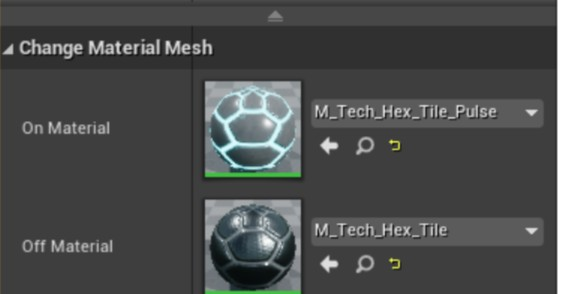

# 30. 触发改变网格的材质

在本教程中，当发生重叠事件时，我们将改变静态网格的材质。首先，创建一个新的 Actor 子类，在本教程中我叫它 `ChangeMaterialMesh`。

首先，在 .h 文件中，我们将创建一个 `UStaticMeshComponent` 、两个 `UMaterial` 类和一个 `UBoxComponent`。将元素添加到头文件的公共部分。

```cpp
...
UPROPERTY(VisibleAnywhere)
class UStaticMeshComponent* MyMesh;
 
UPROPERTY(EditAnywhere)
class UMaterial* OnMaterial;
 
UPROPERTY(EditAnywhere)
class UMaterial* OffMaterial;
 
UPROPERTY()
class UBoxComponent* MyBoxComponent;
 
UFUNCTION()
void OnOverlapBegin(class UPrimitiveComponent* OverlappedComp, class AActor* OtherActor, class UPrimitiveComponent* OtherComp, int32 OtherBodyIndex, bool bFromSweep, const FHitResult& SweepResult);
```

现在我们进入 .cpp 文件。首先，在顶部包含 DrawDebugHelpers.h  和Components/BoxComponent.h 文件，这样我们就可以可视化和使用我们的碰撞框。

```cpp
// include draw debug helpers header file
#include "DrawDebugHelpers.h"
#include "Components/BoxComponent.h"
```

接下来，我们将设置构造函数并设置默认值。使用 `CreateDefaultSubobject<UStaticMeshComponent>` 创建静态网格，并将其设置为 `RootComponent` 。然后，通过 `CreateDefaultSubobject<UBoxComponent>` 创建盒子组件，我们将通过使用 `InitBoxExtent` 将它的大小范围设置为 `FVector(100,100,100)` 。盒子组件将初始化为一个名为 `Trigger` 的碰撞配置文件，并将被附加到 `RootComponent` 上。接下来，创建两个材质的网格之间切换，建立 bool 的默认值，最后连接重叠函数。

下面是构造函数代码。

```cpp
AChangeMaterialMesh::AChangeMaterialMesh()
{
 	// Set this actor to call Tick() every frame.  You can turn this off to improve performance if you don't need it.
	PrimaryActorTick.bCanEverTick = true;
 
	MyMesh = CreateDefaultSubobject<UStaticMeshComponent>(TEXT("MyMesh"));
	RootComponent = MyMesh;
 
	MyBoxComponent = CreateDefaultSubobject<UBoxComponent>(TEXT("MyBoxComponent"));
	MyBoxComponent->InitBoxExtent(FVector(100,100,100));
	MyBoxComponent->SetCollisionProfileName("Trigger");
	MyBoxComponent->SetupAttachment(RootComponent);
 
	OnMaterial = CreateDefaultSubobject<UMaterial>(TEXT("OnMaterial"));
	OffMaterial = CreateDefaultSubobject<UMaterial>(TEXT("OffMaterial"));
 
	MyBoxComponent->OnComponentBeginOverlap.AddDynamic(this, &AChangeMaterialMesh::OnOverlapBegin);
 
}
```

接下来，在 `BeginPlay()` 方法中，我们将使用 `DrawDebugBox` 绘制调试框，并使用 `SetMaterial` 设置网格的第一个材质。下面是 `BeginPlay()` 代码。

```cpp
void AChangeMaterialMesh::BeginPlay()
{
	Super::BeginPlay();
 
	DrawDebugBox(GetWorld(), GetActorLocation(), FVector(100,100,100), FColor::White, true, -1, 0, 10);
 
	MyMesh->SetMaterial(0, OffMaterial);
	
}
```

现在，我们将创建一个重叠函数来改变网格的材质。我们将检查 `OtherActor` 是否不为空，`OtherActor` 是否不是同一个 actor，以及 `OtherComp` 是否不为空。如果一切都通过了，我们将调用 `SetMaterial` 并传入新的材质，并将其设置为网格的第一个材质。

下面是重叠函数。

```cpp
void AChangeMaterialMesh::OnOverlapBegin(class UPrimitiveComponent* OverlappedComp, class AActor* OtherActor, class UPrimitiveComponent* OtherComp, int32 OtherBodyIndex, bool bFromSweep, const FHitResult& SweepResult) 
{
	if ( (OtherActor != nullptr ) && (OtherActor != this) && ( OtherComp != nullptr ) ) 
	{
		MyMesh->SetMaterial(0, OnMaterial);
	}
}
```

编译代码。将 actor 拖放到游戏世界中。在细节面板中添加一个网格，并向 actor 添加两个材质(这些材质是在父组件 (实例) 的细节面板中设置的)。现在当你按下播放时，网格将在发生重叠时改变材质。



效果图如下：


## 参考

* [触发改变网格的材质【三十】](https://panda1234lee.blog.csdn.net/article/details/119261664)
* [英文原地址](https://unrealcpp.com/change-material-mesh/)