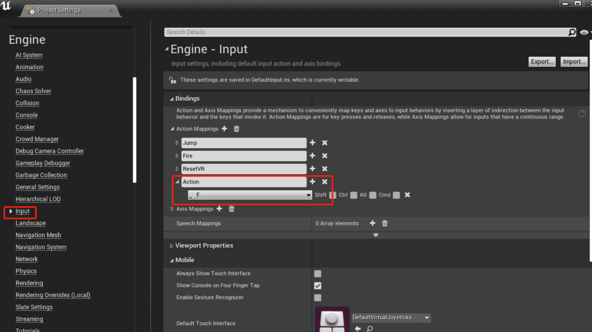
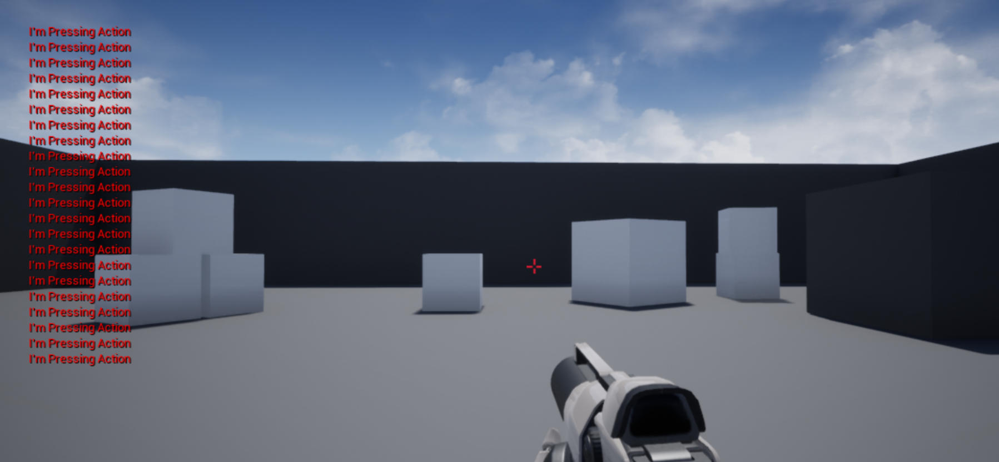

# 为玩家绑定键盘事件

在本教程中，让我们为角色添加一个 **Action** 键盘响应。首先，我们需要添加一个名为 Action 的输入选项，并将其绑定到键盘输入或控制器按钮上。在本例中，我们将把 Action 输入绑定到键盘的 F 键。转到 **编辑>项目设置（Edit > Project Settings）** 。然后选择 **Input** 选项。单击 **Action Mappings** 旁边的加号。调用新的输入 **Action** 并从下拉菜单中选择 **F** 。




在 `xxxCharacter.h` 文件中，在 `OnFire` 方法下添加 `OnAction` 方法。

```cpp
protected:
	
	/** Fires a projectile. */
	void OnFire();
 
	// on action 
	void OnAction();
```

接下来，在 `xxxCharacter.cpp` 文件中，我们将找到 `SetupPlayerInputComponent` 函数，并将 `Action` 映射与 `OnAction` 函数连接起来。我们之后马上会创建 `OnAction` 函数。我通过 `PlayerInputComponent` 中 的 `BindAction` 函数将控制器连接到 `OnAction` 函数。在这个例子中，每次按下键盘 `F` 时都会调用 `OnAction` 函数

```cpp
PlayerInputComponent->BindAction("Action", IE_Pressed, this, &AUnrealCPPCharacter::OnAction);
```

最后，我们将添加 `OnAction` 函数。这将是一个非常简单的函数，用于将消息记录到屏幕上。

```cpp
void AUnrealCPPCharacter::OnAction() 
{
	if (GEngine) 
	{
        GEngine->AddOnScreenDebugMessage(-1, 5.f, FColor::Red, TEXT("I'm Pressing Action"));
	}
}
```

游戏运行后，按下 F 键的效果图如下 




## 指定的任意的 Pawn 绑定键盘相应事件

除了给玩家接收键盘响应，也可以给我们指定的任意的 Pawn 绑定键盘相应事件

首先，我们可以新建一个 MyPawn 类，注意其继承自 Pawn 类

**MyPawn.h**

```cpp
#pragma once
 
#include "CoreMinimal.h"
#include "GameFramework/Pawn.h"
#include "MyPawn.generated.h"
 
UCLASS()
class UNREALCPP_API AMyPawn : public APawn
{
	GENERATED_BODY()
 
public:
	// Sets default values for this pawn's properties
	AMyPawn();
 
protected:
	// Called when the game starts or when spawned
	virtual void BeginPlay() override;
 
public:
    // Called every frame
    virtual void Tick(float DeltaSeconds) override;
 
    // Called to bind functionality to input
    virtual void SetupPlayerInputComponent(class UInputComponent* InputComponent) override;
 
    UPROPERTY(EditAnywhere)
    USceneComponent* OurVisibleComponent;
 
    // Input functions
    void Move_XAxis(float AxisValue);
    void Move_YAxis(float AxisValue);
    void StartGrowing();
    void StopGrowing();
 
    // Input variables
    FVector CurrentVelocity;
    bool bGrowing;
};
```

接着在编辑器中，我们创建一个名为 Grow 的 Action 映射，并将其绑定到 G 键， 用于缩放。然后创建两个 Axis 映射用于平移，并将它们命名为 MoveX 和 MoveY 。将轴的比例分别设置为 1 和 -1 。

    1. MoveX

    I: Scale 1.0
    K: Scale -1.0

    2. MoveY
    J: Scale -1.0
    L: Scale 1.0

    3. Grow
    G

完整的 cpp 代码如下

```cpp
#include "MyPawn.h"
#include "Camera/CameraComponent.h"
#include "Components/InputComponent.h"
#include "Components/StaticMeshComponent.h"
 
// Sets default values
AMyPawn::AMyPawn()
{
    // Set this pawn to call Tick() every frame.  You can turn this off to improve performance if you don't need it.
    PrimaryActorTick.bCanEverTick = true;
 
    // Set this pawn to be controlled by the lowest-numbered player
    AutoPossessPlayer = EAutoReceiveInput::Player0;
 
    // Create a dummy root component we can attach things to.
    RootComponent = CreateDefaultSubobject<USceneComponent>(TEXT("RootComponent"));
    // Create a camera and a visible object
    UCameraComponent* OurCamera = CreateDefaultSubobject<UCameraComponent>(TEXT("OurCamera"));
    OurVisibleComponent = CreateDefaultSubobject<UStaticMeshComponent>(TEXT("OurVisibleComponent"));
    // Attach our camera and visible object to our root component. Offset and rotate the camera.
    OurCamera->SetupAttachment(RootComponent);
    OurCamera->SetRelativeLocation(FVector(-250.0f, 0.0f, 250.0f));
    OurCamera->SetRelativeRotation(FRotator(-45.0f, 0.0f, 0.0f));
    OurVisibleComponent->SetupAttachment(RootComponent);
 
}
 
// Called every frame
void AMyPawn::Tick(float DeltaTime)
{
	Super::Tick(DeltaTime);
 
	
    // Handle growing and shrinking based on our "Grow" action
    {
        float CurrentScale = OurVisibleComponent->GetComponentScale().X;
        if (bGrowing)
        {
            // Grow to double size over the course of one second
            CurrentScale += DeltaTime;
        }
        else
        {
            // Shrink half as fast as we grow
            CurrentScale -= (DeltaTime * 0.5f);
        }
        // Make sure we never drop below our starting size, or increase past double size.
        CurrentScale = FMath::Clamp(CurrentScale, 1.0f, 2.0f);
        OurVisibleComponent->SetWorldScale3D(FVector(CurrentScale));
    }
 
    // Handle movement based on our "MoveX" and "MoveY" axes
    {
        if (!CurrentVelocity.IsZero())
        {
            FVector NewLocation = GetActorLocation() + (CurrentVelocity * DeltaTime);
            SetActorLocation(NewLocation);
        }
    }
 
}
 
// Called to bind functionality to input
void AMyPawn::SetupPlayerInputComponent(UInputComponent* PlayerInputComponent)
{
	Super::SetupPlayerInputComponent(InputComponent);
 
    // Respond when our "Grow" key is pressed or released.
    InputComponent->BindAction("Grow", IE_Pressed, this, &AMyPawn::StartGrowing);
    InputComponent->BindAction("Grow", IE_Released, this, &AMyPawn::StopGrowing);
 
    // Respond every frame to the values of our two movement axes, "MoveX" and "MoveY".
    InputComponent->BindAxis("MoveX", this, &AMyPawn::Move_XAxis);
    InputComponent->BindAxis("MoveY", this, &AMyPawn::Move_YAxis);
 
}
 
void AMyPawn::Move_XAxis(float AxisValue)
{
    // Move at 100 units per second forward or backward
    CurrentVelocity.X = FMath::Clamp(AxisValue, -1.0f, 1.0f) * 100.0f;
}
 
void AMyPawn::Move_YAxis(float AxisValue)
{
    // Move at 100 units per second right or left
    CurrentVelocity.Y = FMath::Clamp(AxisValue, -1.0f, 1.0f) * 100.0f;
}
 
void AMyPawn::StartGrowing()
{
    bGrowing = true;
}
 
void AMyPawn::StopGrowing()
{
    bGrowing = false;
}
 
```

效果图为


## 参考

* [为玩家绑定键盘事件【二十四】](https://blog.csdn.net/panda1234lee/article/details/119200569)
* [英文原地址](https://unrealcpp.com/character-bind-button/)