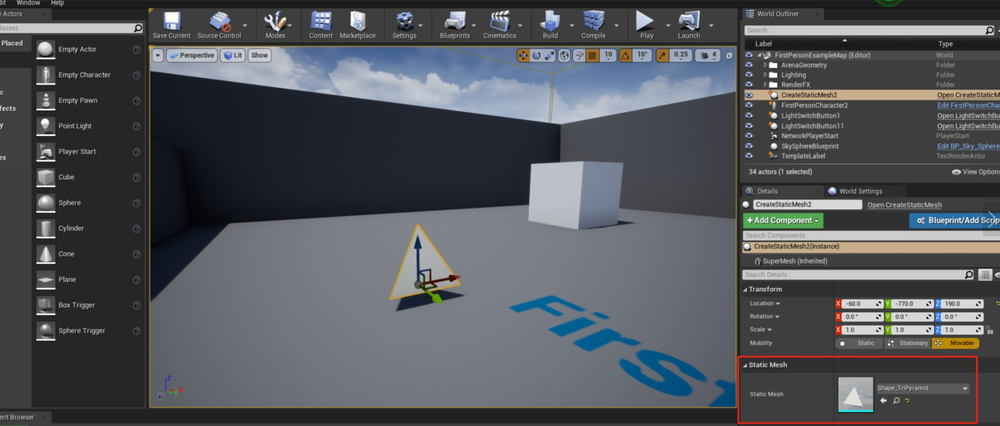

# 2. 创建静态网格

接上一节教程，创建一个新的继承自 Actor 的 C++  类并将其命名为 `CreateStaticMesh` 。在头文件中添加`UStaticMeshComponent`，然后随意命名它。在这个例子中，我将其命名为 `SuperMesh`。我们将变量的 `UPROPERTY` 设置为 `VisibleAnywhere` ，这样我们就可以轻松地在编辑器中添加一个网格。如下图所示。


下面是最终的头文件` CreateStaticMesh.h`的代码：


```C++
#pragma once
#include "CoreMinimal.h"
#include "GameFramework/Actor.h"
#include "CreateStaticMesh.generated.h"

UCLASS()
class UNREALCPP_API ACreateStaticMesh : public AActor
{
    GENERATED_BODY()
public:
    // Sets default values for this actor's properties
    ACreateStaticMesh();
protected:
    // Called when the game starts or when spawned
    virtual void BeginPlay() override;
public:
    // Called every frame
    virtual void Tick(float DeltaTime) override;
    UPROPERTY(VisibleAnywhere)
    UStaticMeshComponent* SuperMesh;
};
```


在 cpp 文件中，我们在 actor 类的构造函数中添加一个简单的静态网格组件。使用 `CreateDefaultSubobject` 创建一个新的 `UStaticMeshComponent`，你可以任意为它取名。在这个例子中，我把这个网格叫做 `My Super Mesh` 。

下面是最终的`CreateStaticMesh.cpp`代码。

```C++
#include "CreateStaticMesh.h"
// Sets default values
ACreateStaticMesh::ACreateStaticMesh()
{
    // Set this actor to call Tick() every frame. You can turn this off to improve performance if you don't need it.
    PrimaryActorTick.bCanEverTick = true;
    // Add static mesh component to actor
    SuperMesh = CreateDefaultSubobject<UStaticMeshComponent>(TEXT("My Super Mesh"));
}
// Called when the game starts or when spawned
void ACreateStaticMesh::BeginPlay()
{
    Super::BeginPlay();
}
// Called every frame
void ACreateStaticMesh::Tick(float DeltaTime)
{
    Super::Tick(DeltaTime);
}
```

现在在编辑器中，拖放您的新 actor。在 actor 的 Details面板中，选择你想要添加到 actor 的静态网格。 



## 参考

* [创建静态网格【二】](https://panda1234lee.blog.csdn.net/article/details/119089498)
* [英文源地址](https://unrealcpp.com/create-static-mesh/)

