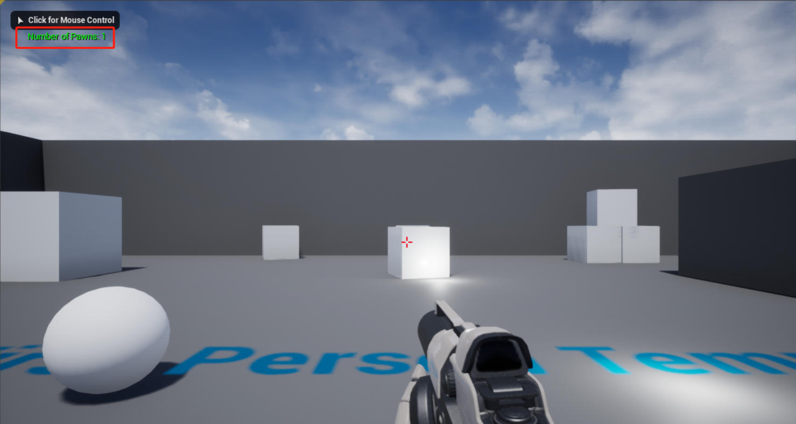

# 获取场景中棋子的个数

接上一节教程，本教程将介绍 —— 如何在一个场景中获得小兵的总数。创建一个新的 C++ Actor 子类，并将其命名为 **GetNumberOfPawns** 。

头文件中不需要做任何事情，下面是最终的头文件。

**GetNumberOfPawns.h**

```cpp
#pragma once
#include "CoreMinimal.h"
#include "GameFramework/Actor.h"
#include "GetNumberOfPawns.generated.h"
UCLASS()
class UNREALCPP_API AGetNumberOfPawns : publicAActor
{
	GENERATED_BODY()
public:
	// Sets default values for this actor's properties
	AGetNumberOfPawns();
protected:
	// Called when the game starts or when spawned
	virtual void BeginPlay() override;
public:
	// Called every frame
	virtual void Tick(float DeltaTime) override;
};
```

接下来，在我们的 BeginPlay() 函数中添加 **GetWorld()->GetNumPawns()** 。所有 actor 都可以访问 **GetWorld()** 函数。你可以在这里看到 UWorld 的所有的函数。


下面是我们最终的 .cpp 文件。

```cpp
#include "GetNumberOfPawns.h"
// Sets default values
AGetNumberOfPawns::AGetNumberOfPawns()
{
	// Set this actor to call Tick() every frame. You can turn this off to improve performance if you don't need it.
	PrimaryActorTick.bCanEverTick = true;
}
// Called when the game starts or when spawned
void AGetNumberOfPawns::BeginPlay()
{
	Super::BeginPlay();
	int32 MyPawns = GetWorld()->GetNumPawns();
	GEngine->AddOnScreenDebugMessage(-1, 5.f, FColor::Green, FString::Printf(TEXT("Number of Pawns: %d"), MyPawns));
}
// Called every frame
void AGetNumberOfPawns::Tick(float DeltaTime)
{
	Super::Tick(DeltaTime);
}
```

运行效果如图




## 参考

* [获取场景中小兵的个数](https://bbs.huaweicloud.com/blogs/310578)
