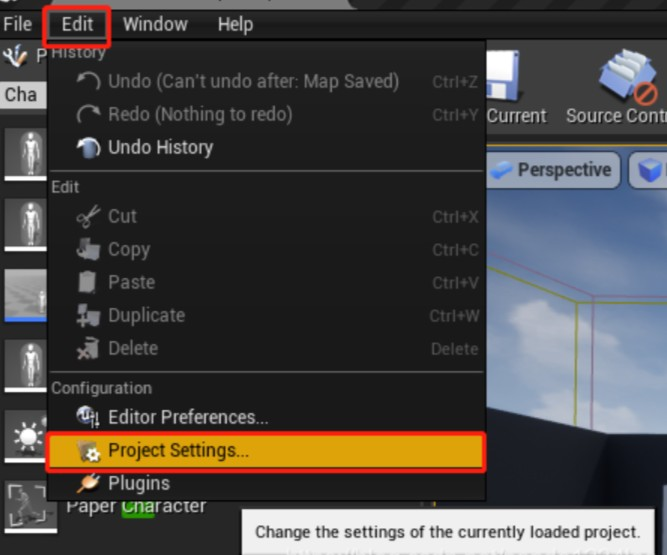

# 25. 触发区域内的键盘响应开关灯

接上一节教程，创建一个新的 C++ Actor 子类并将其命名为 **LightSwitchPushButton** 。我们将在头文件中定义四个东西 —— 我们将定义一个 **UPointLightComponent**、**USphereComponent**、**float** 变量和 **void** 函数。

下面是最终的头代码。

**LightSwitchPushButton.h**

```cpp
#pragma once
 
#include "CoreMinimal.h"
#include "GameFramework/Actor.h"
#include "LightSwitchPushButton.generated.h"
 
UCLASS()
class UNREALCPP_API ALightSwitchPushButton : public AActor
{
	GENERATED_BODY()
	
public:	
	// Sets default values for this actor's properties
	ALightSwitchPushButton();
 
protected:
	// Called when the game starts or when spawned
	virtual void BeginPlay() override;
 
public:	
	// Called every frame
	// virtual void Tick(float DeltaTime) override;
 
	// declare point light comp
	UPROPERTY(VisibleAnywhere, Category = "Light Switch")
	class UPointLightComponent* PointLight;
 
	// declare sphere comp
	UPROPERTY(VisibleAnywhere, Category = "Light Switch")
	class USphereComponent* LightSphere;
 
	// declare light intensity variable
	UPROPERTY(VisibleAnywhere, Category = "Light Switch")
	float LightIntensity;
 
	// declare ToggleLight function
	UFUNCTION(BlueprintCallable, Category = "Light Switch")
	void ToggleLight();
	
};
```

接下来，在我们的 .cpp 文件中，让我们首先 #include 我们将在代码中使用的必要脚本。包括 `Components/PointLightComponent.h` 和 `Components/spherecomcomponent.h` 两个文件。
```cpp
#include "LightSwitchPushButton.h"
// include these header files
#include "Components/PointLightComponent.h"
#include "Components/SphereComponent.h"
```

我们将在构造函数中设置 actor 的所有默认属性。首先让我们设置我们的 float 变量 `LightIntensity` 为 3000.0f，它将使光相对于其他对象看起来足够明亮。接下来，我们将创建我们的 `UPointLightComponent` 并将它设置为我们的 `RootComponent` 。之后，我们将创建 `USphereComponent` ，当我们的玩家在半径内时，它将作为碰撞球体。然后，我们将创建简单的 `ToggleLight()` 函数来切换灯光的可见性状态。稍后我们将从玩家代码中调用该函数。下面是`LightSwitchPushButton` 角色的最后一个 .cpp 文件。

**LightSwitchPushButton.cpp**

```cpp
#include "LightSwitchPushButton.h"
#include "Components/PointLightComponent.h"
#include "Components/SphereComponent.h"
 
// Sets default values
ALightSwitchPushButton::ALightSwitchPushButton()
{
 	// Set this actor to call Tick() every frame.  You can turn this off to improve performance if you don't need it.
	PrimaryActorTick.bCanEverTick = true;
 
	LightIntensity = 3000.0f;
 
	PointLight = CreateDefaultSubobject<UPointLightComponent>(TEXT("Point Light"));
	PointLight->Intensity = LightIntensity;
	//PointLight->bVisible = true; ///< 过时了
    //PointLight->SetVisibleFlag(true);
    PointLight->SetVisibility(true);
	RootComponent = PointLight;
 
	LightSphere = CreateDefaultSubobject<USphereComponent>(TEXT("Light Sphere Component"));
	LightSphere->InitSphereRadius(300.0f);
	LightSphere->SetCollisionProfileName(TEXT("Trigger"));
	LightSphere->SetCollisionResponseToChannel(ECC_Pawn, ECR_Ignore);
	LightSphere->SetupAttachment(RootComponent);
}
 
// Called when the game starts or when spawned
void ALightSwitchPushButton::BeginPlay()
{
	Super::BeginPlay();
}
 
void ALightSwitchPushButton::ToggleLight()
{
    PointLight->ToggleVisibility();
}
```

接下来，和上一节类似，让我们向项目添加一个 `Action` 输入。在本例中，我们将把 `Action` 输入绑定到键盘的 F键。转到 `编辑>项目设置 ( Edit > Project Settings)`。然后选择 Input 选项。单击 `Action Mappings` 旁边的加号。调用新的输入 `Action` 并从下拉菜单中选择 `F` 。




**【以下我们把目光转到 xxxCharacter.h / .cpp 上】**

 在 xxxCharacter.h文件中，在 `OnFire` 方法下添加 `OnAction` 方法。

```cpp
protected:
	
	/** Fires a projectile. */
	void OnFire();
 
	// on action 
	void OnAction();
```

此外，我们还必须包含 `LightSwitchPushButton` 头文件，这样我们的角色才能访问它的功能。


```cpp
// declare overlap begin function
UFUNCTION()
void OnOverlapBegin(class UPrimitiveComponent* OverlappedComp, class AActor* OtherActor, class UPrimitiveComponent* OtherComp, int32 OtherBodyIndex, bool bFromSweep, const FHitResult& SweepResult);
 
// declare overlap end function
UFUNCTION()
void OnOverlapEnd(class UPrimitiveComponent* OverlappedComp, class AActor* OtherActor, class UPrimitiveComponent* OtherComp, int32 OtherBodyIndex);
// declare current light switch
class ALightSwitchPushButton* CurrentLightSwitch;
```

 同时还声明了 UCapsuleComponent 来处理我们的触发事件

```cpp
UPROPERTY(VisibleAnywhere, Category = "Trigger Capsule")
class UCapsuleComponent* TriggerCapsule;
```

在构造函数中添加触发器胶囊并将其绑定到重叠事件。接着设置变量 `CurrentLightSwitch` 为 `NULL` 。

```cpp
AUnrealCPPCharacter::AUnrealCPPCharacter()
{
    ...
    // create trigger capsule
    TriggerCapsule = CreateDefaultSubobject<UCapsuleComponent>(TEXT("Trigger Capsule"));
    TriggerCapsule->InitCapsuleSize(55.f, 96.0f);;
    TriggerCapsule->SetCollisionProfileName(TEXT("Trigger"));
    TriggerCapsule->SetupAttachment(RootComponent);
 
    // bind trigger events
    TriggerCapsule->OnComponentBeginOverlap.AddDynamic(this, &AUnrealCPPCharacter::OnOverlapBegin); 
    TriggerCapsule->OnComponentEndOverlap.AddDynamic(this, &AUnrealCPPCharacter::OnOverlapEnd); 
 
     // set current light switch to null
     CurrentLightSwitch = NULL;
}
```

进一步，将 `Action` 输入绑定连接到玩家

```cpp
void AUnrealCPPCharacter::SetupPlayerInputComponent(class UInputComponent* PlayerInputComponent)
{
    ...
    // Bind action event
    PlayerInputComponent->BindAction("Action", IE_Pressed, this, &AUnrealCPPCharacter::OnAction);
 
}
```

将 `OnAction()` 函数添加到玩家脚本中。该函数将检查 `CurrentLightSwitch` 是否为 NULL 。如果 `CurrentLightSwitch` 不为 `NULL`，那么当玩家按下动作键 F 时，将切换灯光的可见性（开关灯）。然后，添加重叠函数来设置和取消 `CurrentLightSwitch`

```cpp
void AUnrealCPPCharacter::OnAction() 
{
	if(CurrentLightSwitch) 
	{
		CurrentLightSwitch->ToggleLight();
	}
}
 
// overlap on begin function
void AUnrealCPPCharacter::OnOverlapBegin(class UPrimitiveComponent* OverlappedComp, class AActor* OtherActor, class UPrimitiveComponent* OtherComp, int32 OtherBodyIndex, bool bFromSweep, const FHitResult& SweepResult)
{
	if (OtherActor && (OtherActor != this) && OtherComp && OtherActor->GetClass()->IsChildOf(ALightSwitchPushButton::StaticClass())) 
	{
		CurrentLightSwitch = Cast<ALightSwitchPushButton>(OtherActor);
	}
} 
 
// overlap on end function
void AUnrealCPPCharacter::OnOverlapEnd(class UPrimitiveComponent* OverlappedComp, class AActor* OtherActor, class UPrimitiveComponent* OtherComp, int32 OtherBodyIndex)
{
	if (OtherActor && (OtherActor != this) && OtherComp) 
	{
		CurrentLightSwitch = NULL;
	}
}
```

编译代码。拖放 actor （`LightSwitchPushButton`）到场景中，当玩家进入球形触发区域，点击 `F` 键开关灯。

最后的效果图如下：


## 参考

* [触发区域内的键盘响应开关灯【二十五】](panda1234lee.blog.csdn.net/article/details/119204101)
