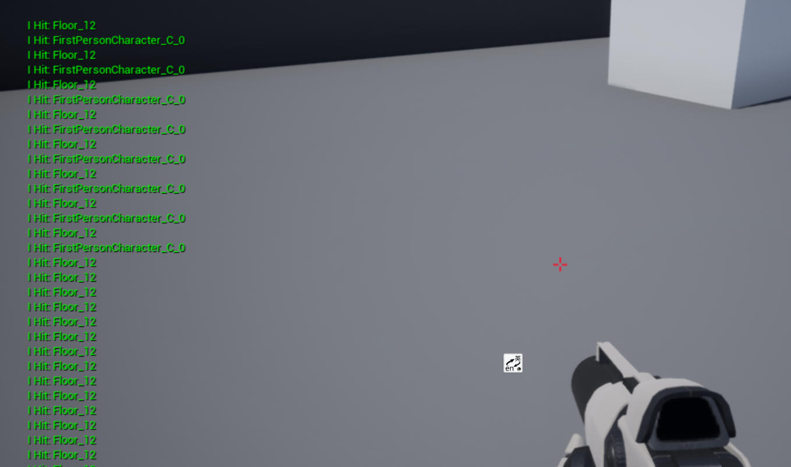

# 15. 注册组件的 hit 事件


接上一节教程，在本教程中，我们将学习如何在组件上注册一个 hit 事件。创建一个新的 C++ Actor 子类并将其命名为 `OnComponentHit` 。在头文件中，将声明一个 `UBoxComponent` 变量和一个当组件注册一个 hit 事件时运行的 void 函数。

下面是最终的头文件

**OnHitComponent.h**

```cpp
#pragma once
 
#include "CoreMinimal.h"
#include "GameFramework/Actor.h"
#include "OnComponentHit.generated.h"
 
UCLASS()
class UNREALCPP_API AOnComponentHit : public AActor
{
	GENERATED_BODY()
	
public:	
	// Sets default values for this actor's properties
	AOnComponentHit();
 
protected:
	// Called when the game starts or when spawned
	virtual void BeginPlay() override;
 
public:	
	// Called every frame
	virtual void Tick(float DeltaTime) override;
 
	UPROPERTY(VisibleAnywhere)
	class UBoxComponent* MyComp;
 
	UFUNCTION()
	void OnCompHit(UPrimitiveComponent* HitComp, AActor* OtherActor, UPrimitiveComponent* OtherComp, FVector NormalImpulse, const FHitResult& Hit);
	
};
```

在 .cpp 文件中，首先 `
#include "Components/BoxComponent.h"` 头文件 。

```cpp
#include "OnComponentHit.h"
// include files
#include "Components/BoxComponent.h"
```

接下来，我们将在 actor 的构造函数中为 actor 设置默认值。我们将用 `UBoxComponent` 初始化 actor，并将其设置为 `RootComponent` 。然后，我们将添加 `OnComponentHit` 到组件，并将它连接到我们的 `OnCompHit` 函数。我们将在下一步创建 `OnCompHit` （回调函数）。我还将默认的 `CollisionProfileName` 设置为 `BlockAllDynamic` ，这可以稍后在编辑器中更改。

```cpp
// Sets default values
AOnComponentHit::AOnComponentHit()
{
 	// Set this actor to call Tick() every frame.  You can turn this off to improve performance if you don't need it.
	PrimaryActorTick.bCanEverTick = true;
 
	// 使用球体作为简单的碰撞表示
	MyComp = CreateDefaultSubobject<UBoxComponent>(TEXT("BoxComp"));
	MyComp->SetSimulatePhysics(true);
    MyComp->SetNotifyRigidBodyCollision(true);
    
	MyComp->BodyInstance.SetCollisionProfileName("BlockAllDynamic");
	MyComp->OnComponentHit.AddDynamic(this, &AOnComponentHit::OnCompHit);
 
	// 设置为根组件
	RootComponent = MyComp;
}
```

现在让我们创建简单的 `OnCompHit` 函数，当我们的 actor 撞击它时，它将打印并显示其他 actor 的名字到屏幕上。关于 `OnComponentHit` 的更多信息，你可以在访问一些不错的 AnswerHub [帖子1](https://answers.unrealengine.com/questions/429353/cpp-on-component-hit-doesnt-fire.html) 、[帖子2](https://answers.unrealengine.com/questions/429353/cpp-on-component-hit-doesnt-fire.html) ，或者在这里访问 [ue4 文档](https://docs.unrealengine.com/latest/INT/API/Runtime/Engine/Components/UPrimitiveComponent/OnComponentHit/) 。


```cpp
void AOnComponentHit::OnCompHit(UPrimitiveComponent* HitComp, AActor* OtherActor, UPrimitiveComponent* OtherComp, FVector NormalImpulse, const FHitResult& Hit)
{
	if ((OtherActor != NULL) && (OtherActor != this) && (OtherComp != NULL))
	{
		if (GEngine) GEngine->AddOnScreenDebugMessage(-1, 5.f, FColor::Green, FString::Printf(TEXT("I Hit: %s"), *OtherActor->GetName()));
	}
}
```

以下就是最终完整的 .cpp 文件

```cpp
#include "OnComponentHit.h"
#include "Components/BoxComponent.h"
 
// Sets default values
AOnComponentHit::AOnComponentHit()
{
 	// Set this actor to call Tick() every frame.  You can turn this off to improve performance if you don't need it.
	PrimaryActorTick.bCanEverTick = true;
 
	// Use a sphere as a simple collision representation
	MyComp = CreateDefaultSubobject<UBoxComponent>(TEXT("BoxComp"));
	MyComp->SetSimulatePhysics(true);
	MyComp->SetNotifyRigidBodyCollision(true);
	MyComp->BodyInstance.SetCollisionProfileName("BlockAllDynamic");
	MyComp->OnComponentHit.AddDynamic(this, &AOnComponentHit::OnCompHit);
 
	// Set as root component
	RootComponent = MyComp;
 
}
 
// Called when the game starts or when spawned
void AOnComponentHit::BeginPlay()
{
	Super::BeginPlay();
	
}
 
// Called every frame
void AOnComponentHit::Tick(float DeltaTime)
{
	Super::Tick(DeltaTime);
 
}
 
void AOnComponentHit::OnCompHit(UPrimitiveComponent* HitComp, AActor* OtherActor, UPrimitiveComponent* OtherComp, FVector NormalImpulse, const FHitResult& Hit)
{
	if ((OtherActor != NULL) && (OtherActor != this) && (OtherComp != NULL))
	{
		if (GEngine) GEngine->AddOnScreenDebugMessage(-1, 5.f, FColor::Green, FString::Printf(TEXT("I Hit: %s"), *OtherActor->GetName()));
	}
}
```

编译代码。将 actor 拖放到游戏场景中。添加一个静态网格到该 actor，并调整尺寸以适应 hit 框。当你按下 play 时，actor 应该注册 hit 事件。


运行的结果




## 参考

* [注册组件的 hit 事件【十五】](https://panda1234lee.blog.csdn.net/article/details/119127452)