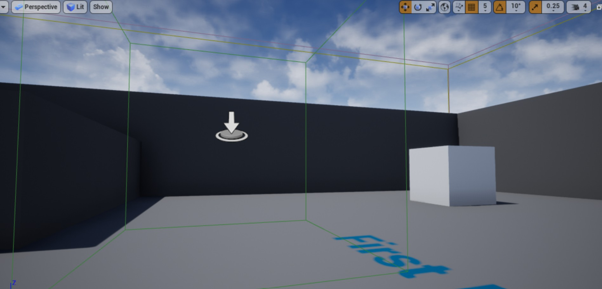

# 19. 为 Charactor 添加重叠事件


接上一节教程，我们继续在 Character.h 文件中，在 public 部分声明 `OnOverlapBegin` 和 `OnOverlapEnd` 方法。我在本教程中的头文件名为 `UnrealCPPCharacter.h` ，你的文件可能有不同的名称。你可以在这里了解更多关于 [OnComponentBeginOverlap](https://docs.unrealengine.com/latest/INT/API/Runtime/Engine/Components/UPrimitiveComponent/OnComponentBeginOverlap/index.html) 和 [OnComponentEndOverlap](https://docs.unrealengine.com/latest/INT/API/Runtime/Engine/Components/UPrimitiveComponent/OnComponentEndOverlap/index.html) 的信息。

```cpp
public
  ...
 
  // 声明重叠开始函数
	UFUNCTION()
	void OnOverlapBegin(class UPrimitiveComponent* OverlappedComp, class AActor* OtherActor, class UPrimitiveComponent* OtherComp, int32 OtherBodyIndex, bool bFromSweep, const FHitResult& SweepResult);
 
	// 声明重叠结束函数
	UFUNCTION()
	void OnOverlapEnd(class UPrimitiveComponent* OverlappedComp, class AActor* OtherActor, class UPrimitiveComponent* OtherComp, int32 OtherBodyIndex);
```

在本教程中，我们将为角色添加一个胶囊组件来专门处理触发事件。

```cpp
class AUnrealCPPCharacter : public ACharacter
{
  GENERATED_BODY()
 
  ...
 
	// 创建触发胶囊
	UPROPERTY(VisibleAnywhere, Category = "Trigger Capsule")
  class UCapsuleComponent* TriggerCapsule;
```

我们已经完成了头文件。继续把目光移动到 .cpp 文件。

如果你还没有包含 `Components/CapsuleComponent.h` ，请在顶部包含这个文件。
```cpp
#include "Components/CapsuleComponent.h"
```

在 Character 的构造函数中，我们将向其添加胶囊组件，并将其连接到重叠事件。


要给我们的角色添加一个胶囊，我们首先通过 `CreateDefaultSubobject` 创建一个 UCapsuleComponent 组件，并给它起任何我们想要的名字。我称之为“触发胶囊(Trigger Capsule)”。


接下来，我们必须初始化其大小，我使其大小与初始胶囊组件(在构造函数中声明的)相同。我们还可以使用 `SetCollisionProfileName` 设置这个组件的碰撞类型。我们将 `Trigger` Profile 文件名称添加到胶囊中，这将为组件提供类似于触发器胶囊的重叠事件。这也可以很容易地在编辑器中设置。最后将 `TriggerCapsule` 附加到 `RootComponent`

```cpp
AUnrealCPPCharacter::AUnrealCPPCharacter()
{
  ...
  // 声明触发胶囊
	TriggerCapsule = CreateDefaultSubobject<UCapsuleComponent>(TEXT("Trigger Capsule"));
	TriggerCapsule->InitCapsuleSize(55.f, 96.0f);;
	TriggerCapsule->SetCollisionProfileName(TEXT("Trigger"));
  TriggerCapsule->SetupAttachment(RootComponent);
}
```

我们通过调用 `OnComponentBeginOverlap` 和 `OnComponentEndOverlap` 将胶囊连接到重叠事件。


```cpp
...
void AUnrealCPPCharacter::OnOverlapBegin(class UPrimitiveComponent* OverlappedComp, class AActor* OtherActor, class UPrimitiveComponent* OtherComp, int32 OtherBodyIndex, bool bFromSweep, const FHitResult& SweepResult)
{
	if (OtherActor && (OtherActor != this) && OtherComp) 
	{
		GEngine->AddOnScreenDebugMessage(-1, 5.f, FColor::Red, TEXT("Overlap Begin"));
	}
} 
 
void AUnrealCPPCharacter::OnOverlapEnd(class UPrimitiveComponent* OverlappedComp, class AActor* OtherActor, class UPrimitiveComponent* OtherComp, int32 OtherBodyIndex)
{
	if (OtherActor && (OtherActor != this) && OtherComp) 
	{
		GEngine->AddOnScreenDebugMessage(-1, 5.f, FColor::Red, TEXT("Overlap End"));
	}
}
```

我们手动在场景中添加一个 Triggger Box



然后操控 Character 与其发生重叠，下面是最终运行效果


## 参考

* [为 Charactor 添加重叠事件【十九】](https://blog.csdn.net/panda1234lee/article/details/119152036)
* [英文原地址](https://unrealcpp.com/on-overlap-begin/)