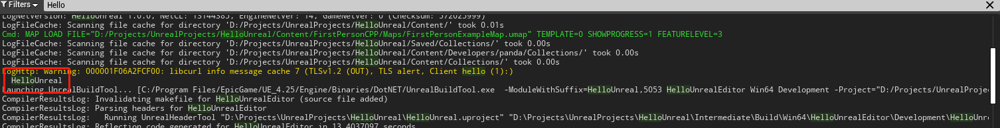

# 5.打印调式信息

新创建一个名为 ConsoleLog 的新 Actor 子类（不需要在头文件中执行任何操作）。

<details>
<summary><b>AddBillboardComp.h</b> </summary>

```C++
#pragma once
#include "CoreMinimal.h"
#include "GameFramework/Actor.h"
#include "ConsoleLog.generated.h"
UCLASS()
class UNREALCPP_API AConsoleLog : public AActor
{
    GENERATED_BODY()
    public:
    // Sets default values for this actor's properties
    AConsoleLog();
    protected:
    // Called when the game starts or when spawned
    virtual void BeginPlay() override;
    public:
    // Called every frame
    virtual void Tick(float DeltaTime) override;
};
```
</details>
<br>


接着我们将在 .cpp 文件中打印日志消息。对于这个例子，我们将在 BeginPlay 方法中打印该消息。所以，当游戏开始时，消息将打印出来。

下面是打印消息的 3 种方法。

* 打印到控制台
* 打印到屏幕：[AddOnScreenDebugMessage()](https://github.com/OpenHUTB/engine/blob/1413799f28af699ad0e6139ea25853b66c719c7d/Engine/Source/Runtime/Engine/Private/UnrealEngine.cpp#L9458)
* 打印的数据格式为向量


分别如下所示：
```C++
UE_LOG(LogTemp, Warning, TEXT("I just started running"));
```

```
GEngine->AddOnScreenDebugMessage(-1, 5.f, FColor::Red, TEXT("Screen Message"));
```

```
GEngine->AddOnScreenDebugMessage(-1, 5.f, FColor::Orange, FString::Printf(TEXT("My Location is: %s"), *GetActorLocation().ToString()));
```

下面是完整的 C++ 文件（使用宏定义可以简化打印调试信息的步骤）

<details>
<summary><b>AddBillboardComp.cpp</b> </summary>

```cpp
// Copyright (c) 2025 OpenHUTB at the Human University of Technology and Business (HUTB). This work is licensed under the terms of the MIT license. For a copy, see <https://opensource.org/licenses/MIT>.

#define print(text) if (GEngine) GEngine->AddOnScreenDebugMessage(-1, 5.f, FColor::Green, text)
#define printFString(text, fstring) if (GEngine) GEngine->AddOnScreenDebugMessage(-1, 5.f, FColor::Magenta, FString::Printf(TEXT(text), fstring))

#include "Tutorial/ConsoleLog.h"

// Sets default values
AConsoleLog::AConsoleLog()
{
 	// Set this actor to call Tick() every frame.  You can turn this off to improve performance if you don't need it.
	PrimaryActorTick.bCanEverTick = true;

}

// Called when the game starts or when spawned
void AConsoleLog::BeginPlay()
{
	Super::BeginPlay();
	// 标注的方式：输出到控制台
	UE_LOG(LogTemp, Warning, TEXT("I just started running"));
	// 记录到屏幕上
	GEngine->AddOnScreenDebugMessage(-1, 5.f, FColor::Red, TEXT("Screen Message"));
	FVector MyVector = FVector(200, 100, 900);
	GEngine->AddOnScreenDebugMessage(-1, 5.f, FColor::Orange, FString::Printf(TEXT("My Location is: %s"), *GetActorLocation().ToString()));
	print("Hello Engine");
	printFString("My Variable Vector is: %s", *MyVector.ToString());
}

// Called every frame
void AConsoleLog::Tick(float DeltaTime)
{
	Super::Tick(DeltaTime);

}
```
</details>
<br>

执行的结果如下所示（先打印的在下，后打印的在上）：




!!! 笔记
    1.为了避免每次需要重启引擎编辑器使修改的代码生效，可以参考[热重载](./hot_reload.md)。<br>
    2.引擎编辑器界面输出日志默认是没打开，打开方法：`窗口->开发者工具->输出日志`，日志目录通过`输出日志`窗口右下角的`视图选项->打开源文件位置`。