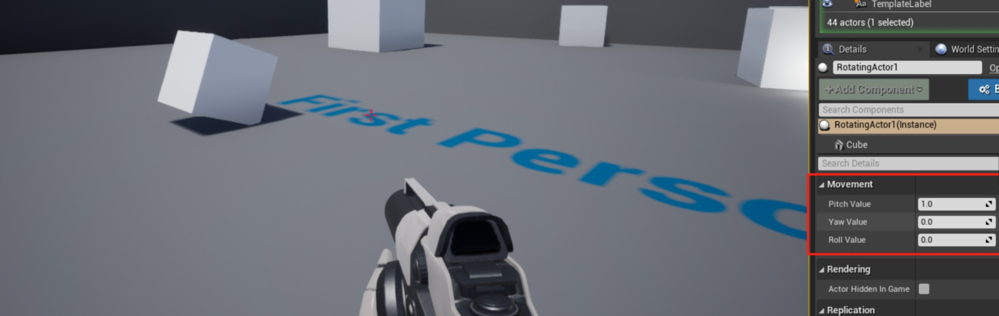

# 11.实时旋转 Actor


接上一节教程，在本教程中，我们将每帧都对一个 actor 进行旋转。创建一个新的 C++ Actor 类并将其命名为 `RotatingActor`。在头文件中，我们将创建 3 个浮点变量。我们将把它们的 `UPROPERTY` 设置为 `EditAnywhere`，这样我们就可以在编辑器中更改值，我们将把所有变量放在 `Movement` 类别中，以使它们在一起，并与其他属性分开。

下面是最终的头文件。

**RotatingActor.h**

```cpp
#pragma once
 
#include "CoreMinimal.h"
#include "GameFramework/Actor.h"
#include "RotatingActor.generated.h"
 
UCLASS()
class UNREALCPP_API ARotatingActor : public AActor
{
	GENERATED_BODY()
	
public:	
	// Sets default values for this actor's properties
	ARotatingActor();
 
protected:
	// Called when the game starts or when spawned
	virtual void BeginPlay() override;
 
public:	
	// Called every frame
	virtual void Tick(float DeltaTime) override;
 
	// declare our float variables 	
	UPROPERTY(EditAnywhere, Category = Movement)
	float PitchValue;
 
	UPROPERTY(EditAnywhere, Category = Movement)
	float YawValue;
 
	UPROPERTY(EditAnywhere, Category = Movement)
	float RollValue;
	
};
```

在 .cpp 文件中将所有浮点变量的默认值设置为 0。

```cpp
// Sets default values
ARotatingActor::ARotatingActor()
{
 	// Set this actor to call Tick() every frame.  You can turn this off to improve performance if you don't need it.
	PrimaryActorTick.bCanEverTick = true;
 
	PitchValue = 0.f;
	YawValue = 0.f;
	RollValue = 0.f;
 
}
```

在 `Tick` 函数中创建一个名为 `NewRotation` 的 `FRotator` 变量，并将其设置为前面创建的浮点变量。接下来，创建一个 `FQuat` 变量（四元数），并将其设置为 `NewRotatoin` 。然后，我们要做的就是运行 `AddActorLocalRotation`，让 actor 旋转到位。

下面是最终的.cpp 代码。

```cpp
void ARotatingActor::Tick(float DeltaTime)
{
	Super::Tick(DeltaTime);
 
	// on every frame change rotationg for a smooth rotating actor
	FRotator NewRotation = FRotator(PitchValue, YawValue, RollValue);
	
	FQuat QuatRotation = FQuat(NewRotation);
	
	AddActorLocalRotation(QuatRotation, false, 0, ETeleportType::None);
 
 
	// The below method causes a bug for the pitch value. The pitch value stops updating at 90 degrees
	// this is a known bug in the Unreal Engine. 
	// solution found by ue4 user nutellis https://answers.unrealengine.com/questions/591752/pitch-rotation-stucks-at-90-90-c.html
 
	// FRotator NewRotation = GetActorRotation();
 
	// NewRotation.Pitch += PitchValue;
	// NewRotation.Yaw += YawValue;
	// NewRotation.Roll += RollValue;
	
	// OR add values using the FRotator Add function
	// FRotator NewRotation = GetActorRotation().Add(PitchValue, YawValue, RollValue);
 
 
	// SetActorRotation(NewRotation);
 
}
```

**效果图**

为该 actor 添加 cube 组件，并设置 pitch 后，它就绕着 Y 轴旋转（UE4 是左手坐标系）




## 参考

* [实时旋转 Actor【十一】](https://panda1234lee.blog.csdn.net/article/details/119123641)