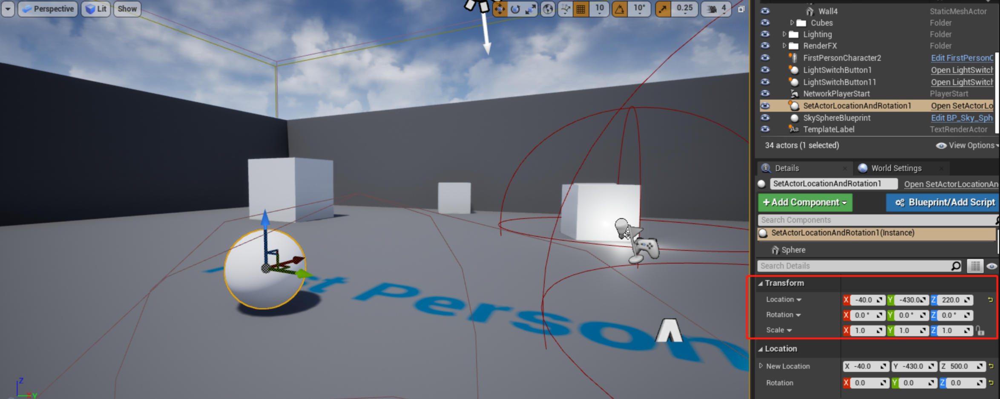

# 设置 Actor 的位置和朝向

接上一节教程，在本教程中，我们将学习如何使用 **SetActorLocationAndRotation** 函数。创建一个新的 C++ Actor 子类并将其命名为 **SetActorLocationAndRotation**。在头文件中创建分别一个 **FVector** 和 **FQuat** 变量，通过设置 **UPROPERTY** 为 **EditAnywhere** 使它们可以在任何地方被编辑。同时将这些变量放在 **Location** 类别中，使它们在一起，并与其他属性分开。

下面是最终的头文件 **SetActorLocationAndRotation.h**
```cpp
#pragma once
#include "CoreMinimal.h"
#include "GameFramework/Actor.h"
#include "SetActorLocationAndRotation.generated.h"
UCLASS()
class UNREALCPP_API ASetActorLocationAndRotation :public AActor
{
	GENERATED_BODY()
public:
	// Sets default values for this actor's properties
	ASetActorLocationAndRotation();
protected:
	// Called when the game starts or when spawned
	virtual void BeginPlay() override;
public:
	// Called every frame
	virtual void Tick(float DeltaTime) override;
	UPROPERTY(EditAnywhere, Category = Location)
	FVector NewLocation;
	UPROPERTY(EditAnywhere, Category = Location)
	FQuat NewRotation;
};
```

在这个例子中，我们将在 **BeginPlay** 函数中调用 **SetActorLocationAndRotation** 函数。要了解更多关于 **SetActorLocationAndRotation** 函数的信息，请点击[这里](https://dev.epicgames.com/documentation/en-us/unreal-engine/API/Runtime/Engine/GameFramework/AActor/SetActorLocationAndRotation?application_version=4.27)。

下面是最后的 .cpp 文件 **SetActorLocationAndRotation.cpp**

```cpp
#include "SetActorLocationAndRotation.h"
// Sets default values
ASetActorLocationAndRotation::ASetActorLocationAndRtation()
{
	// Set this actor to call Tick() every frame. You can turn this off to improve performance if you don't need it.
	PrimaryActorTick.bCanEverTick = true;
}
// Called when the game starts or when spawned
void ASetActorLocationAndRotation::BeginPlay()
{
	Super::BeginPlay();
	SetActorLocationAndRotation(NewLocation, NewRotation, false, 0, ETeleportType::None);
}
// Called every frame
void ASetActorLocationAndRotation::Tick(floatDeltaTime)
{
	Super::Tick(DeltaTime);
}
```

编译代码。将新角色拖放到游戏中。向 actor 添加一个静态网格组件。在编辑器中，为 **NewLocation** 和 **NewRotation** 设置一个值，然后当你点击 play 按钮时，actor 将定位和旋转到这些坐标上。

**效果示意图**

游戏运行前：



游戏运行后：


## 参考

* [设置 Actor 的位置和朝向](https://panda1234lee.blog.csdn.net/article/details/119122265)
