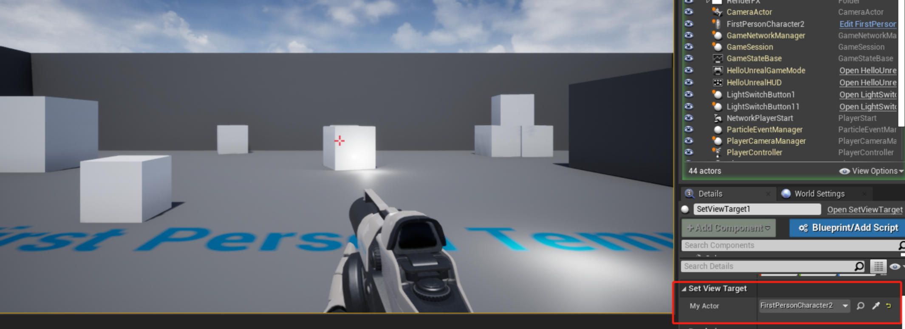
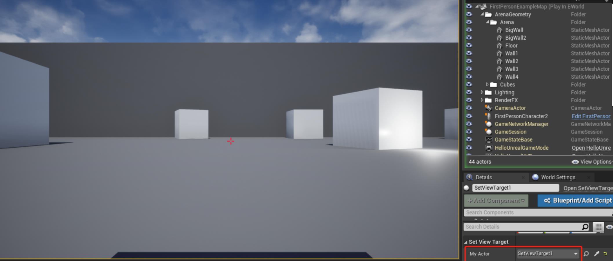

# 12. 立即切换玩家的相机（视图目标）到 Actor 位置


接上一节教程，在这个简单的教程中，我们将在游戏开始时简单地改变玩家的视图目标。

创建一个新的 C++ Actor 子类并将其命名为 **SetViewTarget** 。在头文件中，我们将声明一个 actor 变量，并将其称为 **MyActor** 并使该 actor 在任何地方都可编辑。

**SetViewTarget.h**
```cpp
#pragma once
 
#include "CoreMinimal.h"
#include "GameFramework/Actor.h"
#include "SetViewTarget.generated.h"
 
UCLASS()
class UNREALCPP_API ASetViewTarget : public AActor
{
	GENERATED_BODY()
	
public:	
	// Sets default values for this actor's properties
	ASetViewTarget();
 
protected:
	// Called when the game starts or when spawned
	virtual void BeginPlay() override;
 
public:	
	// Called every frame
	virtual void Tick(float DeltaTime) override;
 
	// declare variables
	UPROPERTY(EditAnywhere)
	AActor* MyActor;	
};
```

首先，为了拥有玩家，我们需要 `
#include "Kismet/GameplayStatics.h"` 文件。

```cpp
#include "SetViewTarget.h"
// include gameplay statics header file
#include "Kismet/GameplayStatics.h"
```

在这个例子中，我们所有的逻辑都放在了 **BeginPlay** 函数中（**不是构造函数中，不然 UE4 可能会崩溃**）。我们需要通过执行`UGameplayStatics::GetPlayerController(this, 0)` 来拥有当前玩家。这将获得游戏场景中的第一个玩家。接下来我们将使用 `SetViewTarget(MyActor)` 将我们拥有的玩家的视图目标设置为我们的 `MyActor` 变量。

下面是最后的 .cpp 文件。

**SetViewTarget.cpp**

```cpp
#include "SetViewTarget.h"
// include gameplay statics header file
#include "Kismet/GameplayStatics.h"
 
 
// Sets default values
ASetViewTarget::ASetViewTarget()
{
 	// Set this actor to call Tick() every frame.  You can turn this off to improve performance if you don't need it.
	PrimaryActorTick.bCanEverTick = true;
 
}
 
// Called when the game starts or when spawned
void ASetViewTarget::BeginPlay()
{
	Super::BeginPlay();
 
	//Find the actor that handles control for the local player.
	APlayerController* OurPlayerController = UGameplayStatics::GetPlayerController(this, 0);
 
	//Cut instantly to our actor on begin play.
	OurPlayerController->SetViewTarget(MyActor);
	
}
 
// Called every frame
void ASetViewTarget::Tick(float DeltaTime)
{
	Super::Tick(DeltaTime);
 
}
```

编译代码。将新 actor 拖放到游戏中。在编辑器中，向 actor 的细节面板中的 **MyActor** 变量添加一个静态网格。

按下播放按钮，玩家的摄像机将会显示在新的 actor 上。

效果图如下

第一玩家的视角




Actor 的视角




## 参考
* [立即切换玩家的相机（视图目标）到 Actor 位置](https://panda1234lee.blog.csdn.net/article/details/119125069)
* [英文原链接](https://unrealcpp.com/set-view-target/)