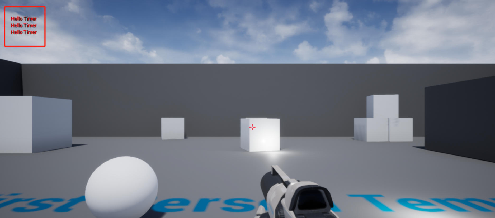

# 14. 定时执行（定时器）的 Actor

接上一节教程，我们将创建一个名为 `TimerActor` 的新 actor 。

在头文件中，我们将添加一个函数，每 2 秒重复执行一次；一个 `FTimerHandle` 类，以在世界时间内管理该函数。

**TimerActor.h**

```cpp
#pragma once
 
#include "CoreMinimal.h"
#include "GameFramework/Actor.h"
#include "TimerActor.generated.h"
 
UCLASS()
class UNREALCPP_API ATimerActor : public AActor
{
	GENERATED_BODY()
	
public:	
	// Sets default values for this actor's properties
	ATimerActor();
 
protected:
	// Called when the game starts or when spawned
	virtual void BeginPlay() override;
 
public:	
	// Called every frame
	virtual void Tick(float DeltaTime) override;
 
	void RepeatingFunction();
	
	FTimerHandle MemberTimerHandle;
	
};
```

在 .cpp 文件中，必须包含 `TimerManager.h` 文件。如果我们想使用引擎 `World Time Manager` ,  TimerManager.h 是必须的。您可以通过在角色头文件下面添加 `
#include "TimerManager.h"` 来添加TimerManager.h。

在 `BeginPlay()` 设置我们的世界计时器，在 5 秒后 每 2 秒播放我们的 `RepeatingFunction()` 。所以当你按下播放键，等待 5 秒，函数就会每 2 秒播放一次。

重复函数是打印到屏幕上的非常简单的函数。

**TimerActor.cpp**

```cpp
#include "TimerActor.h"
#include "TimerManager.h"
 
 
// Sets default values
ATimerActor::ATimerActor()
{
 	// Set this actor to call Tick() every frame.  You can turn this off to improve performance if you don't need it.
	PrimaryActorTick.bCanEverTick = true;	
 
}
 
// Called when the game starts or when spawned
void ATimerActor::BeginPlay()
{
	Super::BeginPlay();
 
	// connect timer function to actor. After 5 seconds run RepeatingFunction every 2 seconds 
	GetWorldTimerManager().SetTimer(MemberTimerHandle, this, &ATimerActor::RepeatingFunction, 2.0f, true, 5.0f);
}
 
// Called every frame
void ATimerActor::Tick(float DeltaTime)
{
	Super::Tick(DeltaTime);
 
}
 
void ATimerActor::RepeatingFunction()
{
	GEngine->AddOnScreenDebugMessage(-1, 5.f, FColor::Red, TEXT("Hello Timer"));
}
```

效果图如下




## 参考

* [定时执行（定时器）的 Actor【十四】](https://panda1234lee.blog.csdn.net/article/details/119126508)
* [英文原地址](https://unrealcpp.com/timer-actor/)