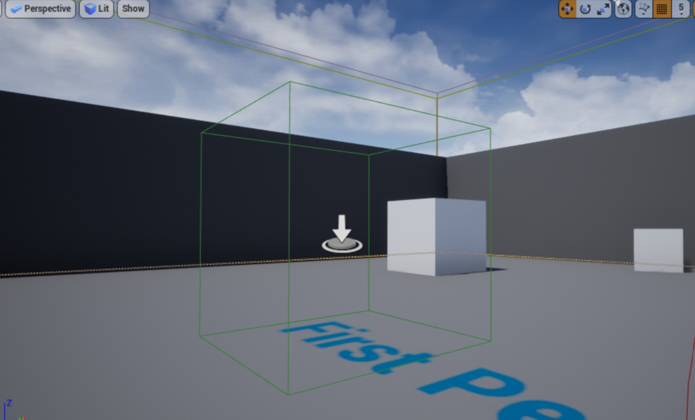
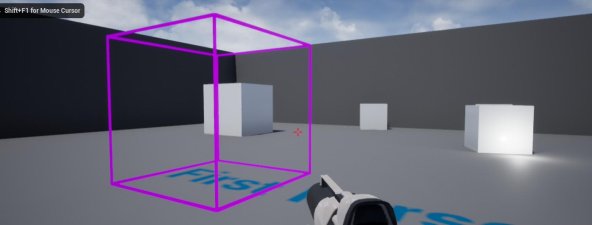

# 触发框

接上一节教程，在本教程中，当角色与一个触发框（Trigger Box）发生重叠时将触发一个事件。

创建一个新的 C++ `TriggerBox` 子类（**它继承自 TriggerBase 类，而它又继承自 Actor 类**）并将其命名为 `MyTriggerBox` 。在头文件中添加 `OnOverlapBegin` 和 `OnOverlapEnd` 函数。


下面是最终的 .h 头文件

```cpp
#pragma once
 
#include "CoreMinimal.h"
#include "Engine/TriggerBox.h"
#include "MyTriggerBox.generated.h"
 
/**
 *
 */
UCLASS()
class HELLOUNREAL_API AMyTriggerBox : public ATriggerBox {
    GENERATED_BODY()
 
  protected:
 
    // Called when the game starts or when spawned
    virtual void BeginPlay() override;
 
  public:
 
    // constructor sets default values for this actor's properties
    AMyTriggerBox();
 
    // declare overlap begin function
    UFUNCTION()
    void OnOverlapBegin(AActor* OverlappedActor, AActor* OtherActor);
 
    // declare overlap end function
    UFUNCTION()
    void OnOverlapEnd(AActor* OverlappedActor, AActor* OtherActor);
};
```

在 .cpp 文件中，为了帮助我们可视化触发器框，我们必须 `
#include "DrawDebugHelpers.h"` 文件。

```cpp
#include "MyTriggerBox.h"
// include draw debu helpers header file
#include "DrawDebugHelpers.h"
```

我们也可以 `#define` 一些调试日志的快捷方式。

```cpp
#define print(text) if (GEngine) GEngine->AddOnScreenDebugMessage(-1, 1.5, FColor::Green,text)
#define printFString(text, fstring) if (GEngine) GEngine->AddOnScreenDebugMessage(-1, 5.f, FColor::Green, FString::Printf(TEXT(text), fstring))
```

在该 actor 的构造函数中，我们将向 `OnActorBeginOverlap.AddDynamic` 和 `OnActorEndOverlap.AddDynamic` 注册重叠事件。

```cpp
AMyTriggerBox::AMyTriggerBox()
{
    //Register Events
    OnActorBeginOverlap.AddDynamic(this, &AMyTriggerBox::OnOverlapBegin);
    OnActorEndOverlap.AddDynamic(this, &AMyTriggerBox::OnOverlapEnd);
}
```

在 `BeginPlay` 上，我们将使用 `DrawDebugBox` 绘制调试框。

```cpp
void AMyTriggerBox::BeginPlay()
{
	Super::BeginPlay();
 
    DrawDebugBox(GetWorld(), GetActorLocation(), GetComponentsBoundingBox().GetExtent(), FColor::Purple, true, -1, 0, 5);
	
}
```

接下来，我们将编写重叠函数，它将向屏幕打印一条消息，指示进入和退出**触发器框**的 actor 。

```cpp
void AMyTriggerBox::OnOverlapBegin(class AActor* OverlappedActor, class AActor* OtherActor)
{
    // check if Actors do not equal nullptr and that 
    if (OtherActor && (OtherActor != this)) {
        // print to screen using above defined method when actor enters trigger box
        print("Overlap Begin");
        printFString("Overlapped Actor = %s", *OverlappedActor->GetName());
    }
}
 
void AMyTriggerBox::OnOverlapEnd(class AActor* OverlappedActor, class AActor* OtherActor)
{
    if (OtherActor && (OtherActor != this)) {
        // print to screen using above defined method when actor leaves trigger box
        print("Overlap Ended");
        printFString("%s has left the Trigger Box", *OtherActor->GetName());
    }
}
```

编译代码，将新 actor 拖放到游戏中，如下所示



运行起来的框是这样的



下面是最后的 .cpp 文件。

```cpp
#define print(text) if (GEngine) GEngine->AddOnScreenDebugMessage(-1, 1.5, FColor::Green,text)
#define printFString(text, fstring) if (GEngine) GEngine->AddOnScreenDebugMessage(-1, 5.f, FColor::Green, FString::Printf(TEXT(text), fstring))
 
#include "MyTriggerBox.h"
// include draw debu helpers header file
#include "DrawDebugHelpers.h"
 
AMyTriggerBox::AMyTriggerBox()
{
    //Register Events
    OnActorBeginOverlap.AddDynamic(this, &AMyTriggerBox::OnOverlapBegin);
    OnActorEndOverlap.AddDynamic(this, &AMyTriggerBox::OnOverlapEnd);
}
 
// Called when the game starts or when spawned
void AMyTriggerBox::BeginPlay()
{
	Super::BeginPlay();
 
    DrawDebugBox(GetWorld(), GetActorLocation(), GetComponentsBoundingBox().GetExtent(), FColor::Purple, true, -1, 0, 5);
	
}
 
void AMyTriggerBox::OnOverlapBegin(class AActor* OverlappedActor, class AActor* OtherActor)
{
    // check if Actors do not equal nullptr and that 
    if (OtherActor && (OtherActor != this)) {
        // print to screen using above defined method when actor enters trigger box
        print("Overlap Begin");
        printFString("Overlapped Actor = %s", *OverlappedActor->GetName());
    }
}
 
void AMyTriggerBox::OnOverlapEnd(class AActor* OverlappedActor, class AActor* OtherActor)
{
    if (OtherActor && (OtherActor != this)) {
        // print to screen using above defined method when actor leaves trigger box
        print("Overlap Ended");
        printFString("%s has left the Trigger Box", *OtherActor->GetName());
    }
}
```
最后，按下播放键，操控玩家在触发器框里进进出出，得到的最终效果图如下所示。 


## 参考

* [触发器框【二十】](https://panda1234lee.blog.csdn.net/article/details/119186637)