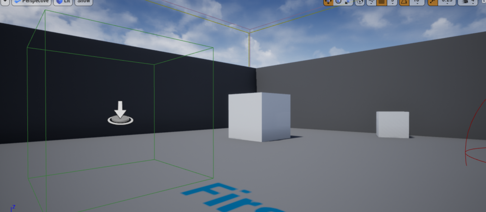
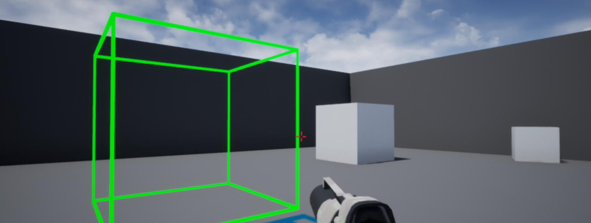
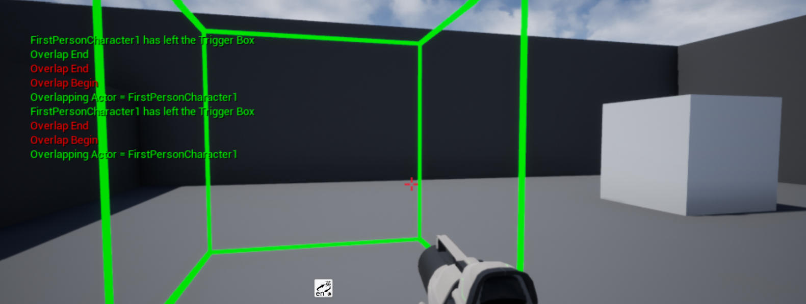

# 21. 指定 Actor 的触发器框

接上一节教程，本教程将通过特定的 actor 触发重叠事件。

创建一个新的 C++ TriggerBox 类，并将其命名为 TriggerBoxSpecificActor。在头文件中，我们将为特定的 actor 声明两个 void 重叠函数和 AActor 类。

下面是最终的头代码。

**TriggerBoxSpecificActor.h**

```cpp
#pragma once
 
#include "CoreMinimal.h"
#include "Engine/TriggerBox.h"
#include "TriggerBoxSpecificActor.generated.h"
 
 
UCLASS()
class UNREALCPP_API ATriggerBoxSpecificActor : public ATriggerBox
{
	GENERATED_BODY()
 
protected:
 
	// Called when the game starts or when spawned
	virtual void BeginPlay() override;
	
public:
 
	// constructor sets default values for this actor's properties
	ATriggerBoxSpecificActor();
 
	// overlap begin function
	UFUNCTION()
	void OnOverlapBegin(class AActor* OverlappedActor, class AActor* OtherActor);
 
	// overlap end function
	UFUNCTION()
	void OnOverlapEnd(class AActor* OverlappedActor, class AActor* OtherActor);
 
	// specific actor for overlap
	UPROPERTY(EditAnywhere)
	class AActor* SpecificActor;
	
};
```


在 .cpp 文件中，为了帮助我们可视化触发器框，我们必须 `#include "DrawDebugHelpers.h"` 文件。

```cpp
#include "TriggerBoxSpecificActor.h"
// include draw debug helpers header file
#include "DrawDebugHelpers.h"
```

我们也可以 **#define** 一些调试日志的快捷方式。

```cpp
#define print(text) if (GEngine) GEngine->AddOnScreenDebugMessage(-1, 1.5, FColor::Green,text)
#define printFString(text, fstring) if (GEngine) GEngine->AddOnScreenDebugMessage(-1, 5.f, FColor::Green, FString::Printf(TEXT(text), fstring))
```

在 actor 的构造函数中，我们将向 `OnActorBeginOverlap.AddDynamic` 和 `OnActorEndOverlap.AddDynamic` 注册重叠事件。

```cpp
ATriggerBoxSpecificActor::ATriggerBoxSpecificActor()
{
    //Register Events
    OnActorBeginOverlap.AddDynamic(this, &ATriggerBoxSpecificActor::OnOverlapBegin);
    OnActorEndOverlap.AddDynamic(this, &ATriggerBoxSpecificActor::OnOverlapEnd);
}
```

在 **BeginPlay** 上，我们将使用 **DrawDebugBox** 绘制调试框。

```cpp
// Called when the game starts or when spawned
void ATriggerBoxSpecificActor::BeginPlay()
{
	Super::BeginPlay();
 
    DrawDebugBox(GetWorld(), GetActorLocation(), GetComponentsBoundingBox().GetExtent(), FColor::Green, true, -1, 0, 5);
	
}
```

接下来，我们将编写重叠函数，当特定的 actor 进入和退出 TriggerBox 时，它将向屏幕打印一条消息。在重叠函数中，我们通过 `OtherActor == SpecificActor` 来检查 TriggerBox 中的 actor 是否是我们的特定 actor。

```cpp
void ATriggerBoxSpecificActor::OnOverlapBegin(class AActor* OverlappedActor, class AActor* OtherActor)
{
    //if the overlapping actor is the specific actor we identified in the editor
    if (OtherActor && (OtherActor != this) && OtherActor == SpecificActor )
    {
        print("Overlap Begin");
        printFString("Overlapping Actor = %s", *OtherActor->GetName());
    }
}
 
void ATriggerBoxSpecificActor::OnOverlapEnd(class AActor* OverlappedActor, class AActor* OtherActor)
{
    //if the overlapping actor is the specific actor we identified in the editor
    if (OtherActor && (OtherActor != this) && OtherActor == SpecificActor )
    {
        print("Overlap End");
        printFString("%s has left the Trigger Box", *OtherActor->GetName());
    }
}
```

编译代码。将新 actor 拖放到游戏中。



 运行起来是这样的：



在 actor 的详细信息面板中添加一个 actor，即特定 actor。


点击播放按钮，将特定的 actor **进进出出** TriggerBox 中以触发重叠事件。

下面是**进进出出**的效果图：




## 参考

* [指定 Actor 的触发器框【二十一】](https://blog.csdn.net/panda1234lee/article/details/119194477?spm=1001.2101.3001.10752)
