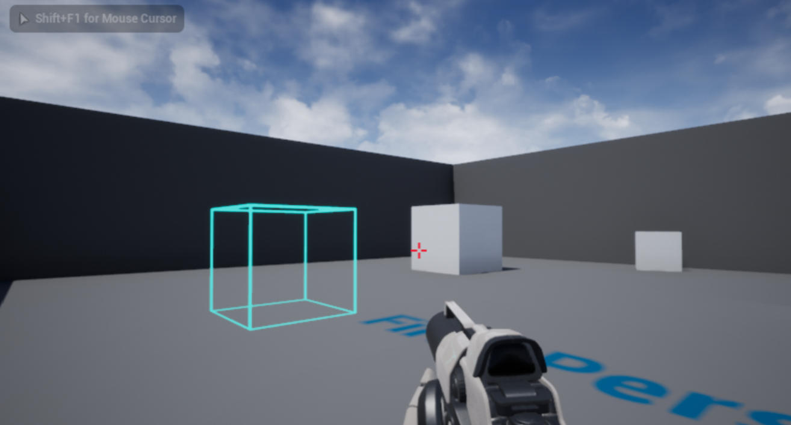

# 22. 触发器体

接上一节教程，在本教程中，当 actor 与 TriggerVolume 重叠时将触发一个事件。本教程使用了TriggerBox，但过程应该是相似的。

创建一个新的 C++ `TriggerVolume` 子类并将其命名为 `MyTriggerVolume` 。在头文件中添加 `OnOverlapBegin` 和 `OnOverlapEnd` 函数。

下面是最终的头文件 **MyTriggerVolume.h** 

```cpp
#pragma once
 
#include "CoreMinimal.h"
#include "Engine/TriggerVolume.h"
#include "MyTriggerVolume.generated.h"
 
/**
 * 
 */
UCLASS()
class UNREALCPP_API AMyTriggerVolume : public ATriggerVolume
{
	GENERATED_BODY()
 
protected:
	// Called when the game starts or when spawned
	virtual void BeginPlay() override;
	
public:
 
	// constructor sets default values for this actor's properties
	AMyTriggerVolume();
 
	// overlap begin function
	UFUNCTION()
	void OnOverlapBegin(class AActor* OverlappedActor, class AActor* OtherActor);
 
	// overlap end function
	UFUNCTION()
	void OnOverlapEnd(class AActor* OverlappedActor, class AActor* OtherActor);
	
};
```

在 .cpp 文件中，为了帮助我们可视化触发器体，我们必须 `#include "DrawDebugHelpers.h"` 文件。

```cpp
#include "MyTriggerVolume.h"
// include draw debug helpers header file
#include "DrawDebugHelpers.h"
```

我们也可以 #define 一些调试日志的快捷方式。

```cpp
#define print(text) if (GEngine) GEngine->AddOnScreenDebugMessage(-1, 1.5, FColor::Green,text)
#define printFString(text, fstring) if (GEngine) GEngine->AddOnScreenDebugMessage(-1, 5.f, FColor::Green, FString::Printf(TEXT(text), fstring))
```

在 actor 的构造函数中，我们将向 `OnActorBeginOverlap.AddDynamic` 和 `OnActorEndOverlap.AddDynamic` 注册重叠事件。

```cpp
AMyTriggerVolume::AMyTriggerVolume()
{
    //Register Events
    OnActorBeginOverlap.AddDynamic(this, &AMyTriggerVolume::OnOverlapBegin);
    OnActorEndOverlap.AddDynamic(this, &AMyTriggerVolume::OnOverlapEnd);
}
```

在 BeginPlay 上，我们将使用 DrawDebugBox 绘制调试框。

```cpp
void AMyTriggerVolume::BeginPlay()
{
	Super::BeginPlay();
 
	DrawDebugBox(GetWorld(), GetActorLocation(), GetActorScale()*100, FColor::Cyan, true, -1, 0, 5);
	
}
```

接下来，我们将编写重叠函数，它将向屏幕打印一条消息，指示进入和退出 TriggerVolume 的 actor 。

```cpp
void AMyTriggerVolume::OnOverlapBegin(class AActor* OverlappedActor, class AActor* OtherActor)
{
    if (OtherActor && (OtherActor != this)) {
        // print to screen using above defined method when actor enters trigger volume
        print("Overlap Begin");
        printFString("Other Actor = %s", *OtherActor->GetName());
    }
}
 
void AMyTriggerVolume::OnOverlapEnd(class AActor* OverlappedActor, class AActor* OtherActor)
{
    if (OtherActor && (OtherActor != this)) {
        // print to screen using above defined method when actor leaves trigger volume
        print("Overlap Ended");
        printFString("%s has left the Trigger Volume", *OtherActor->GetName());
    }
}
```

编译代码。将新 actor 拖放到游戏中。


按下播放按钮，并进进出出触发器体。

下面是最后运行的效果图




